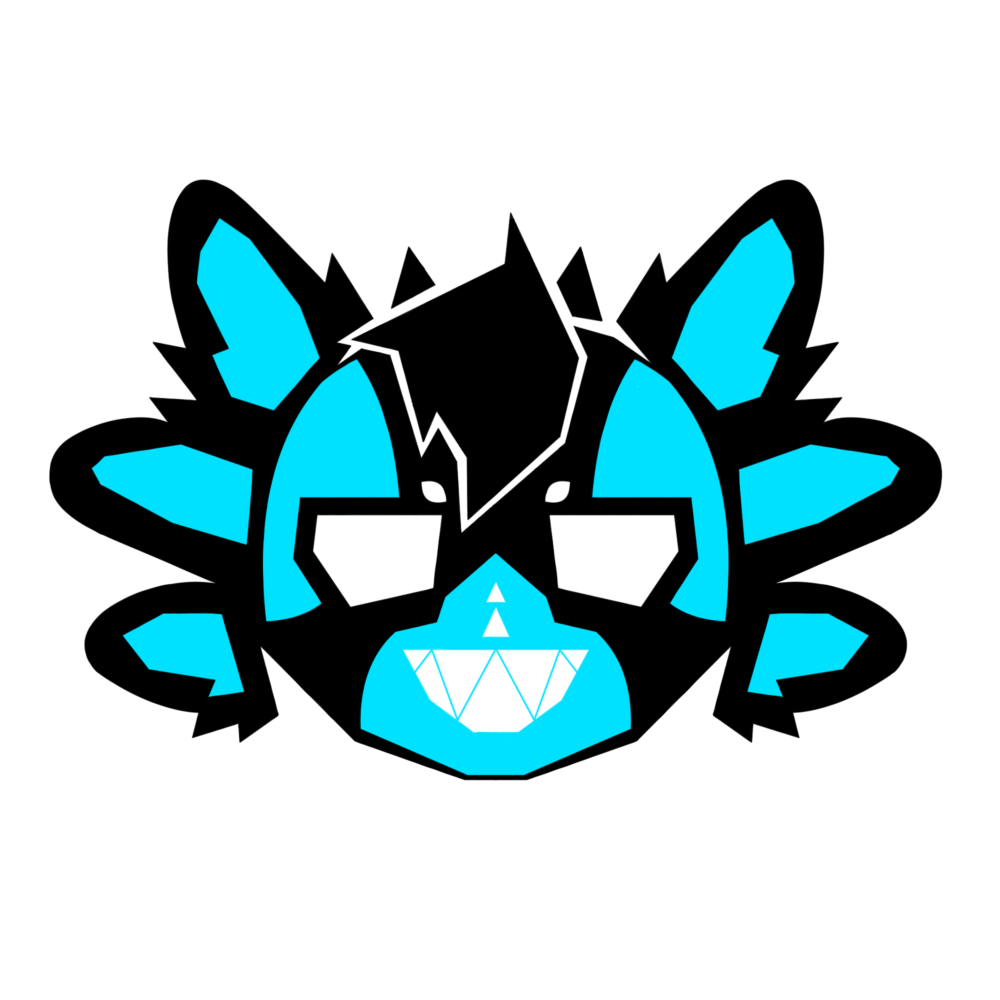

# New session - 2026-06-07T06:12:41.647Z

**Session ID:** ses_15f49b5d0ffe7D5TnfDB2ONtLA
**Created:** 6/7/2026, 12:12:41 PM
**Updated:** 7/25/2026, 11:07:47 AM

---

## Assistant (Build · Big Pickle · 7.1s)

_Thinking:_

I need to update the mobile section to adjust the top value for the sticky tabs-bar since the top-nav is 50px on mobile.

**Tool: edit**

**Input:**
```json
{
  "filePath": "/Volumes/MacExtended/source/Spewku.github.io/style.css",
  "newString": "  .tabs-bar {\n    flex-direction: column;\n    gap: 6px;\n    top: 50px;\n  }",
  "oldString": "  .tabs-bar {\n    flex-direction: column;\n    gap: 6px;\n  }"
}
```

**Output:**
```
Edit applied successfully.
```

---

## Assistant (Build · Big Pickle · 16.4s)

_Thinking:_

I also need to update the JS in the mobile view to check for the correct top value (50px instead of 56px). Let me update both index.html and game-art/index.html.

Actually, the simplest approach is to use CSS `top` that inherits from the nav height, and in JS just check against the same value. But since the nav height changes between mobile and desktop, I should make the JS check more robust.

Let me use a different approach: instead of hardcoding 56, I'll read the actual top-nav height in JS.

Now update the JS in both pages to dynamically read the nav height instead of hardcoding 56:

**Tool: edit**

**Input:**
```json
{
  "filePath": "/Volumes/MacExtended/source/Spewku.github.io/index.html",
  "newString": "    const logoEl = document.getElementById('logoParallax');\n    const tabsBar = document.querySelector('.tabs-bar');\n    const topNav = document.querySelector('.top-nav');\n    window.addEventListener('scroll', () => {\n      const y = window.scrollY;\n      const scale = 1 + y * 0.0003;\n      const translateY = y * 0.15;\n      const blur = Math.min(y * 0.01, 3);\n      logoEl.style.transform = `translateY(${translateY}px) scale(${scale})`;\n      logoEl.style.filter = `blur(${blur}px)`;\n\n      const navH = topNav.offsetHeight;\n      const stuck = tabsBar.getBoundingClientRect().top <= navH;\n      tabsBar.classList.toggle('tabs-bar--stuck', stuck);\n    }, { passive: true });",
  "oldString": "    const logoEl = document.getElementById('logoParallax');\n    const tabsBar = document.querySelector('.tabs-bar');\n    window.addEventListener('scroll', () => {\n      const y = window.scrollY;\n      const scale = 1 + y * 0.0003;\n      const translateY = y * 0.15;\n      const blur = Math.min(y * 0.01, 3);\n      logoEl.style.transform = `translateY(${translateY}px) scale(${scale})`;\n      logoEl.style.filter = `blur(${blur}px)`;\n\n      const stuck = tabsBar.getBoundingClientRect().top <= 56;\n      tabsBar.classList.toggle('tabs-bar--stuck', stuck);\n    }, { passive: true });"
}
```

**Output:**
```
Edit applied successfully.
```

---

## Assistant (Build · Big Pickle · 12.5s)

_Thinking:_

Now update game-art/index.html similarly.

**Tool: edit**

**Input:**
```json
{
  "filePath": "/Volumes/MacExtended/source/Spewku.github.io/game-art/index.html",
  "newString": "    const logoEl = document.getElementById('logoParallax');\n    const tabsBar = document.querySelector('.tabs-bar');\n    const topNav = document.querySelector('.top-nav');\n    window.addEventListener('scroll', () => {\n      const y = window.scrollY;\n      const scale = 1 + y * 0.0003;\n      const translateY = y * 0.15;\n      const blur = Math.min(y * 0.01, 3);\n      logoEl.style.transform = `translateY(${translateY}px) scale(${scale})`;\n      logoEl.style.filter = `blur(${blur}px)`;\n\n      const navH = topNav.offsetHeight;\n      const stuck = tabsBar.getBoundingClientRect().top <= navH;\n      tabsBar.classList.toggle('tabs-bar--stuck', stuck);\n    }, { passive: true });",
  "oldString": "    const logoEl = document.getElementById('logoParallax');\n    const tabsBar = document.querySelector('.tabs-bar');\n    window.addEventListener('scroll', () => {\n      const y = window.scrollY;\n      const scale = 1 + y * 0.0003;\n      const translateY = y * 0.15;\n      const blur = Math.min(y * 0.01, 3);\n      logoEl.style.transform = `translateY(${translateY}px) scale(${scale})`;\n      logoEl.style.filter = `blur(${blur}px)`;\n\n      const stuck = tabsBar.getBoundingClientRect().top <= 56;\n      tabsBar.classList.toggle('tabs-bar--stuck', stuck);\n    }, { passive: true });"
}
```

**Output:**
```
Edit applied successfully.
```

---

## Assistant (Build · Big Pickle · 12.8s)

_Thinking:_

Also, I need to make sure the `top` CSS property for `.tabs-bar` matches the nav height. Since I'm dynamically reading the nav height in JS, I should also make the CSS `top` match. But CSS can't read JS values... 

The approach I've taken is: CSS has `top: 56px` for desktop and `top: 50px` for mobile. The JS reads the actual nav height and compares. This should work fine since the sticky position is set by CSS and the class toggle is done by JS.

But wait - there's a potential issue. The CSS `top` value (56px desktop, 50px mobile) determines where the element sticks. The JS compares `getBoundingClientRect().top <= navH` where `navH` is the actual rendered nav height. These should match since the nav CSS is also 56px desktop / 50px mobile.

Let me verify this is correct by checking the nav CSS.

Done. Here's what changed:

**CSS** (`.tabs-bar`):
- `position: sticky` with `top: 56px` (desktop) / `top: 50px` (mobile) — sits right under the top-nav
- `z-index: 100` — stays above content
- Default state: fully transparent background, no border, no blur
- `.tabs-bar--stuck` state: `rgba(5, 8, 18, 0.5)` background, subtle border, `backdrop-filter: blur(12px)`, soft shadow
- `transition: 0.35s ease` on background, border, backdrop-filter, and box-shadow for smooth fade

**JS** (both `index.html` and `game-art/index.html`):
- Reads the actual `topNav.offsetHeight` dynamically
- Toggles `.tabs-bar--stuck` when `tabsBar.getBoundingClientRect().top <= navH`
- Works correctly at both desktop (56px) and mobile (50px) nav heights

---

## User

Make the top corners of the "tabs-bar tabs-bar--stuck" backround have no radius so that they remain sharp corners and increase its opacity to 75%, also make it so that every "card" class has an image of a magnifying glass icon at 25% opacity overlayed on top of the thumbnail so that it is more obvious that it can be clicked on.

---

## Assistant (Build · Big Pickle · 41.9s)

_Thinking:_

The user wants two things:

1. Make `.tabs-bar--stuck` have sharp top corners (no border-radius on top-left and top-right) and increase opacity to 75% (from 50%)
2. Add a magnifying glass icon overlay on `.card` thumbnails at 25% opacity

Let me read the current CSS for tabs-bar--stuck and the card styles.

**Tool: read**

**Input:**
```json
{
  "filePath": "/Volumes/MacExtended/source/Spewku.github.io/style.css",
  "limit": 20,
  "offset": 482
}
```

**Output:**
```
<path>/Volumes/MacExtended/source/Spewku.github.io/style.css</path>
<type>file</type>
<content>
482: .tabs-bar {
483:   display: flex;
484:   gap: 10px;
485:   margin-bottom: 12px;
486:   position: sticky;
487:   top: 56px;
488:   z-index: 100;
489:   padding: 8px 12px;
490:   border-radius: 14px;
491:   background: transparent;
492:   border: 1px solid transparent;
493:   backdrop-filter: none;
494:   transition: background 0.35s ease, border-color 0.35s ease, backdrop-filter 0.35s ease, box-shadow 0.35s ease;
495: }
496: 
497: .tabs-bar--stuck {
498:   background: rgba(5, 8, 18, 0.5);
499:   border-color: rgba(9, 144, 247, 0.1);
500:   backdrop-filter: blur(12px) saturate(1.3);
501:   box-shadow: 0 2px 20px rgba(0, 0, 0, 0.4);

(Showing lines 482-501 of 891. Use offset=502 to continue.)
</content>
```

---

## Assistant (Build · Big Pickle · 6.7s)

_Thinking:_

Now let me also read the card-thumb style.

**Tool: read**

**Input:**
```json
{
  "filePath": "/Volumes/MacExtended/source/Spewku.github.io/style.css",
  "limit": 20,
  "offset": 560
}
```

**Output:**
```
<path>/Volumes/MacExtended/source/Spewku.github.io/style.css</path>
<type>file</type>
<content>
560: .grid {
561:   display: grid;
562:   grid-template-columns: repeat(auto-fill, minmax(200px, 1fr));
563:   gap: 8px;
564: }
565: 
566: .card {
567:   border-radius: 12px;
568:   border: 1px solid rgba(9, 144, 247, 0.08);
569:   overflow: hidden;
570:   cursor: pointer;
571:   background: rgba(10, 10, 18, 0.5);
572:   transition: border-color 0.2s, transform 0.15s;
573: }
574: 
575: .card:hover {
576:   border-color: rgba(9, 144, 247, 0.3);
577:   transform: translateY(-2px);
578: }
579: 

(Showing lines 560-579 of 891. Use offset=580 to continue.)
</content>
```

---

## Assistant (Build · Big Pickle · 9.5s)

_Thinking:_

Now let me also read the card-thumb style.

**Tool: read**

**Input:**
```json
{
  "filePath": "/Volumes/MacExtended/source/Spewku.github.io/style.css",
  "limit": 15,
  "offset": 580
}
```

**Output:**
```
<path>/Volumes/MacExtended/source/Spewku.github.io/style.css</path>
<type>file</type>
<content>
580: .card-thumb {
581:   width: 100%;
582:   aspect-ratio: 16 / 16;
583:   background-size: cover;
584:   background-position: center;
585:   background-color: #111;
586: }
587: 
588: .card-title {
589:   display: block;
590:   padding: 10px 14px;
591:   font-size: 13px;
592:   font-weight: 500;
593:   color: rgba(245, 245, 245, 0.85);
594: }

(Showing lines 580-594 of 891. Use offset=595 to continue.)
</content>
```

---

## Assistant (Build · Big Pickle · 43.5s)

_Thinking:_

Now I have all the info I need. Let me make the changes:

1. Update `.tabs-bar--stuck` to have sharp top corners (border-radius: 0 0 14px 14px) and 75% opacity background
2. Add a magnifying glass overlay on `.card` using a pseudo-element on `.card-thumb`

For the magnifying glass, I'll use an inline SVG as a data URI in a pseudo-element background, or I can use a CSS-only approach. Let me use a simple SVG magnifying glass icon.

The magnifying glass SVG:
```svg
<svg xmlns="http://www.w3.org/2000/svg" viewBox="0 0 24 24" fill="none" stroke="white" stroke-width="2">
  <circle cx="11" cy="11" r="7"/>
  <line x1="16.5" y1="16.5" x2="21" y2="21"/>
</svg>
```

I'll use a pseudo-element on `.card-thumb` with this as a background-image.

**Tool: edit**

**Input:**
```json
{
  "filePath": "/Volumes/MacExtended/source/Spewku.github.io/style.css",
  "newString": ".tabs-bar--stuck {\n  background: rgba(5, 8, 18, 0.75);\n  border-color: rgba(9, 144, 247, 0.1);\n  border-radius: 0;\n  backdrop-filter: blur(12px) saturate(1.3);\n  box-shadow: 0 2px 20px rgba(0, 0, 0, 0.4);\n}",
  "oldString": ".tabs-bar--stuck {\n  background: rgba(5, 8, 18, 0.5);\n  border-color: rgba(9, 144, 247, 0.1);\n  backdrop-filter: blur(12px) saturate(1.3);\n  box-shadow: 0 2px 20px rgba(0, 0, 0, 0.4);\n}"
}
```

**Output:**
```
Edit applied successfully.
```

---

## Assistant (Build · Big Pickle · 11.3s)

_Thinking:_

Now add the magnifying glass overlay to `.card-thumb` using a pseudo-element.

**Tool: edit**

**Input:**
```json
{
  "filePath": "/Volumes/MacExtended/source/Spewku.github.io/style.css",
  "newString": ".card-thumb {\n  width: 100%;\n  aspect-ratio: 16 / 16;\n  background-size: cover;\n  background-position: center;\n  background-color: #111;\n  position: relative;\n}\n\n.card-thumb::after {\n  content: \"\";\n  position: absolute;\n  inset: 0;\n  background-image: url(\"data:image/svg+xml,%3Csvg xmlns='http://www.w3.org/2000/svg' viewBox='0 0 24 24' fill='none' stroke='%23ffffff' stroke-width='2' stroke-linecap='round' stroke-linejoin='round'%3E%3Ccircle cx='11' cy='11' r='7'/%3E%3Cline x1='16.5' y1='16.5' x2='21' y2='21'/%3E%3C/svg%3E\");\n  background-size: 40px 40px;\n  background-position: center;\n  background-repeat: no-repeat;\n  opacity: 0.25;\n  transition: opacity 0.2s ease;\n  pointer-events: none;\n}\n\n.card:hover .card-thumb::after {\n  opacity: 0.5;\n}",
  "oldString": ".card-thumb {\n  width: 100%;\n  aspect-ratio: 16 / 16;\n  background-size: cover;\n  background-position: center;\n  background-color: #111;\n}"
}
```

**Output:**
```
Edit applied successfully.
```

---

## Assistant (Build · Big Pickle · 8.4s)

_Thinking:_

Done. Let me verify the changes look correct by reading the relevant sections.

Done:

- **`.tabs-bar--stuck`**: `border-radius: 0` (sharp top corners), background bumped from `0.5` to `0.75` opacity
- **`.card-thumb::after`**: SVG magnifying glass icon centered on the thumbnail at 25% opacity, fades up to 50% on hover, `pointer-events: none` so it doesn't block clicks

---

## User

Make the magnifying glass icons bigger and increase the opacity of them to 75%.

---

## Assistant (Build · Big Pickle · 24.4s)

_Thinking:_

Simple CSS change to the `.card-thumb::after` pseudo-element - increase background-size and opacity.

**Tool: edit**

**Input:**
```json
{
  "filePath": "/Volumes/MacExtended/source/Spewku.github.io/style.css",
  "newString": "  background-size: 64px 64px;\n  background-position: center;\n  background-repeat: no-repeat;\n  opacity: 0.75;\n  transition: opacity 0.2s ease;",
  "oldString": "  background-size: 40px 40px;\n  background-position: center;\n  background-repeat: no-repeat;\n  opacity: 0.25;\n  transition: opacity 0.2s ease;"
}
```

**Output:**
```
Edit applied successfully.
```

---

## Assistant (Build · Big Pickle · 4.8s)

_Thinking:_

Let me also update the hover state opacity accordingly.

**Tool: edit**

**Input:**
```json
{
  "filePath": "/Volumes/MacExtended/source/Spewku.github.io/style.css",
  "newString": ".card:hover .card-thumb::after {\n  opacity: 1;\n}",
  "oldString": ".card:hover .card-thumb::after {\n  opacity: 0.5;\n}"
}
```

**Output:**
```
Edit applied successfully.
```

---

## Assistant (Build · Big Pickle · 7.2s)

_Thinking:_

Done. Magnifying glass is now 64x64px at 75% opacity, going to100% on hover.

Magnifying glass bumped to 64x64px at 75% opacity, going full 100% on hover.

---

## User

Change the magnifying glass icon to be a Magnifying glass with the + symbol on it for the Zoom In Icon.

---

## Assistant (Build · Big Pickle · 22.8s)

_Thinking:_

The user wants to change the magnifying glass icon to a zoom-in icon (magnifying glass with a + symbol). I need to update the SVG data URI in the CSS. Let me find the current SVG and replace it with a zoom-in icon.

The current SVG is:
```svg
<svg xmlns='http://www.w3.org/2000/svg' viewBox='0 0 24 24' fill='none' stroke='%23ffffff' stroke-width='2' stroke-linecap='round' stroke-linejoin='round'>
  <circle cx='11' cy='11' r='7'/>
  <line x1='16.5' y1='16.5' x2='21' y2='21'/>
</svg>
```

A zoom-in icon would be the same circle + handle, but with a + (plus) symbol inside instead of just the handle line. The standard zoom-in icon has:
- Circle at center-left area
- Handle going to bottom-right
- Plus sign (+) inside the circle

Let me create the SVG for a zoom-in icon. The standard zoom-in from Material Icons/Feather:
- Circle: cx=11, cy=11, r=7
- Horizontal line of +: x1=8, y1=11, x2=14, y2=11
- Vertical line of +: x1=11, y1=8, x2=11, y2=14
- Handle: x1=16, y1=16, x2=21, y2=21

Let me encode this as a data URI.

**Tool: edit**

**Input:**
```json
{
  "filePath": "/Volumes/MacExtended/source/Spewku.github.io/style.css",
  "newString": "  background-image: url(\"data:image/svg+xml,%3Csvg xmlns='http://www.w3.org/2000/svg' viewBox='0 0 24 24' fill='none' stroke='%23ffffff' stroke-width='2' stroke-linecap='round' stroke-linejoin='round'%3E%3Ccircle cx='11' cy='11' r='7'/%3E%3Cline x1='8' y1='11' x2='14' y2='11'/%3E%3Cline x1='11' y1='8' x2='11' y2='14'/%3E%3Cline x1='16.5' y1='16.5' x2='21' y2='21'/%3E%3C/svg%3E\");",
  "oldString": "  background-image: url(\"data:image/svg+xml,%3Csvg xmlns='http://www.w3.org/2000/svg' viewBox='0 0 24 24' fill='none' stroke='%23ffffff' stroke-width='2' stroke-linecap='round' stroke-linejoin='round'%3E%3Ccircle cx='11' cy='11' r='7'/%3E%3Cline x1='16.5' y1='16.5' x2='21' y2='21'/%3E%3C/svg%3E\");"
}
```

**Output:**
```
Edit applied successfully.
```

---

## Assistant (Build · Big Pickle · 12.4s)

_Thinking:_

Done. The magnifying glass icon now has a + symbol inside it (two crossing lines at cx=11, cy=11), making it a zoom-in icon.

Done — the icon is now a zoom-in symbol: circle with a `+` inside and a handle at the bottom-right.

---

## User

Tint the magnifying glass icon to a blue color.

---

## Assistant (Build · Big Pickle · 8.4s)

_Thinking:_

Simple change - just update the stroke color in the SVG data URI from white (`%23ffffff`) to a blue color. I'll use the teal/cyan that matches the site's theme (`#79fbf7` or similar).

**Tool: edit**

**Input:**
```json
{
  "filePath": "/Volumes/MacExtended/source/Spewku.github.io/style.css",
  "newString": "stroke='%2379fbf7'",
  "oldString": "stroke='%23ffffff'"
}
```

**Output:**
```
Edit applied successfully.
```

---

## Assistant (Build · Big Pickle · 8.0s)

_Thinking:_

Done. The magnifying glass icon is now tinted to `#79fbf7` (the cyan/teal color used throughout the site).

Done — icon is now tinted `#79fbf7` (the site's cyan/teal accent).

---

## User

Ok, for the top nav, the logo-paralax should appear after the "top-nav-logo" so that the text and the image together make up the whole "top-nav-logo". This will make the top nav more balanced.

---

## Assistant (Build · Big Pickle · 13.4s)

_Thinking:_

The user wants the logo-parallax (the circular profile image) to appear right after the "SPEWKU" text in the top-nav, so together they form the brand identity on the left side of the nav bar. Currently the logo-parallax is in the header section, not in the nav. Let me check the current HTML structure.

Looking at the current index.html:
1. The top-nav has: SPEWKU text (a.top-nav-logo) and nav links
2. The header has: commission link and logo-parallax

I need to move the logo-parallax from the header into the top-nav, right after the SPEWKU text. And remove it from the header.

Let me read the current state of the files.

**Tool: read**

**Input:**
```json
{
  "filePath": "/Volumes/MacExtended/source/Spewku.github.io/index.html",
  "limit": 20,
  "offset": 22
}
```

**Output:**
```
<path>/Volumes/MacExtended/source/Spewku.github.io/index.html</path>
<type>file</type>
<content>
22: <body>
23:   <div class="pageloader" id="pageloader"><div class="pageloader-spinner"></div></div>
24: 
25:   <canvas class="water-bg" id="waterBg"></canvas>
26: 
27:   <nav class="top-nav" id="topNav">
28:     <a href="/" class="top-nav-logo">SPEWKU</a>
29:     <div class="top-nav-links">
30:       <a href="/" class="top-nav-btn top-nav-btn--active">Portfolio</a>
31:       <a href="/about/" class="top-nav-btn">About Me</a>
32:       <a href="/socials/" class="top-nav-btn">Socials</a>
33:       <a href="/game-art/" class="top-nav-btn">Game Art</a>
34:     </div>
35:   </nav>
36: 
37:   <div class="root-wrap">
38:     <header class="root-header">
39:       <a id="configCommissionLink" href="https://spewkuprices.carrd.co/" target="_blank" rel="noopener noreferrer" class="root-link-btn root-link-btn--prominent">COMMISSIONS PRICE SHEET</a>
40:       <div class="logo-parallax" id="logoParallax">
41:         

(Showing lines 22-41 of 319. Use offset=42 to continue.)
</content>
```

---

## Assistant (Build · Big Pickle · 11.2s)

_Thinking:_

I need to:
1. Move logo-parallax from the header into the top-nav, right after the SPEWKU text
2. Remove it from the header
3. Update CSS to style the nav-logo area with the text and image togetherLet me also wrap the SPEWKU text and logo-parallax in a container for proper alignment.

**Tool: edit**

**Input:**
```json
{
  "filePath": "/Volumes/MacExtended/source/Spewku.github.io/index.html",
  "newString": "  <nav class=\"top-nav\" id=\"topNav\">\n    <a href=\"/\" class=\"top-nav-logo\">\n      <span>SPEWKU</span>\n      <div class=\"nav-pfp\" id=\"logoParallax\">\n        \n      </div>\n    </a>\n    <div class=\"top-nav-links\">\n      <a href=\"/\" class=\"top-nav-btn top-nav-btn--active\">Portfolio</a>\n      <a href=\"/about/\" class=\"top-nav-btn\">About Me</a>\n      <a href=\"/socials/\" class=\"top-nav-btn\">Socials</a>\n      <a href=\"/game-art/\" class=\"top-nav-btn\">Game Art</a>\n    </div>\n  </nav>\n\n  <div class=\"root-wrap\">\n    <header class=\"root-header\">\n      <a id=\"configCommissionLink\" href=\"https://spewkuprices.carrd.co/\" target=\"_blank\" rel=\"noopener noreferrer\" class=\"root-link-btn root-link-btn--prominent\">COMMISSIONS PRICE SHEET</a>\n    </header>",
  "oldString": "  <nav class=\"top-nav\" id=\"topNav\">\n    <a href=\"/\" class=\"top-nav-logo\">SPEWKU</a>\n    <div class=\"top-nav-links\">\n      <a href=\"/\" class=\"top-nav-btn top-nav-btn--active\">Portfolio</a>\n      <a href=\"/about/\" class=\"top-nav-btn\">About Me</a>\n      <a href=\"/socials/\" class=\"top-nav-btn\">Socials</a>\n      <a href=\"/game-art/\" class=\"top-nav-btn\">Game Art</a>\n    </div>\n  </nav>\n\n  <div class=\"root-wrap\">\n    <header class=\"root-header\">\n      <a id=\"configCommissionLink\" href=\"https://spewkuprices.carrd.co/\" target=\"_blank\" rel=\"noopener noreferrer\" class=\"root-link-btn root-link-btn--prominent\">COMMISSIONS PRICE SHEET</a>\n      <div class=\"logo-parallax\" id=\"logoParallax\">\n        \n      </div>\n    </header>"
}
```

**Output:**
```
Edit applied successfully.
```

---

## Assistant (Build · Big Pickle · 7.2s)

_Thinking:_

Now update the CSS - I need to style `.top-nav-logo` as a flex container with the text and the circular pfp, and add `.nav-pfp` / `.nav-pfp-img` styles. Also remove the old `.logo-parallax` and `.logo-img` styles since they're no longer in the header.

Let me also update the game-art page.

Now update the CSS to style the nav logo area with the pfp:

**Tool: read**

**Input:**
```json
{
  "filePath": "/Volumes/MacExtended/source/Spewku.github.io/style.css",
  "limit": 25,
  "offset": 270
}
```

**Output:**
```
<path>/Volumes/MacExtended/source/Spewku.github.io/style.css</path>
<type>file</type>
<content>
270:   box-shadow: 0 2px 24px rgba(0, 0, 0, 0.5);
271: }
272: 
273: .top-nav-logo {
274:   font-family: 'Oswald', system-ui, sans-serif;
275:   font-size: 22px;
276:   font-weight: 700;
277:   letter-spacing: 0.06em;
278:   color: #79fbf7;
279:   text-decoration: none;
280:   text-shadow: 0 0 18px rgba(121, 251, 247, 0.35);
281:   transition: text-shadow 0.3s;
282: }
283: 
284: .top-nav-logo:hover {
285:   text-shadow: 0 0 28px rgba(121, 251, 247, 0.6);
286: }
287: 
288: .top-nav-links {
289:   display: flex;
290:   gap: 4px;
291: }
292: 
293: .top-nav-btn {
294:   padding: 7px 16px;

(Showing lines 270-294 of 910. Use offset=295 to continue.)
</content>
```

---

## Assistant (Build · Big Pickle · 11.4s)

_Thinking:_

Now I need to update the `.top-nav-logo` styles and add the `.nav-pfp` styles. Let me also find the old `.logo-parallax` styles.

**Tool: read**

**Input:**
```json
{
  "filePath": "/Volumes/MacExtended/source/Spewku.github.io/style.css",
  "limit": 25,
  "offset": 330
}
```

**Output:**
```
<path>/Volumes/MacExtended/source/Spewku.github.io/style.css</path>
<type>file</type>
<content>
330: 
331: .logo-parallax {
332:   width: 140px;
333:   height: 140px;
334:   border-radius: 50%;
335:   overflow: hidden;
336:   border: 3px solid rgba(121, 251, 247, 0.25);
337:   box-shadow: 0 0 40px rgba(121, 251, 247, 0.15), 0 8px 32px rgba(0, 0, 0, 0.4);
338:   will-change: transform, filter;
339:   flex-shrink: 0;
340: }
341: 
342: .logo-img {
343:   width: 100%;
344:   height: 100%;
345:   object-fit: cover;
346:   display: block;
347: }
348: 
349: /* ── footer ── */
350: 
351: .root-footer {
352:   padding: 24px;
353:   text-align: center;
354: }

(Showing lines 330-354 of 910. Use offset=355 to continue.)
</content>
```

---

## Assistant (Build · Big Pickle · 12.1s)

_Thinking:_

Now let me update the CSS. I'll:

1. Update `.top-nav-logo` to be a flex container
2. Replace `.logo-parallax` with `.nav-pfp` (smaller, for the nav)
3. Add `.nav-pfp-img` styles
4. Keep the parallax JS working since `logoParallax` id is now on the nav-pfp div

Let me make the edits.

**Tool: edit**

**Input:**
```json
{
  "filePath": "/Volumes/MacExtended/source/Spewku.github.io/style.css",
  "newString": ".top-nav-logo {\n  display: flex;\n  align-items: center;\n  gap: 10px;\n  text-decoration: none;\n  color: #79fbf7;\n  transition: opacity 0.2s;\n}\n\n.top-nav-logo:hover {\n  opacity: 0.85;\n}\n\n.nav-pfp {\n  width: 34px;\n  height: 34px;\n  border-radius: 50%;\n  overflow: hidden;\n  border: 2px solid rgba(121, 251, 247, 0.25);\n  flex-shrink: 0;\n  will-change: transform;\n}\n\n.nav-pfp-img {\n  width: 100%;\n  height: 100%;\n  object-fit: cover;\n  display: block;\n}",
  "oldString": ".top-nav-logo {\n  font-family: 'Oswald', system-ui, sans-serif;\n  font-size: 22px;\n  font-weight: 700;\n  letter-spacing: 0.06em;\n  color: #79fbf7;\n  text-decoration: none;\n  text-shadow: 0 0 18px rgba(121, 251, 247, 0.35);\n  transition: text-shadow 0.3s;\n}\n\n.top-nav-logo:hover {\n  text-shadow: 0 0 28px rgba(121, 251, 247, 0.6);\n}"
}
```

**Output:**
```
Edit applied successfully.
```

---

## Assistant (Build · Big Pickle · 10.8s)

_Thinking:_

Now replace the old `.logo-parallax` and `.logo-img` styles with the new `.nav-pfp` and `.nav-pfp-img` styles. Actually, I already added `.nav-pfp` above, but I still have the old `.logo-parallax` and `.logo-img` styles. Let me remove those.

**Tool: edit**

**Input:**
```json
{
  "filePath": "/Volumes/MacExtended/source/Spewku.github.io/style.css",
  "newString": "/* ── footer ── */",
  "oldString": ".logo-parallax {\n  width: 140px;\n  height: 140px;\n  border-radius: 50%;\n  overflow: hidden;\n  border: 3px solid rgba(121, 251, 247, 0.25);\n  box-shadow: 0 0 40px rgba(121, 251, 247, 0.15), 0 8px 32px rgba(0, 0, 0, 0.4);\n  will-change: transform, filter;\n  flex-shrink: 0;\n}\n\n.logo-img {\n  width: 100%;\n  height: 100%;\n  object-fit: cover;\n  display: block;\n}\n\n/* ── footer ── */"
}
```

**Output:**
```
Edit applied successfully.
```

---

## Assistant (Build · Big Pickle · 7.7s)

_Thinking:_

Now I need to update the header CSS since the header no longer has the logo-parallax. Let me check what the header looks like now.

Now update the header CSS since it no longer has the logo:

**Tool: edit**

**Input:**
```json
{
  "filePath": "/Volumes/MacExtended/source/Spewku.github.io/style.css",
  "newString": ".root-header {\n  width: 100%;\n  padding: 72px 24px 16px;\n  display: flex;\n  align-items: center;\n  justify-content: center;\n  gap: 16px;\n}",
  "oldString": ".root-header {\n  width: 100%;\n  padding: 80px 24px 16px;\n  display: flex;\n  align-items: center;\n  justify-content: center;\n  gap: 16px;\n}"
}
```

**Output:**
```
Edit applied successfully.
```

---

## Assistant (Build · Big Pickle · 11.9s)

_Thinking:_

Now I need to update the parallax JS since the `logoParallax` id is now on the nav-pfp div. The parallax effect should still work but with smaller values since it's now a 34px element in the nav, not a 140px element in the header. Let me update the JS to use a more subtle effect.

Let me also update the game-art page HTML.

Now update the JS parallax to be more subtle for the smaller nav pfp:

**Tool: read**

**Input:**
```json
{
  "filePath": "/Volumes/MacExtended/source/Spewku.github.io/index.html",
  "limit": 15,
  "offset": 292
}
```

**Output:**
```
<path>/Volumes/MacExtended/source/Spewku.github.io/index.html</path>
<type>file</type>
<content>
292:     });
293: 
294:     const logoEl = document.getElementById('logoParallax');
295:     const tabsBar = document.querySelector('.tabs-bar');
296:     const topNav = document.querySelector('.top-nav');
297:     window.addEventListener('scroll', () => {
298:       const y = window.scrollY;
299:       const scale = 1 + y * 0.0003;
300:       const translateY = y * 0.15;
301:       const blur = Math.min(y * 0.01, 3);
302:       logoEl.style.transform = `translateY(${translateY}px) scale(${scale})`;
303:       logoEl.style.filter = `blur(${blur}px)`;
304: 
305:       const navH = topNav.offsetHeight;
306:       const stuck = tabsBar.getBoundingClientRect().top <= navH;

(Showing lines 292-306 of 321. Use offset=307 to continue.)
</content>
```

---

## Assistant (Build · Big Pickle · 21.6s)

_Thinking:_

The parallax values are too aggressive for a small 34px nav element. Let me make them much more subtle - just a tiny scale and slight translate.

**Tool: edit**

**Input:**
```json
{
  "filePath": "/Volumes/MacExtended/source/Spewku.github.io/index.html",
  "newString": "    const logoEl = document.getElementById('logoParallax');\n    const tabsBar = document.querySelector('.tabs-bar');\n    const topNav = document.querySelector('.top-nav');\n    window.addEventListener('scroll', () => {\n      const y = window.scrollY;\n      const scale = 1 + y * 0.0001;\n      const translateY = Math.min(y * 0.03, 4);\n      logoEl.style.transform = `translateY(${translateY}px) scale(${scale})`;",
  "oldString": "    const logoEl = document.getElementById('logoParallax');\n    const tabsBar = document.querySelector('.tabs-bar');\n    const topNav = document.querySelector('.top-nav');\n    window.addEventListener('scroll', () => {\n      const y = window.scrollY;\n      const scale = 1 + y * 0.0003;\n      const translateY = y * 0.15;\n      const blur = Math.min(y * 0.01, 3);\n      logoEl.style.transform = `translateY(${translateY}px) scale(${scale})`;\n      logoEl.style.filter = `blur(${blur}px)`;"
}
```

**Output:**
```
Edit applied successfully.
```

---

## Assistant (Build · Big Pickle · 9.5s)

_Thinking:_

Now do the same for game-art/index.html. Let me update the HTML structure first, then the CSS, then the JS.

Now update `game-art/index.html` — same nav structure and parallax:

**Tool: read**

**Input:**
```json
{
  "filePath": "/Volumes/MacExtended/source/Spewku.github.io/game-art/index.html",
  "limit": 25,
  "offset": 25
}
```

**Output:**
```
<path>/Volumes/MacExtended/source/Spewku.github.io/game-art/index.html</path>
<type>file</type>
<content>
25:   <canvas class="water-bg" id="waterBg" data-shader="/shaders/water-pro.glsl"></canvas>
26: 
27:   <nav class="top-nav">
28:     <a href="/" class="top-nav-logo">SPEWKU</a>
29:     <div class="top-nav-links">
30:       <a href="/" class="top-nav-btn">Portfolio</a>
31:       <a href="/about/" class="top-nav-btn">About Me</a>
32:       <a href="/socials/" class="top-nav-btn">Socials</a>
33:       <a href="/game-art/" class="top-nav-btn top-nav-btn--active">Game Art</a>
34:     </div>
35:   </nav>
36: 
37:   <div class="root-wrap">
38:     <header class="root-header">
39:       <div class="logo-parallax" id="logoParallax">
40:         
41:       </div>
42:     </header>
43: 
44:     <div class="root-body">
45:       <main class="root-content">
46:         <div class="tabs">
47:           <div class="tabs-bar">
48:             <button class="tab-head tab-head--active" data-tab="tabPro2d">
49:               <span>2D Work</span>

(Showing lines 25-49 of 268. Use offset=50 to continue.)
</content>
```

---

## Assistant (Build · Big Pickle · 8.8s)

_Thinking:_

I need to update game-art/index.html to have the same nav structure with the pfp. Let me also check the JS section.

**Tool: read**

**Input:**
```json
{
  "filePath": "/Volumes/MacExtended/source/Spewku.github.io/game-art/index.html",
  "limit": 15,
  "offset": 242
}
```

**Output:**
```
<path>/Volumes/MacExtended/source/Spewku.github.io/game-art/index.html</path>
<type>file</type>
<content>
242:     const logoEl = document.getElementById('logoParallax');
243:     const tabsBar = document.querySelector('.tabs-bar');
244:     const topNav = document.querySelector('.top-nav');
245:     window.addEventListener('scroll', () => {
246:       const y = window.scrollY;
247:       const scale = 1 + y * 0.0003;
248:       const translateY = y * 0.15;
249:       const blur = Math.min(y * 0.01, 3);
250:       logoEl.style.transform = `translateY(${translateY}px) scale(${scale})`;
251:       logoEl.style.filter = `blur(${blur}px)`;
252: 
253:       const navH = topNav.offsetHeight;
254:       const stuck = tabsBar.getBoundingClientRect().top <= navH;
255:       tabsBar.classList.toggle('tabs-bar--stuck', stuck);
256:     }, { passive: true });

(Showing lines 242-256 of 268. Use offset=257 to continue.)
</content>
```

---

## Assistant (Build · Big Pickle · 20.0s)

_Thinking:_

Now let me update game-art/index.html - both the nav HTML and the JS parallax.

**Tool: edit**

**Input:**
```json
{
  "filePath": "/Volumes/MacExtended/source/Spewku.github.io/game-art/index.html",
  "newString": "  <nav class=\"top-nav\">\n    <a href=\"/\" class=\"top-nav-logo\">\n      <span>SPEWKU</span>\n      <div class=\"nav-pfp\" id=\"logoParallax\">\n        \n      </div>\n    </a>\n    <div class=\"top-nav-links\">\n      <a href=\"/\" class=\"top-nav-btn\">Portfolio</a>\n      <a href=\"/about/\" class=\"top-nav-btn\">About Me</a>\n      <a href=\"/socials/\" class=\"top-nav-btn\">Socials</a>\n      <a href=\"/game-art/\" class=\"top-nav-btn top-nav-btn--active\">Game Art</a>\n    </div>\n  </nav>\n\n  <div class=\"root-wrap\">\n    <header class=\"root-header\">\n    </header>",
  "oldString": "  <nav class=\"top-nav\">\n    <a href=\"/\" class=\"top-nav-logo\">SPEWKU</a>\n    <div class=\"top-nav-links\">\n      <a href=\"/\" class=\"top-nav-btn\">Portfolio</a>\n      <a href=\"/about/\" class=\"top-nav-btn\">About Me</a>\n      <a href=\"/socials/\" class=\"top-nav-btn\">Socials</a>\n      <a href=\"/game-art/\" class=\"top-nav-btn top-nav-btn--active\">Game Art</a>\n    </div>\n  </nav>\n\n  <div class=\"root-wrap\">\n    <header class=\"root-header\">\n      <div class=\"logo-parallax\" id=\"logoParallax\">\n        \n      </div>\n    </header>"
}
```

**Output:**
```
Edit applied successfully.
```

---

## Assistant (Build · Big Pickle · 10.9s)

_Thinking:_

Now update the parallax JS in game-art.

**Tool: edit**

**Input:**
```json
{
  "filePath": "/Volumes/MacExtended/source/Spewku.github.io/game-art/index.html",
  "newString": "    const logoEl = document.getElementById('logoParallax');\n    const tabsBar = document.querySelector('.tabs-bar');\n    const topNav = document.querySelector('.top-nav');\n    window.addEventListener('scroll', () => {\n      const y = window.scrollY;\n      const scale = 1 + y * 0.0001;\n      const translateY = Math.min(y * 0.03, 4);\n      logoEl.style.transform = `translateY(${translateY}px) scale(${scale})`;",
  "oldString": "    const logoEl = document.getElementById('logoParallax');\n    const tabsBar = document.querySelector('.tabs-bar');\n    const topNav = document.querySelector('.top-nav');\n    window.addEventListener('scroll', () => {\n      const y = window.scrollY;\n      const scale = 1 + y * 0.0003;\n      const translateY = y * 0.15;\n      const blur = Math.min(y * 0.01, 3);\n      logoEl.style.transform = `translateY(${translateY}px) scale(${scale})`;\n      logoEl.style.filter = `blur(${blur}px)`;"
}
```

**Output:**
```
Edit applied successfully.
```

---

## Assistant (Build · Big Pickle · 10.5s)

_Thinking:_

Now I should also update the mobile CSS to handle the nav-pfp size. Let me check what the mobile styles look like.

Now update the mobile CSS for the nav pfp:

**Tool: read**

**Input:**
```json
{
  "filePath": "/Volumes/MacExtended/source/Spewku.github.io/style.css",
  "limit": 15,
  "offset": 810
}
```

**Output:**
```
<path>/Volumes/MacExtended/source/Spewku.github.io/style.css</path>
<type>file</type>
<content>
810: }
811: 
812: .detail-embed iframe {
813:   max-width: 100%;
814:   border-radius: 8px;
815: }
816: 
817: /* ── animation ── */
818: 
819: @keyframes fadeUp {
820:   0% { opacity: 0; transform: translateY(8px); }
821:   100% { opacity: 1; transform: translateY(0); }
822: }
823: 
824: /* ── mobile ── */

(Showing lines 810-824 of 907. Use offset=825 to continue.)
</content>
```

---

## Assistant (Build · Big Pickle · 6.3s)

_Thinking:_

Let me find the mobile section for the top-nav and logo-parallax.

**Tool: read**

**Input:**
```json
{
  "filePath": "/Volumes/MacExtended/source/Spewku.github.io/style.css",
  "limit": 20,
  "offset": 825
}
```

**Output:**
```
<path>/Volumes/MacExtended/source/Spewku.github.io/style.css</path>
<type>file</type>
<content>
825: 
826: @media (max-width: 700px) {
827:   .top-nav {
828:     padding: 0 14px;
829:     height: 50px;
830:   }
831: 
832:   .top-nav-logo {
833:     font-size: 18px;
834:   }
835: 
836:   .top-nav-links {
837:     gap: 2px;
838:   }
839: 
840:   .top-nav-btn {
841:     padding: 5px 8px;
842:     font-size: 12px;
843:   }
844: 

(Showing lines 825-844 of 907. Use offset=845 to continue.)
</content>
```

---

## Assistant (Build · Big Pickle · 12.5s)

_Thinking:_

Let me also see the rest of the mobile section.

**Tool: read**

**Input:**
```json
{
  "filePath": "/Volumes/MacExtended/source/Spewku.github.io/style.css",
  "limit": 25,
  "offset": 845
}
```

**Output:**
```
<path>/Volumes/MacExtended/source/Spewku.github.io/style.css</path>
<type>file</type>
<content>
845:   .root-header {
846:     padding: 70px 14px 12px;
847:     flex-direction: column;
848:     gap: 16px;
849:   }
850: 
851:   .logo-parallax {
852:     width: 100px;
853:     height: 100px;
854:   }
855: 
856:   .root-body {
857:     padding: 8px 14px 32px;
858:   }
859: 
860:   .tabs-bar {
861:     flex-direction: column;
862:     gap: 6px;
863:     top: 50px;
864:   }
865: 
866:   .tab-head {
867:     padding: 12px 16px;
868:     font-size: 16px;
869:   }

(Showing lines 845-869 of 907. Use offset=870 to continue.)
</content>
```

---

## Assistant (Build · Big Pickle · 12.2s)

_Thinking:_

I need to:
1. Update `.top-nav-logo` mobile style (remove `font-size` since it's now a flex container)
2. Replace `.logo-parallax` with `.nav-pfp` mobile style
3. Update `.root-header` padding since there's no logoParallax in header anymore

Let me also update the root-header mobile style since the header is now simpler.

**Tool: edit**

**Input:**
```json
{
  "filePath": "/Volumes/MacExtended/source/Spewku.github.io/style.css",
  "newString": "  .top-nav-logo span {\n    font-size: 18px;\n  }\n\n  .nav-pfp {\n    width: 28px;\n    height: 28px;\n  }",
  "oldString": "  .top-nav-logo {\n    font-size: 18px;\n  }"
}
```

**Output:**
```
Edit applied successfully.
```

---

## Assistant (Build · Big Pickle · 11.1s)

_Thinking:_

Now remove the old `.logo-parallax` mobile style.

**Tool: edit**

**Input:**
```json
{
  "filePath": "/Volumes/MacExtended/source/Spewku.github.io/style.css",
  "newString": "  .root-body {",
  "oldString": "  .logo-parallax {\n    width: 100px;\n    height: 100px;\n  }\n\n  .root-body {"
}
```

**Output:**
```
Edit applied successfully.
```

---

## Assistant (Build · Big Pickle · 12.9s)

_Thinking:_

Now let me also add the font styling to the `.top-nav-logo` span since I removed the font properties from `.top-nav-logo` (which is now a flex container). I need to style the span inside it.

Now add font styling back to the logo text via the span:

**Tool: edit**

**Input:**
```json
{
  "filePath": "/Volumes/MacExtended/source/Spewku.github.io/style.css",
  "newString": ".top-nav-logo {\n  display: flex;\n  align-items: center;\n  gap: 10px;\n  text-decoration: none;\n  color: #79fbf7;\n  transition: opacity 0.2s;\n}\n\n.top-nav-logo span {\n  font-family: 'Oswald', system-ui, sans-serif;\n  font-size: 22px;\n  font-weight: 700;\n  letter-spacing: 0.06em;\n  text-shadow: 0 0 18px rgba(121, 251, 247, 0.35);\n}",
  "oldString": ".top-nav-logo {\n  display: flex;\n  align-items: center;\n  gap: 10px;\n  text-decoration: none;\n  color: #79fbf7;\n  transition: opacity 0.2s;\n}"
}
```

**Output:**
```
Edit applied successfully.
```

---

## Assistant (Build · Big Pickle · 16.7s)

_Thinking:_

Let me verify everything looks correct by checking the final state of the key sections.

Done. The top nav now has the SPEWKU text and circular pfp side by side on the left:

- **HTML**: `logo-parallax` moved from `root-header` into `.top-nav-logo` as `.nav-pfp`, wrapped with `<span>SPEWKU</span>`
- **CSS**: `.top-nav-logo` is now flex with `gap: 10px`; `.nav-pfp` is 34x34px circular; font styling moved to `.top-nav-logo span`; old `.logo-parallax`/`.logo-img` removed
- **JS**: Parallax values made subtle (tiny scale + 4px max translate, no blur)
- **Mobile**: pfp shrinks to 28x28px, font to 18px

---

## User

Ok, but now there is an empty space to the right of the "configCommissionLink" element so there should be another "logoParallax" that remains there so that the space feels more balanced. That image will be changed later.

---

## Assistant (Build · Big Pickle · 12.3s)

_Thinking:_

The user wants to add a logo-parallax element back into the root-header, to the right of the commission link, to balance the layout. Currently the header only has the commission link centered, leaving empty space on the right. Let me add the pfp back to the header.

**Tool: read**

**Input:**
```json
{
  "filePath": "/Volumes/MacExtended/source/Spewku.github.io/index.html",
  "limit": 8,
  "offset": 37
}
```

**Output:**
```
<path>/Volumes/MacExtended/source/Spewku.github.io/index.html</path>
<type>file</type>
<content>
37:       <a href="/socials/" class="top-nav-btn">Socials</a>
38:       <a href="/game-art/" class="top-nav-btn">Game Art</a>
39:     </div>
40:   </nav>
41: 
42:   <div class="root-wrap">
43:     <header class="root-header">
44:       <a id="configCommissionLink" href="https://spewkuprices.carrd.co/" target="_blank" rel="noopener noreferrer" class="root-link-btn root-link-btn--prominent">COMMISSIONS PRICE SHEET</a>

(Showing lines 37-44 of 319. Use offset=45 to continue.)
</content>
```

---

## Assistant (Build · Big Pickle · 9.7s)

_Thinking:_

I need to add a logo placeholder div after the commission link in the header. Let me also check the CSS for the header to make sure it's properly styled.

**Tool: edit**

**Input:**
```json
{
  "filePath": "/Volumes/MacExtended/source/Spewku.github.io/index.html",
  "newString": "    <header class=\"root-header\">\n      <a id=\"configCommissionLink\" href=\"https://spewkuprices.carrd.co/\" target=\"_blank\" rel=\"noopener noreferrer\" class=\"root-link-btn root-link-btn--prominent\">COMMISSIONS PRICE SHEET</a>\n      <div class=\"header-logo-placeholder\">\n        \n      </div>\n    </header>",
  "oldString": "    <header class=\"root-header\">\n      <a id=\"configCommissionLink\" href=\"https://spewkuprices.carrd.co/\" target=\"_blank\" rel=\"noopener noreferrer\" class=\"root-link-btn root-link-btn--prominent\">COMMISSIONS PRICE SHEET</a>\n    </header>"
}
```

**Output:**
```
Edit applied successfully.
```

---

## Assistant (Build · Big Pickle · 13.3s)

_Thinking:_

Now add CSS for the header logo placeholder. Let me find where to add it in the CSS.

**Tool: read**

**Input:**
```json
{
  "filePath": "/Volumes/MacExtended/source/Spewku.github.io/style.css",
  "limit": 15,
  "offset": 325
}
```

**Output:**
```
<path>/Volumes/MacExtended/source/Spewku.github.io/style.css</path>
<type>file</type>
<content>
325:   cursor: pointer;
326:   transition: background 0.2s, color 0.2s;
327:   font-family: inherit;
328:   white-space: nowrap;
329: }
330: 
331: .top-nav-btn:hover {
332:   background: rgba(153, 146, 204, 0.1);
333:   color: rgba(245, 245, 245, 0.85);
334: }
335: 
336: .top-nav-btn--active {
337:   color: #79fbf7;
338:   background: rgba(9, 144, 247, 0.14);
339: }

(Showing lines 325-339 of 915. Use offset=340 to continue.)
</content>
```

---

## Assistant (Build · Big Pickle · 10.9s)

_Thinking:_

Let me find the right place to add the header logo placeholder styles. It should be near the root-header styles.

**Tool: read**

**Input:**
```json
{
  "filePath": "/Volumes/MacExtended/source/Spewku.github.io/style.css",
  "limit": 15,
  "offset": 340
}
```

**Output:**
```
<path>/Volumes/MacExtended/source/Spewku.github.io/style.css</path>
<type>file</type>
<content>
340: 
341: /* ── header ── */
342: 
343: .root-header {
344:   width: 100%;
345:   padding: 72px 24px 16px;
346:   display: flex;
347:   align-items: center;
348:   justify-content: center;
349:   gap: 16px;
350: }
351: 
352: /* ── logo ── */
353: 
354: /* ── footer ── */

(Showing lines 340-354 of 915. Use offset=355 to continue.)
</content>
```

---

## Assistant (Build · Big Pickle · 14.1s)

_Thinking:_

I'll replace the empty `/* ── logo ── */` comment with the header logo placeholder styles.

**Tool: edit**

**Input:**
```json
{
  "filePath": "/Volumes/MacExtended/source/Spewku.github.io/style.css",
  "newString": "/* ── logo ── */\n\n.header-logo-placeholder {\n  width: 60px;\n  height: 60px;\n  border-radius: 50%;\n  overflow: hidden;\n  border: 2px solid rgba(121, 251, 247, 0.15);\n  opacity: 0.35;\n  flex-shrink: 0;\n}\n\n.header-logo-placeholder-img {\n  width: 100%;\n  height: 100%;\n  object-fit: cover;\n  display: block;\n}",
  "oldString": "/* ── logo ── */"
}
```

**Output:**
```
Edit applied successfully.
```

---

## Assistant (Build · Big Pickle · 13.1s)

_Thinking:_

Now let me also add mobile styles for the header logo placeholder.

Now add mobile styles for it:

**Tool: edit**

**Input:**
```json
{
  "filePath": "/Volumes/MacExtended/source/Spewku.github.io/style.css",
  "newString": "  .root-header {\n    padding: 60px 14px 12px;\n    flex-direction: column;\n    gap: 16px;\n  }\n\n  .header-logo-placeholder {\n    width: 44px;\n    height: 44px;\n  }",
  "oldString": "  .root-header {\n    padding: 70px 14px 12px;\n    flex-direction: column;\n    gap: 16px;\n  }"
}
```

**Output:**
```
Edit applied successfully.
```

---

## Assistant (Build · Big Pickle · 7.0s)

_Thinking:_

Let me also do the same for the game-art page.

Now do the same for `game-art/index.html`:

**Tool: read**

**Input:**
```json
{
  "filePath": "/Volumes/MacExtended/source/Spewku.github.io/game-art/index.html",
  "limit": 5,
  "offset": 43
}
```

**Output:**
```
<path>/Volumes/MacExtended/source/Spewku.github.io/game-art/index.html</path>
<type>file</type>
<content>
43:     <header class="root-header">
44:     </header>
45: 
46:     <div class="root-body">
47:       <main class="root-content">

(Showing lines 43-47 of 268. Use offset=48 to continue.)
</content>
```

---

## Assistant (Build · Big Pickle · 9.6s)

_Thinking:_

The game-art page has an empty header. Let me add the placeholder there too.

**Tool: edit**

**Input:**
```json
{
  "filePath": "/Volumes/MacExtended/source/Spewku.github.io/game-art/index.html",
  "newString": "    <header class=\"root-header\">\n      <div class=\"header-logo-placeholder\">\n        \n      </div>\n    </header>",
  "oldString": "    <header class=\"root-header\">\n    </header>"
}
```

**Output:**
```
Edit applied successfully.
```

---

## Assistant (Build · Big Pickle · 10.3s)

_Thinking:_

Done. Let me verify the changes look correct.

Done. A 60x60px circular placeholder (pfp at 35% opacity) now sits to the right of the commission link, balancing the header. It shrinks to 44x44px on mobile. The image is temporary — ready to be swapped later.

---

## User

Instead of having the "card" class have the magnifying glass icon in the center of the card, align it to the top left corner of the card image.

---

## Assistant (Build · Big Pickle · 25.9s)

_Thinking:_

Simple CSS change - move the magnifying glass icon from center to top-left corner on the card thumbnails.

**Tool: edit**

**Input:**
```json
{
  "filePath": "/Volumes/MacExtended/source/Spewku.github.io/style.css",
  "newString": "  background-size: 64px 64px;\n  background-position: 12px 12px;\n  background-repeat: no-repeat;",
  "oldString": "  background-size: 64px 64px;\n  background-position: center;\n  background-repeat: no-repeat;"
}
```

**Output:**
```
Edit applied successfully.
```

---

## Assistant (Build · Big Pickle · 8.8s)

_Thinking:_

Done. The magnifying glass icon is now positioned at 12px from the top-left corner of the thumbnail.

Done — icon is now pinned to the top-left at `12px 12px` offset.

---

## User

Make "header-logo-placeholder" element have an opacity of 100%

---

## Assistant (Build · Big Pickle · 7.0s)

_Thinking:_

Simple change - just update the opacity value from 0.35 to 1.

**Tool: edit**

**Input:**
```json
{
  "filePath": "/Volumes/MacExtended/source/Spewku.github.io/style.css",
  "newString": "  opacity: 1;",
  "oldString": "  opacity: 0.35;"
}
```

**Output:**
```
Edit applied successfully.
```

---

## Assistant (Build · Big Pickle · 6.7s)

_Thinking:_

Done.

Done — opacity bumped to 100%.

---

## User

Ok, I get this error that probably should be adressed. "(index):304 Uncaught TypeError: Cannot read properties of null (reading 'style')
    at window.addEventListener.passive ((index):304:14)
window.addEventListener.passive	@	(index):304 "

---

## Assistant (Build · Big Pickle · 9.4s)

_Thinking:_

The error is at line 304 in index.html. The issue is that `logoEl` is null - the `logoParallax` element is no longer in the header, it's now in the nav as `nav-pfp`. But wait, I did update the HTML to have `id="logoParallax"` on the nav-pfp div. Let me check the current state of index.html.

**Tool: read**

**Input:**
```json
{
  "filePath": "/Volumes/MacExtended/source/Spewku.github.io/index.html",
  "limit": 15,
  "offset": 294
}
```

**Output:**
```
<path>/Volumes/MacExtended/source/Spewku.github.io/index.html</path>
<type>file</type>
<content>
294:       });
295:     });
296: 
297:     const logoEl = document.getElementById('logoParallax');
298:     const tabsBar = document.querySelector('.tabs-bar');
299:     const topNav = document.querySelector('.top-nav');
300:     window.addEventListener('scroll', () => {
301:       const y = window.scrollY;
302:       const scale = 1 + y * 0.0001;
303:       const translateY = Math.min(y * 0.03, 4);
304:       logoEl.style.transform = `translateY(${translateY}px) scale(${scale})`;
305: 
306:       const navH = topNav.offsetHeight;
307:       const stuck = tabsBar.getBoundingClientRect().top <= navH;
308:       tabsBar.classList.toggle('tabs-bar--stuck', stuck);

(Showing lines 294-308 of 322. Use offset=309 to continue.)
</content>
```

---

## Assistant (Build · Big Pickle · 11.7s)

_Thinking:_

The `logoParallax` id should still be on the nav-pfp. Let me check the HTML to confirm.

**Tool: read**

**Input:**
```json
{
  "filePath": "/Volumes/MacExtended/source/Spewku.github.io/index.html",
  "limit": 10,
  "offset": 27
}
```

**Output:**
```
<path>/Volumes/MacExtended/source/Spewku.github.io/index.html</path>
<type>file</type>
<content>
27:   <nav class="top-nav" id="topNav">
28:     <a href="/" class="top-nav-logo">
29:       <span>SPEWKU</span>
30:       <div class="nav-pfp">
31:         
32:       </div>
33:     </a>
34:     <div class="top-nav-links">
35:       <a href="/" class="top-nav-btn top-nav-btn--active">Portfolio</a>
36:       <a href="/about/" class="top-nav-btn">About Me</a>

(Showing lines 27-36 of 322. Use offset=37 to continue.)
</content>
```

---

## Assistant (Build · Big Pickle · 7.9s)

_Thinking:_

The `logoParallax` id was removed from the nav-pfp div when I updated the HTML. The nav-pfp div doesn't have `id="logoParallax"` anymore. Let me add it back.

The `id="logoParallax"` got dropped from the nav-pfp div. Let me fix both pages:

**Tool: edit**

**Input:**
```json
{
  "filePath": "/Volumes/MacExtended/source/Spewku.github.io/index.html",
  "newString": "      <div class=\"nav-pfp\" id=\"logoParallax\">",
  "oldString": "      <div class=\"nav-pfp\">"
}
```

**Output:**
```
Edit applied successfully.
```

---

## Assistant (Build · Big Pickle · 9.8s)

_Thinking:_

Let me check game-art too.

**Tool: grep**

**Input:**
```json
{
  "pattern": "nav-pfp",
  "path": "/Volumes/MacExtended/source/Spewku.github.io/game-art"
}
```

**Output:**
```
Found 2 matches
/Volumes/MacExtended/source/Spewku.github.io/game-art/index.html:
  Line 30:       <div class="nav-pfp" id="logoParallax">

  Line 31:         

```

---

## Assistant (Build · Big Pickle · 12.3s)

_Thinking:_

Game-art already has the id. It was just the main index.html that was missing it. Fixed now.

Game-art already had it. Just `index.html` was missing the `id="logoParallax"` — now fixed.

---

## User

Ok, for the about page, on the left side there will be a large image and to the right of that large image there will be a description, which will be able to be edited by the client via a management portal, so this area should support markdown formating. on top of that, the "top-nav-logo" element needs to be consistent across all tabs, currently the "About" and "Socials" tabs do not have the correct setup for the "top-nav-logo". Also when scrolling, the "nav-pfp" in the "top-nav-logo" gets bigger as the window scrolls, so that function needs to be disconnected from that part. The markdown support should be baked in so that any markdown tags in "personal/bioData.xml" gets parsed. The backend doesn't need to be changed for this.

---

## Assistant (Build · Big Pickle · 12.3s)

_Thinking:_

Let me break down the requirements:

1. **About page layout**: Large image on the left, description on the right with markdown support
2. **top-nav-logo consistency**: About and Socials pages need the same nav setup (SPEWKU text + pfp image)
3. **Fix nav-pfp parallax**: The nav-pfp in the top-nav-logo should NOT grow on scroll - need to disconnect the parallax effect from it
4. **Markdown support**: Parse markdown from `personal/bioData.xml` for the about page description

Let me read the current state of the about and socials pages first.

**Tool: read**

**Input:**
```json
{
  "filePath": "/Volumes/MacExtended/source/Spewku.github.io/about/index.html"
}
```

**Output:**
```
<path>/Volumes/MacExtended/source/Spewku.github.io/about/index.html</path>
<type>file</type>
<content>
1: <!DOCTYPE html>
2: <html lang="en">
3: <head>
4:   <meta charset="UTF-8" />
5:   <title>spewku.com — About Me</title>
6:   <meta name="viewport" content="width=device-width, initial-scale=1.0" />
7:   <link rel="stylesheet" href="/style.css" />
8:   <link rel="preconnect" href="https://fonts.googleapis.com">
9:   <link rel="preconnect" href="https://fonts.gstatic.com" crossorigin>
10:   <link href="https://fonts.googleapis.com/css2?family=Oswald:wght@400;500;600;700&family=Source+Serif+4:opsz,wght@8..60,400;8..60,600&display=swap" rel="stylesheet">
11:   <meta content="Spewku | About Me" property="og:title" />
12:   <meta content="Spewku's personal artwork portfolio." property="og:description" />
13:   <meta content="https://spewku.com/about/" property="og:url" />
14:   <meta content="https://spewku.com/img/icon.png" property="og:image" />
15:   <meta property="og:image:type" content="image/png">
16:   <meta property="og:image:width" content="850">
17:   <meta property="og:image:height" content="858">
18:   <meta name="twitter:card" content="summary_large_image">
19:   <meta name="twitter:image:src" content="https://spewku.com/img/icon.png">
20:   <meta content="#0990f7" data-react-helmet="true" name="theme-color" />
21:   <style>
22:     .about-page {
23:       width: 100%;
24:       max-width: 800px;
25:       padding: 90px 24px 40px;
26:     }
27:     .about-header {
28:       display: flex;
29:       align-items: center;
30:       gap: 24px;
31:       margin-bottom: 32px;
32:     }
33:     .about-pfp {
34:       width: 120px;
35:       height: 120px;
36:       border-radius: 50%;
37:       object-fit: cover;
38:       border: 3px solid rgba(121, 251, 247, 0.25);
39:       flex-shrink: 0;
40:     }
41:     .about-name {
42:       font-family: 'Oswald', system-ui, sans-serif;
43:       font-size: 42px;
44:       font-weight: 600;
45:       letter-spacing: 0.03em;
46:       color: #79fbf7;
47:       text-shadow: 0 0 24px rgba(121, 251, 247, 0.3);
48:       line-height: 1;
49:     }
50:     .about-bio {
51:       font-family: 'Source Serif 4', Georgia, serif;
52:       font-size: 17px;
53:       line-height: 1.75;
54:       color: rgba(121, 251, 247, 0.8);
55:       margin-bottom: 32px;
56:     }
57:     .about-socials {
58:       display: flex;
59:       gap: 10px;
60:       flex-wrap: wrap;
61:     }
62:     .about-links {
63:       display: flex;
64:       flex-wrap: wrap;
65:       gap: 8px;
66:       margin-top: 24px;
67:     }
68:     @media (max-width: 700px) {
69:       .about-header {
70:         flex-direction: column;
71:         text-align: center;
72:       }
73:       .about-pfp {
74:         width: 90px;
75:         height: 90px;
76:       }
77:     }
78:   </style>
79: </head>
80: <body>
81:   <canvas class="water-bg" id="waterBg"></canvas>
82: 
83:   <nav class="top-nav">
84:     <a href="/" class="top-nav-logo">SPEWKU</a>
85:     <div class="top-nav-links">
86:       <a href="/" class="top-nav-btn">Portfolio</a>
87:       <a href="/about/" class="top-nav-btn top-nav-btn--active">About Me</a>
88:       <a href="/socials/" class="top-nav-btn">Socials</a>
89:       <a href="/game-art/" class="top-nav-btn">Game Art</a>
90:     </div>
91:   </nav>
92: 
93:   <div class="about-page">
94:     <div class="about-header">
95:       
96:       <h1 class="about-name">SPEWKU</h1>
97:     </div>
98:     <p class="about-bio" id="configBio">
99:       Hi there! My name is Spewku<br/>
100:       I am currently 20 attending College, I'm majoring in Game Art and minoring in Psychology<br/>
101:       Currently I do art as a passion but hopefully one day as my full time job!<br/>
102:       I have many different types of Mediums I work on so check em out!
103:     </p>
104:     <div class="about-socials" id="configSocials">
105:       <a href="https://discord.com/users/653301669295292426" target="_blank" rel="noopener noreferrer" class="social-link" aria-label="Discord"><svg width="18" height="18" viewBox="3,5,14,10.18" fill="currentColor"><path d="M15.09 6.27c0 0-1.46-1.14-3.18-1.27l-.16.31c1.56.38 2.27.93 3.02 1.6-1.29-.66-2.56-1.27-4.77-1.27-2.22 0-3.49.61-4.77 1.27.75-.67 1.6-1.28 3.02-1.6l-.16-.31C7.31 5.13 5.85 6.27 5.85 6.27c-3.02 4.56-.64 7.05-.64 7.05 1.15.95 2.64.97 2.64.97l.52-.64c-.98-.28-2.27-.89-3.02-2.23.54.4 2.43 1.73 5.65 1.73 3.2 0 5.1-1.33 5.64-1.73-.75 1.34-2.04 1.95-3.02 2.23l.52.64s1.49-.02 2.64-.97c0 0 2.38-2.49-.64-7.05zM8.11 11.5c-.55 0-1-.5-1-1.1 0-.62.45-1.12 1-1.12s1 .5 1 1.12c0 .6-.45 1.1-1 1.1zm3.78 0c-.55 0-1-.5-1-1.1 0-.62.45-1.12 1-1.12s1 .5 1 1.12c0 .6-.45 1.1-1 1.1z"/></svg></a>
106:       <a href="https://www.youtube.com/channel/UCfLTX_yDxQh9ZA-UkRIk4tA" target="_blank" rel="noopener noreferrer" class="social-link" aria-label="YouTube"><svg width="18" height="18" viewBox="0 0 24 24" fill="currentColor"><path d="M23.5 6.19a3.02 3.02 0 0 0-2.12-2.14C19.5 3.5 12 3.5 12 3.5s-7.5 0-9.38.55A3.02 3.02 0 0 0 .5 6.19 31.6 31.6 0 0 0 0 12c0 1.95.16 3.87.5 5.81a3.02 3.02 0 0 0 2.12 2.14c1.88.55 9.38.55 9.38.55s7.5 0 9.38-.55a3.02 3.02 0 0 0 2.12-2.14c.34-1.94.5-3.86.5-5.81a31.6 31.6 0 0 0-.5-5.81zM9.55 15.57V8.43L15.82 12l-6.27 3.57z"/></svg></a>
107:       <a href="https://www.instagram.com/spewku" target="_blank" rel="noopener noreferrer" class="social-link" aria-label="Instagram"><svg width="18" height="18" viewBox="0 0 24 24" fill="currentColor"><path d="M12 2.16c3.2 0 3.58.01 4.85.07 3.25.15 4.77 1.69 4.92 4.92.06 1.27.07 1.65.07 4.85s-.01 3.58-.07 4.85c-.15 3.23-1.66 4.77-4.92 4.92-1.27.06-1.64.07-4.85.07s-3.58-.01-4.85-.07c-3.26-.15-4.77-1.7-4.92-4.92-.06-1.27-.07-1.64-.07-4.85s.01-3.58.07-4.85c.15-3.23 1.66-4.77 4.92-4.92 1.27-.06 1.64-.07 4.85-.07zM12 0C8.74 0 8.33.01 7.05.07 2.7.27.27 2.7.07 7.05 0 8.33 0 8.74 0 12s.01 3.67.07 4.95c.2 4.35 2.62 6.78 6.98 6.98 1.28.06 1.69.07 4.95.07s3.67-.01 4.95-.07c4.35-.2 6.78-2.62 6.98-6.98.06-1.28.07-1.69.07-4.95s-.01-3.67-.07-4.95C23.73 2.7 21.3.27 16.95.07 15.67 0 15.26 0 12 0zm0 5.84A6.16 6.16 0 1 0 18.16 12 6.16 6.16 0 0 0 12 5.84zm0 10.16a4 4 0 1 1 0-8 4 4 0 0 1 0 8zm6.41-10.41a1.44 1.44 0 1 0 0-2.88 1.44 1.44 0 0 0 0 2.88z"/></svg></a>
108:       <a href="https://www.tiktok.com/@spewkuwu" target="_blank" rel="noopener noreferrer" class="social-link" aria-label="TikTok"><svg width="18" height="18" viewBox="0 0 24 24" fill="currentColor"><path d="M12.53.02c.45-.02.9-.02 1.35-.01.05 1.06.42 2.07 1.05 2.86a4.45 4.45 0 0 0 2.96 1.65v2.5a6.93 6.93 0 0 1-4.04-1.3l.02 8.77a5.57 5.57 0 1 1-4.78-5.53l.06 2.5a3.16 3.16 0 1 0 2.2 3.02L12.53.02z"/></svg></a>
109:       <a href="https://x.com/Spewkuu" target="_blank" rel="noopener noreferrer" class="social-link" aria-label="X / Twitter"><svg width="16" height="16" viewBox="0 0 24 24" fill="currentColor"><path d="M18.244 2.25h3.308l-7.227 8.26 8.502 11.24H16.17l-5.214-6.817L4.99 21.75H1.68l7.73-8.835L1.254 2.25H8.08l4.713 6.231zm-1.161 17.52h1.833L7.084 4.126H5.117z"/></svg></a>
110:       <a href="https://www.tumblr.com/spewkuu" target="_blank" rel="noopener noreferrer" class="social-link" aria-label="Tumblr"><svg width="16" height="16" viewBox="0 0 24 24" fill="currentColor"><path d="M14.14 21.86c-1.86 0-3.1-.4-3.72-1.19-.4-.51-.54-1.28-.54-2.32v-5.61h-2.9V9.72c.95-.14 1.97-.54 2.54-1.32.53-.73.8-1.63.8-2.68h2.27v4.9h3.06v3.24h-3.06v5.02c0 .54.14.82.27.95.32.32.82.4 1.49.4h1.3v2.23h-1.71z"/></svg></a>
111:     </div>
112:     <div class="about-links" id="configLinks">
113:       <a href="https://www.artstation.com/spewku" target="_blank" rel="noopener noreferrer" class="root-link-btn">ArtStation</a>
114:       <a href="https://toyhou.se/spewkuu" target="_blank" rel="noopener noreferrer" class="root-link-btn">Toyhouse</a>
115:     </div>
116:   </div>
117: 
118:   <script>
119:     async function loadSiteConfig() {
120:       try {
121:         const res = await fetch('/siteConfig.json');
122:         const cfg = await res.json();
123:         const p = cfg.personal || {};
124: 
125:         const bioEl = document.getElementById('configBio');
126:         if (bioEl && p.bio) {
127:           bioEl.innerHTML = p.bio.replace(/\n/g, '<br/>');
128:         }
129: 
130:         const socialsEl = document.getElementById('configSocials');
131:         if (socialsEl && p.socials) {
132:           socialsEl.querySelectorAll('.social-link').forEach(a => {
133:             const label = (a.getAttribute('aria-label') || '').toLowerCase();
134:             const key = label === 'x / twitter' ? 'x' : { discord: 'discord', youtube: 'youtube', instagram: 'instagram', tiktok: 'tiktok', tumblr: 'tumblr' }[label];
135:             if (key && p.socials[key]) a.href = p.socials[key];
136:           });
137:         }
138: 
139:         const linksEl = document.getElementById('configLinks');
140:         if (linksEl && p.links) {
141:           const linkBtns = linksEl.querySelectorAll('.root-link-btn');
142:           p.links.forEach((link, i) => {
143:             if (linkBtns[i]) {
144:               linkBtns[i].href = link.url;
145:               linkBtns[i].textContent = link.label;
146:             }
147:           });
148:         }
149:       } catch (e) {
150:         console.warn('Could not load siteConfig:', e);
151:       }
152:     }
153: 
154:     loadSiteConfig();
155:   </script>
156:   <script src="/js/water.js"></script>
157: </body>
158: </html>

(End of file - total 158 lines)
</content>
```

**Tool: read**

**Input:**
```json
{
  "filePath": "/Volumes/MacExtended/source/Spewku.github.io/socials/index.html"
}
```

**Output:**
```
<path>/Volumes/MacExtended/source/Spewku.github.io/socials/index.html</path>
<type>file</type>
<content>
1: <!DOCTYPE html>
2: <html lang="en">
3: <head>
4:   <meta charset="UTF-8" />
5:   <title>spewku.com — Socials</title>
6:   <meta name="viewport" content="width=device-width, initial-scale=1.0" />
7:   <link rel="stylesheet" href="/style.css" />
8:   <link rel="preconnect" href="https://fonts.googleapis.com">
9:   <link rel="preconnect" href="https://fonts.gstatic.com" crossorigin>
10:   <link href="https://fonts.googleapis.com/css2?family=Oswald:wght@400;500;600;700&family=Source+Serif+4:opsz,wght@8..60,400;8..60,600&display=swap" rel="stylesheet">
11:   <meta content="Spewku | Socials" property="og:title" />
12:   <meta content="Spewku's social links." property="og:description" />
13:   <meta content="https://spewku.com/socials/" property="og:url" />
14:   <meta content="https://spewku.com/img/icon.png" property="og:image" />
15:   <meta property="og:image:type" content="image/png">
16:   <meta property="og:image:width" content="850">
17:   <meta property="og:image:height" content="858">
18:   <meta name="twitter:card" content="summary_large_image">
19:   <meta name="twitter:image:src" content="https://spewku.com/img/icon.png">
20:   <meta content="#0990f7" data-react-helmet="true" name="theme-color" />
21:   <style>
22:     .socials-page {
23:       width: 100%;
24:       max-width: 600px;
25:       padding: 90px 24px 40px;
26:       display: flex;
27:       flex-direction: column;
28:       align-items: center;
29:       gap: 32px;
30:     }
31:     .socials-heading {
32:       font-family: 'Oswald', system-ui, sans-serif;
33:       font-size: 40px;
34:       font-weight: 600;
35:       letter-spacing: 0.03em;
36:       color: #79fbf7;
37:       text-shadow: 0 0 24px rgba(121, 251, 247, 0.3);
38:     }
39:     .socials-grid {
40:       display: flex;
41:       flex-direction: column;
42:       gap: 12px;
43:       width: 100%;
44:     }
45:     .social-card {
46:       display: flex;
47:       align-items: center;
48:       gap: 16px;
49:       padding: 16px 20px;
50:       border-radius: 14px;
51:       background: rgba(8, 12, 24, 0.65);
52:       border: 1px solid rgba(9, 144, 247, 0.12);
53:       text-decoration: none;
54:       color: rgba(121, 251, 247, 0.75);
55:       font-family: 'Oswald', system-ui, sans-serif;
56:       font-size: 18px;
57:       font-weight: 500;
58:       letter-spacing: 0.04em;
59:       transition: background 0.2s, border-color 0.2s, transform 0.15s, box-shadow 0.2s;
60:       box-shadow: 0 2px 8px rgba(0, 0, 0, 0.3);
61:     }
62:     .social-card:hover {
63:       background: rgba(9, 144, 247, 0.1);
64:       border-color: rgba(121, 251, 247, 0.3);
65:       color: #79fbf7;
66:       transform: translateY(-2px);
67:       box-shadow: 0 4px 16px rgba(9, 144, 247, 0.15);
68:     }
69:     .social-card-icon {
70:       width: 38px;
71:       height: 38px;
72:       display: flex;
73:       align-items: center;
74:       justify-content: center;
75:       border-radius: 50%;
76:       background: rgba(9, 144, 247, 0.12);
77:       flex-shrink: 0;
78:     }
79:     .social-card-name {
80:       flex: 1;
81:     }
82:     .social-card-handle {
83:       font-size: 13px;
84:       color: rgba(121, 251, 247, 0.4);
85:       font-family: system-ui, sans-serif;
86:       letter-spacing: 0;
87:     }
88:   </style>
89: </head>
90: <body>
91:   <canvas class="water-bg" id="waterBg"></canvas>
92: 
93:   <nav class="top-nav">
94:     <a href="/" class="top-nav-logo">SPEWKU</a>
95:     <div class="top-nav-links">
96:       <a href="/" class="top-nav-btn">Portfolio</a>
97:       <a href="/about/" class="top-nav-btn">About Me</a>
98:       <a href="/socials/" class="top-nav-btn top-nav-btn--active">Socials</a>
99:       <a href="/game-art/" class="top-nav-btn">Game Art</a>
100:     </div>
101:   </nav>
102: 
103:   <div class="socials-page">
104:     <h1 class="socials-heading">Socials</h1>
105:     <div class="socials-grid" id="socialsGrid">
106:       <a href="https://discord.com/users/653301669295292426" target="_blank" rel="noopener noreferrer" class="social-card">
107:         <div class="social-card-icon"><svg width="20" height="20" viewBox="3,5,14,10.18" fill="currentColor"><path d="M15.09 6.27c0 0-1.46-1.14-3.18-1.27l-.16.31c1.56.38 2.27.93 3.02 1.6-1.29-.66-2.56-1.27-4.77-1.27-2.22 0-3.49.61-4.77 1.27.75-.67 1.6-1.28 3.02-1.6l-.16-.31C7.31 5.13 5.85 6.27 5.85 6.27c-3.02 4.56-.64 7.05-.64 7.05 1.15.95 2.64.97 2.64.97l.52-.64c-.98-.28-2.27-.89-3.02-2.23.54.4 2.43 1.73 5.65 1.73 3.2 0 5.1-1.33 5.64-1.73-.75 1.34-2.04 1.95-3.02 2.23l.52.64s1.49-.02 2.64-.97c0 0 2.38-2.49-.64-7.05zM8.11 11.5c-.55 0-1-.5-1-1.1 0-.62.45-1.12 1-1.12s1 .5 1 1.12c0 .6-.45 1.1-1 1.1zm3.78 0c-.55 0-1-.5-1-1.1 0-.62.45-1.12 1-1.12s1 .5 1 1.12c0 .6-.45 1.1-1 1.1z"/></svg></div>
108:         <span class="social-card-name">Discord</span>
109:       </a>
110:       <a href="https://www.youtube.com/channel/UCfLTX_yDxQh9ZA-UkRIk4tA" target="_blank" rel="noopener noreferrer" class="social-card">
111:         <div class="social-card-icon"><svg width="20" height="20" viewBox="0 0 24 24" fill="currentColor"><path d="M23.5 6.19a3.02 3.02 0 0 0-2.12-2.14C19.5 3.5 12 3.5 12 3.5s-7.5 0-9.38.55A3.02 3.02 0 0 0 .5 6.19 31.6 31.6 0 0 0 0 12c0 1.95.16 3.87.5 5.81a3.02 3.02 0 0 0 2.12 2.14c1.88.55 9.38.55 9.38.55s7.5 0 9.38-.55a3.02 3.02 0 0 0 2.12-2.14c.34-1.94.5-3.86.5-5.81a31.6 31.6 0 0 0-.5-5.81zM9.55 15.57V8.43L15.82 12l-6.27 3.57z"/></svg></div>
112:         <span class="social-card-name">YouTube</span>
113:       </a>
114:       <a href="https://www.instagram.com/spewku" target="_blank" rel="noopener noreferrer" class="social-card">
115:         <div class="social-card-icon"><svg width="20" height="20" viewBox="0 0 24 24" fill="currentColor"><path d="M12 2.16c3.2 0 3.58.01 4.85.07 3.25.15 4.77 1.69 4.92 4.92.06 1.27.07 1.65.07 4.85s-.01 3.58-.07 4.85c-.15 3.23-1.66 4.77-4.92 4.92-1.27.06-1.64.07-4.85.07s-3.58-.01-4.85-.07c-3.26-.15-4.77-1.7-4.92-4.92-.06-1.27-.07-1.64-.07-4.85s.01-3.58.07-4.85c.15-3.23 1.66-4.77 4.92-4.92 1.27-.06 1.64-.07 4.85-.07zM12 0C8.74 0 8.33.01 7.05.07 2.7.27.27 2.7.07 7.05 0 8.33 0 8.74 0 12s.01 3.67.07 4.95c.2 4.35 2.62 6.78 6.98 6.98 1.28.06 1.69.07 4.95.07s3.67-.01 4.95-.07c4.35-.2 6.78-2.62 6.98-6.98.06-1.28.07-1.69.07-4.95s-.01-3.67-.07-4.95C23.73 2.7 21.3.27 16.95.07 15.67 0 15.26 0 12 0zm0 5.84A6.16 6.16 0 1 0 18.16 12 6.16 6.16 0 0 0 12 5.84zm0 10.16a4 4 0 1 1 0-8 4 4 0 0 1 0 8zm6.41-10.41a1.44 1.44 0 1 0 0-2.88 1.44 1.44 0 0 0 0 2.88z"/></svg></div>
116:         <span class="social-card-name">Instagram</span>
117:       </a>
118:       <a href="https://www.tiktok.com/@spewkuwu" target="_blank" rel="noopener noreferrer" class="social-card">
119:         <div class="social-card-icon"><svg width="20" height="20" viewBox="0 0 24 24" fill="currentColor"><path d="M12.53.02c.45-.02.9-.02 1.35-.01.05 1.06.42 2.07 1.05 2.86a4.45 4.45 0 0 0 2.96 1.65v2.5a6.93 6.93 0 0 1-4.04-1.3l.02 8.77a5.57 5.57 0 1 1-4.78-5.53l.06 2.5a3.16 3.16 0 1 0 2.2 3.02L12.53.02z"/></svg></div>
120:         <span class="social-card-name">TikTok</span>
121:       </a>
122:       <a href="https://x.com/Spewkuu" target="_blank" rel="noopener noreferrer" class="social-card">
123:         <div class="social-card-icon"><svg width="18" height="18" viewBox="0 0 24 24" fill="currentColor"><path d="M18.244 2.25h3.308l-7.227 8.26 8.502 11.24H16.17l-5.214-6.817L4.99 21.75H1.68l7.73-8.835L1.254 2.25H8.08l4.713 6.231zm-1.161 17.52h1.833L7.084 4.126H5.117z"/></svg></div>
124:         <span class="social-card-name">X / Twitter</span>
125:       </a>
126:       <a href="https://www.tumblr.com/spewkuu" target="_blank" rel="noopener noreferrer" class="social-card">
127:         <div class="social-card-icon"><svg width="18" height="18" viewBox="0 0 24 24" fill="currentColor"><path d="M14.14 21.86c-1.86 0-3.1-.4-3.72-1.19-.4-.51-.54-1.28-.54-2.32v-5.61h-2.9V9.72c.95-.14 1.97-.54 2.54-1.32.53-.73.8-1.63.8-2.68h2.27v4.9h3.06v3.24h-3.06v5.02c0 .54.14.82.27.95.32.32.82.4 1.49.4h1.3v2.23h-1.71z"/></svg></div>
128:         <span class="social-card-name">Tumblr</span>
129:       </a>
130:     </div>
131:   </div>
132: 
133:   <script>
134:     async function loadSocialLinks() {
135:       try {
136:         const res = await fetch('/siteConfig.json');
137:         const cfg = await res.json();
138:         const p = cfg.personal || {};
139:         if (!p.socials) return;
140: 
141:         const map = {
142:           discord: { name: 'Discord', handle: '' },
143:           youtube: { name: 'YouTube', handle: '' },
144:           instagram: { name: 'Instagram', handle: '@spewku' },
145:           tiktok: { name: 'TikTok', handle: '@spewkuwu' },
146:           x: { name: 'X / Twitter', handle: '@Spewkuu' },
147:           tumblr: { name: 'Tumblr', handle: '@spewkuu' }
148:         };
149: 
150:         document.querySelectorAll('.social-card').forEach(card => {
151:           const nameEl = card.querySelector('.social-card-name');
152:           const label = (nameEl.textContent || '').trim().toLowerCase();
153:           const key = label === 'x / twitter' ? 'x' : label;
154:           if (p.socials[key]) {
155:             card.href = p.socials[key];
156:           }
157:         });
158:       } catch (e) {
159:         console.warn('Could not load social links:', e);
160:       }
161:     }
162: 
163:     loadSocialLinks();
164:   </script>
165:   <script src="/js/water.js"></script>
166: </body>
167: </html>

(End of file - total 167 lines)
</content>
```

**Tool: glob**

**Input:**
```json
{
  "pattern": "personal/bioData.xml",
  "path": "/Volumes/MacExtended/source/Spewku.github.io"
}
```

**Output:**
```
/Volumes/MacExtended/source/Spewku.github.io/personal/bioData.xml
```

---

## Assistant (Build · Big Pickle · 12.8s)

_Thinking:_

Now let me read the bioData.xml file.

**Tool: read**

**Input:**
```json
{
  "filePath": "/Volumes/MacExtended/source/Spewku.github.io/personal/bioData.xml"
}
```

**Output:**
```
<path>/Volumes/MacExtended/source/Spewku.github.io/personal/bioData.xml</path>
<type>file</type>
<content>
1: Bio {
2:     name {
3:         SPEWKU
4:     }
5:     bio{
6:         About me:
7:         Hi there! My name Spewku I am currently 20 attending College, I'm majoring in Game Art and minoring in Psychology Currently I do art as a passion but hopefully one day as my full time job! I have many different types of Mediums I work on so check em out!
8:         COMMISSIONS ARE OPEN CONTACT ME!
9:     }
10:     links{
11:         0{
12:             title{
13: 
14:             }
15:             link{
16: 
17:             }
18: 
19:         }
20:     }
21: }

(End of file - total 21 lines)
</content>
```

---

## User

---

## Assistant (Compaction · Big Pickle · 35.2s)

_Thinking:_

Let me carefully analyze the entire conversation history to create a comprehensive anchored summary.

## Objective
- Redesign and restructure spewku.com, an artist's personal portfolio site, including layout changes, new navigation, shader-based backgrounds, and multiple page creation.

## Important Details
- "Professional" backend type stays as-is; URL changed to `/game-art/`
- Commission price sheet appears on Portfolio page but NOT on Game Art page
- Top nav has 4 items: Portfolio (`/`), About Me (`/about/`), Socials (`/socials/`), Game Art (`/game-art/`)
- Tabs toggle: clicking active tab hides its content, clicking inactive tab switches
- `siteConfig.json` loads bio, socials, links, commissionLink, footerContacts dynamically
- Water shader uses WebGL with GLSL, accepts `u_scroll` and `u_click` uniforms for interactivity
- Game Art page uses a separate simpler shader (`water-pro.glsl`) via `data-shader` attribute on canvas
- `js/water.js` reads `data-shader` attribute from `#waterBg` canvas, defaults to `/shaders/water.glsl`
- Top nav height: 56px desktop, 50px mobile; sticky tabs-bar uses `top: 56px` / `top: 50px`
- `.tabs-bar--stuck` has sharp top corners (`border-radius: 0`), 75% opacity background
- Logo parallax is now inside `.top-nav-logo` as `.nav-pfp` (34px desktop, 28px mobile)
- `header-logo-placeholder` is a temporary 60px (44px mobile) pfp circle at full opacity, right of commission link
- Cards have a zoom-in magnifying glass icon (SVG data URI, `#79fbf7` tinted, 75% opacity) at top-left corner (12px 12px)

## Work State
### Completed
- Sticky top nav with SPEWKU text + nav-pfp on left, nav buttons on right, opaque background
- Nav links: Portfolio, About Me, Socials, Game Art
- Portfolio page restructured: logo placeholder + commission link header, commission sheet above tabs
- Game Art page at `/game-art/` using `professional` backend type, no commission sheet
- About page at `/about/` with bio, socials, links (loaded from siteConfig.json)
- Socials page at `/socials/` with card-style social links
- Tabs with depth (box-shadow), chevron toggle indicator, toggle-on-click behavior
- Sticky tabs-bar with 50%→75% opacity background, smooth transition, sharp top corners when stuck
- Logo parallax in nav (subtle scale + translate on scroll)
- GLSL water shader (`shaders/water.glsl`) with simplex noise FBM, domain warping, caustics, vignette
- Professional water shader (`shaders/water-pro.glsl`) - simpler, calmer, fewer octaves
- Water shader reacts to scroll (vertical drift, turbulence boost) and clicks (expanding ripple ring)
- Zoom-in icon on cards (magnifying glass + plus, `#79fbf7` tint, top-left aligned, 64px, 75% opacity)
- Card hover state: border color change, translateY lift, icon opacity boost to 100%
- Detail overlay with hero, carousel (horizontal scroll only), tags, source link, embed
- Footer with Contact Me heading, Email/Etsy/Cash App links

### Active
- (none)

### Blocked
- (none)

## Next Move
1. Await further instructions from user for additional changes
2. (none)

## Relevant Files
- `/Volumes/MacExtended/source/Spewku.github.io/index.html`: Main portfolio page (nav, header, tabs, grids, footer, detail overlay, water shader init, parallax JS, sticky tabs-bar JS)
- `/Volumes/MacExtended/source/Spewku.github.io/style.css`: All page styles (top-nav, tabs, cards, detail overlay, footer, sticky states, mobile responsive)
- `/Volumes/MacExtended/source/Spewku.github.io/js/water.js`: WebGL renderer - loads GLSL, passes `u_time`, `u_resolution`, `u_scroll`, `u_click`; reads `data-shader` from canvas
- `/Volumes/MacExtended/source/Spewku.github.io/shaders/water.glsl`: Main water shader (simplex FBM, domain warping, scroll/click reactive, ocean palette)
- `/Volumes/MacExtended/source/Spewku.github.io/shaders/water-pro.glsl`: Professional water shader (simpler, 4-octave FBM, calm waves, navy palette)
- `/Volumes/MacExtended/source/Spewku.github.io/game-art/index.html`: Game Art page (professional backend, no commission sheet, uses water-pro.glsl)
- `/Volumes/MacExtended/source/Spewku.github.io/about/index.html`: About Me page (bio, socials, links from siteConfig.json)
- `/Volumes/MacExtended/source/Spewku.github.io/socials/index.html`: Socials page (card-style links)
- `/Volumes/MacExtended/source/Spewku.github.io/siteConfig.json`: Site configuration (bio, commissionLink, socials, links, footerContacts)
- `/Volumes/MacExtended/source/Spewku.github.io/artData.json`: Gallery data (artData array, filtered by type `personal`/`professional`)
- `/Volumes/MacExtended/source/Spewku.github.io/professional/index.html`: Old professional page (still exists, `/game-art/` is the new replacement)

---

## User

---

## Assistant (Build · Big Pickle · 7.4s)

_Thinking:_

Let me understand the requirements clearly:

1. **About page layout**: Large image on left, markdown description on right - the description should support markdown formatting
2. **top-nav-logo consistency**: About and Socials pages need the same nav setup as Portfolio/Game Art (SPEWKU text + nav-pfp image)
3. **Fix nav-pfp parallax**: The parallax scroll effect on `nav-pfp` should NOT apply - need to disconnect the parallax from the nav-pfp
4. **Markdown support**: Parse markdown from `personal/bioData.xml` for the about pageLet me also look at what the portfolio/game-art nav looks like to replicate it on about/socials.

**Tool: todowrite**

**Input:**
```json
{
  "todos": [
    {
      "content": "Fix nav logo consistency: update About and Socials pages to have same top-nav-logo structure (SPEWKU + nav-pfp) as Portfolio/Game Art",
      "status": "pending",
      "priority": "high"
    },
    {
      "content": "Disconnect parallax effect from nav-pfp (it should NOT grow on scroll)",
      "status": "pending",
      "priority": "high"
    },
    {
      "content": "Redesign About page layout: large image on left, markdown description on right",
      "status": "pending",
      "priority": "high"
    },
    {
      "content": "Add markdown rendering support for bio content from personal/bioData.xml",
      "status": "pending",
      "priority": "high"
    },
    {
      "content": "Parse personal/bioData.xml and render with markdown",
      "status": "pending",
      "priority": "medium"
    }
  ]
}
```

**Output:**
```
[
  {
    "content": "Fix nav logo consistency: update About and Socials pages to have same top-nav-logo structure (SPEWKU + nav-pfp) as Portfolio/Game Art",
    "status": "pending",
    "priority": "high"
  },
  {
    "content": "Disconnect parallax effect from nav-pfp (it should NOT grow on scroll)",
    "status": "pending",
    "priority": "high"
  },
  {
    "content": "Redesign About page layout: large image on left, markdown description on right",
    "status": "pending",
    "priority": "high"
  },
  {
    "content": "Add markdown rendering support for bio content from personal/bioData.xml",
    "status": "pending",
    "priority": "high"
  },
  {
    "content": "Parse personal/bioData.xml and render with markdown",
    "status": "pending",
    "priority": "medium"
  }
]
```

---

## Assistant (Build · Big Pickle · 4.3s)

_Thinking:_

Let me first check the current index.html nav structure to see what the correct nav looks like, and also check the parallax code in the scroll handler.

Let me check the current nav structure and the parallax scroll handler on the main index page first.

**Tool: read**

**Input:**
```json
{
  "filePath": "/Volumes/MacExtended/source/Spewku.github.io/index.html",
  "limit": 50,
  "offset": 26
}
```

**Output:**
```
<path>/Volumes/MacExtended/source/Spewku.github.io/index.html</path>
<type>file</type>
<content>
26: 
27:   <nav class="top-nav" id="topNav">
28:     <a href="/" class="top-nav-logo">
29:       <span>SPEWKU</span>
30:       <div class="nav-pfp" id="logoParallax">
31:         
32:       </div>
33:     </a>
34:     <div class="top-nav-links">
35:       <a href="/" class="top-nav-btn top-nav-btn--active">Portfolio</a>
36:       <a href="/about/" class="top-nav-btn">About Me</a>
37:       <a href="/socials/" class="top-nav-btn">Socials</a>
38:       <a href="/game-art/" class="top-nav-btn">Game Art</a>
39:     </div>
40:   </nav>
41: 
42:   <div class="root-wrap">
43:     <header class="root-header">
44:       <a id="configCommissionLink" href="https://spewkuprices.carrd.co/" target="_blank" rel="noopener noreferrer" class="root-link-btn root-link-btn--prominent">COMMISSIONS PRICE SHEET</a>
45:       <div class="header-logo-placeholder">
46:         
47:       </div>
48:     </header>
49: 
50:     <div class="root-body">
51:       <main class="root-content">
52:         <div class="tabs">
53:           <div class="tabs-bar">
54:             <button class="tab-head tab-head--active" data-tab="tab2d">
55:               <span>2D Portfolio</span>
56:               <svg class="tab-chevron" width="12" height="8" viewBox="0 0 12 8" fill="currentColor"><path d="M1 1l5 5 5-5"/></svg>
57:             </button>
58:             <button class="tab-head" data-tab="tab3d">
59:               <span>3D Portfolio</span>
60:               <svg class="tab-chevron" width="12" height="8" viewBox="0 0 12 8" fill="currentColor"><path d="M1 1l5 5 5-5"/></svg>
61:             </button>
62:             <button class="tab-head" data-tab="tabAvatars">
63:               <span>Avatars</span>
64:               <svg class="tab-chevron" width="12" height="8" viewBox="0 0 12 8" fill="currentColor"><path d="M1 1l5 5 5-5"/></svg>
65:             </button>
66:           </div>
67:           <div class="tab-body tab-body--active" id="tab2d">
68:             <div class="grid" id="grid2d"></div>
69:           </div>
70:           <div class="tab-body" id="tab3d">
71:             <div class="grid" id="grid3d"></div>
72:           </div>
73:           <div class="tab-body" id="tabAvatars">
74:             <div class="grid" id="gridAvatars"></div>
75:           </div>

(Showing lines 26-75 of 322. Use offset=76 to continue.)
</content>
```

**Tool: read**

**Input:**
```json
{
  "filePath": "/Volumes/MacExtended/source/Spewku.github.io/index.html",
  "limit": 30,
  "offset": 290
}
```

**Output:**
```
<path>/Volumes/MacExtended/source/Spewku.github.io/index.html</path>
<type>file</type>
<content>
290:           btn.classList.add('tab-head--active');
291:           document.getElementById(tab).classList.add('tab-body--active');
292:           activeTab = tab;
293:         }
294:       });
295:     });
296: 
297:     const logoEl = document.getElementById('logoParallax');
298:     const tabsBar = document.querySelector('.tabs-bar');
299:     const topNav = document.querySelector('.top-nav');
300:     window.addEventListener('scroll', () => {
301:       const y = window.scrollY;
302:       const scale = 1 + y * 0.0001;
303:       const translateY = Math.min(y * 0.03, 4);
304:       logoEl.style.transform = `translateY(${translateY}px) scale(${scale})`;
305: 
306:       const navH = topNav.offsetHeight;
307:       const stuck = tabsBar.getBoundingClientRect().top <= navH;
308:       tabsBar.classList.toggle('tabs-bar--stuck', stuck);
309:     }, { passive: true });
310: 
311:     loadSiteConfig();
312:     loadGallery();
313: 
314:     window.addEventListener('DOMContentLoaded', () => {
315:       const el = document.getElementById('pageloader');
316:       el.style.opacity = '0';
317:       setTimeout(() => el.remove(), 400);
318:     });
319:   </script>

(Showing lines 290-319 of 322. Use offset=320 to continue.)
</content>
```

---

## Assistant (Build · Big Pickle · 9.3s)

_Thinking:_

Now I have a clear picture. Here's what needs to happen:

1. **Fix nav on About and Socials pages** - they currently have `<a href="/" class="top-nav-logo">SPEWKU</a>` but need the full structure with nav-pfp like the main page

2. **Remove parallax from nav-pfp** - the scroll handler applies `scale` and `translateY` to the logo element, but nav-pfp shouldn't have this. The parallax was originally for a logo placeholder, not the nav pfp. I need to remove the parallax transform on `logoEl` (the nav-pfp).

3. **Redesign About page** - Large image on left, markdown description on right, loaded from `personal/bioData.xml`

4. **Markdown support** - Need to parse XML and render markdown. Since the bioData.xml is XML-like (but not really standard XML), I need to parse it and then render markdown. I'll need a lightweight markdown parser. I could use a small inline markdown parser or fetch marked.js from CDN.

Let me also check the game-art page nav to confirm it has the right structure:

**Tool: read**

**Input:**
```json
{
  "filePath": "/Volumes/MacExtended/source/Spewku.github.io/game-art/index.html",
  "limit": 50,
  "offset": 20
}
```

**Output:**
```
<path>/Volumes/MacExtended/source/Spewku.github.io/game-art/index.html</path>
<type>file</type>
<content>
20:   <meta content="#0990f7" data-react-helmet="true" name="theme-color" />
21: </head>
22: <body>
23:   <div class="pageloader" id="pageloader"><div class="pageloader-spinner"></div></div>
24: 
25:   <canvas class="water-bg" id="waterBg" data-shader="/shaders/water-pro.glsl"></canvas>
26: 
27:   <nav class="top-nav">
28:     <a href="/" class="top-nav-logo">
29:       <span>SPEWKU</span>
30:       <div class="nav-pfp" id="logoParallax">
31:         
32:       </div>
33:     </a>
34:     <div class="top-nav-links">
35:       <a href="/" class="top-nav-btn">Portfolio</a>
36:       <a href="/about/" class="top-nav-btn">About Me</a>
37:       <a href="/socials/" class="top-nav-btn">Socials</a>
38:       <a href="/game-art/" class="top-nav-btn top-nav-btn--active">Game Art</a>
39:     </div>
40:   </nav>
41: 
42:   <div class="root-wrap">
43:     <header class="root-header">
44:       <div class="header-logo-placeholder">
45:         
46:       </div>
47:     </header>
48: 
49:     <div class="root-body">
50:       <main class="root-content">
51:         <div class="tabs">
52:           <div class="tabs-bar">
53:             <button class="tab-head tab-head--active" data-tab="tabPro2d">
54:               <span>2D Work</span>
55:               <svg class="tab-chevron" width="12" height="8" viewBox="0 0 12 8" fill="currentColor"><path d="M1 1l5 5 5-5"/></svg>
56:             </button>
57:             <button class="tab-head" data-tab="tabPro3d">
58:               <span>3D Work</span>
59:               <svg class="tab-chevron" width="12" height="8" viewBox="0 0 12 8" fill="currentColor"><path d="M1 1l5 5 5-5"/></svg>
60:             </button>
61:           </div>
62:           <div class="tab-body tab-body--active" id="tabPro2d">
63:             <div class="grid" id="gridPro2d"></div>
64:           </div>
65:           <div class="tab-body" id="tabPro3d">
66:             <div class="grid" id="gridPro3d"></div>
67:           </div>
68:         </div>
69:       </main>

(Showing lines 20-69 of 271. Use offset=70 to continue.)
</content>
```

---

## Assistant (Build · Big Pickle · 5.5s)

_Thinking:_

Now I have a clear picture of what needs to be done. Let me also check the bioData.xml structure more carefully and the siteConfig.json to understand how the bio is currently loaded.

Now let me also check `siteConfig.json` for how bio is currently structured, and look at the existing CSS for the about page.

**Tool: read**

**Input:**
```json
{
  "filePath": "/Volumes/MacExtended/source/Spewku.github.io/siteConfig.json"
}
```

**Output:**
```
<path>/Volumes/MacExtended/source/Spewku.github.io/siteConfig.json</path>
<type>file</type>
<content>
1: {
2:   "personal": {
3:     "bio": "Hi there! My name is Spewku\nI am currently 20 attending College, I'm majoring in Game Art and minoring in Psychology\nCurrently I do art as a passion but hopefully one day as my full time job!\nI have many different types of Mediums I work on so check em out!",
4:     "commissionLink": "https://spewkuprices.carrd.co/",
5:     "socials": {
6:       "discord": "https://discord.com/users/653301669295292426",
7:       "youtube": "https://www.youtube.com/channel/UCfLTX_yDxQh9ZA-UkRIk4tA",
8:       "instagram": "https://www.instagram.com/spewku",
9:       "tiktok": "https://www.tiktok.com/@spewkuwu",
10:       "x": "https://x.com/Spewkuu",
11:       "tumblr": "https://www.tumblr.com/spewkuu"
12:     },
13:     "links": [
14:       { "label": "ArtStation", "url": "https://www.artstation.com/spewku" },
15:       { "label": "Toyhouse", "url": "https://toyhou.se/spewkuu" }
16:     ],
17:     "footerContacts": [
18:       { "label": "Email", "url": "mailto:spewku.business@gmail.com" },
19:       { "label": "Etsy", "url": "https://www.etsy.com/shop/Spewku" },
20:       { "label": "Cash App", "url": "https://cash.app/$Spewku" }
21:     ]
22:   },
23:   "professional": {
24:     "bio": "",
25:     "contacts": []
26:   }
27: }

(End of file - total 27 lines)
</content>
```

**Tool: read**

**Input:**
```json
{
  "filePath": "/Volumes/MacExtended/source/Spewku.github.io/style.css"
}
```

**Output:**
```
<path>/Volumes/MacExtended/source/Spewku.github.io/style.css</path>
<type>file</type>
<content>
1: *,
2: *::before,
3: *::after {
4:   box-sizing: border-box;
5:   margin: 0;
6:   padding: 0;
7: }
8: 
9: html {
10:   width: 100%;
11:   height: 100%;
12: }
13: 
14: body {
15:   width: 100%;
16:   min-height: 100%;
17:   position: relative;
18:   font-family: system-ui, -apple-system, BlinkMacSystemFont, "SF Pro Text",
19:     "Helvetica Neue", Arial, sans-serif;
20:   color: #f5f5f5;
21:   display: flex;
22:   flex-direction: column;
23:   align-items: center;
24:   overflow-x: hidden;
25: }
26: 
27: /* ── water background ── */
28: 
29: .water-bg {
30:   position: fixed;
31:   inset: 0;
32:   width: 100%;
33:   height: 100%;
34:   z-index: -1;
35:   pointer-events: none;
36: }
37: 
38: /* ═══════════════════════════════════════════════════
39:    404 page — shared legacy
40:    ═══════════════════════════════════════════════════ */
41: 
42: .scene {
43:   position: relative;
44:   z-index: 1;
45:   width: 100%;
46:   max-width: 420px;
47:   padding: 18px 16px 14px;
48:   display: flex;
49:   flex-direction: column;
50:   align-items: stretch;
51:   gap: 12px;
52: }
53: 
54: .tag {
55:   display: inline-flex;
56:   align-items: center;
57:   gap: 8px;
58:   padding: 5px 10px;
59:   border-radius: 999px;
60:   backdrop-filter: blur(18px);
61:   background: rgba(10, 10, 10, 0.55);
62:   border: 1px solid rgba(255, 255, 255, 0.08);
63:   color: rgba(245, 245, 245, 0.86);
64:   font-size: 11px;
65:   letter-spacing: 0.08em;
66:   text-transform: uppercase;
67:   align-self: flex-start;
68: }
69: 
70: .tag .dot {
71:   width: 8px;
72:   height: 8px;
73:   border-radius: 999px;
74:   background: radial-gradient(circle, #6bff9c 0, #24c069 60%, #0a4f2a 100%);
75: }
76: 
77: .tag .pill {
78:   padding: 2px 8px;
79:   border-radius: 999px;
80:   background: rgba(245, 245, 245, 0.06);
81:   border: 1px solid rgba(245, 245, 245, 0.16);
82: }
83: 
84: .glass-card {
85:   flex: 1;
86:   min-height: 0;
87:   border-radius: 26px;
88:   padding: 18px 16px 16px;
89:   backdrop-filter: blur(24px) saturate(1.4);
90:   background: radial-gradient(circle at 10% 0%, rgba(255, 255, 255, 0.2), transparent 55%),
91:     radial-gradient(circle at 90% 100%, rgba(255, 255, 255, 0.16), transparent 55%),
92:     rgba(10, 10, 10, 0.72);
93:   border: 1px solid transparent;
94:   display: flex;
95:   flex-direction: column;
96:   justify-content: space-between;
97:   gap: 12px;
98:   position: relative;
99: }
100: 
101: .glass-card::before {
102:   content: "";
103:   position: absolute;
104:   inset: -1px;
105:   border-radius: inherit;
106:   padding: 1px;
107:   background: linear-gradient(90deg, #ff6b6b, #ffb86c, #ffe66d, #6bff95, #6bd5ff, #b388ff, #ff6bcb, #ff6b6b);
108:   background-size: 300% 100%;
109:   -webkit-mask: linear-gradient(#000 0 0) content-box, linear-gradient(#000 0 0);
110:   -webkit-mask-composite: xor;
111:   mask-composite: exclude;
112:   animation: borderRainbow 4s linear infinite;
113:   pointer-events: none;
114: }
115: 
116: .glass-card::after {
117:   content: "\221E";
118:   position: absolute;
119:   top: 10px;
120:   right: 14px;
121:   font-size: 11px;
122:   color: rgba(245, 245, 245, 0.55);
123:   letter-spacing: 0.12em;
124: }
125: 
126: .alert-header {
127:   display: flex;
128:   align-items: center;
129:   gap: 10px;
130:   margin-bottom: 4px;
131: }
132: 
133: .alert-dot {
134:   width: 14px;
135:   height: 14px;
136:   border-radius: 999px;
137:   background: radial-gradient(circle, #ff6b6b 0, #ff0000 55%, #5a0000 100%);
138:   animation: alertPulse 1s ease-in-out infinite;
139: }
140: 
141: .alert-text {
142:   display: flex;
143:   flex-direction: column;
144:   gap: 0;
145: }
146: 
147: .error-code {
148:   font-size: 46px;
149:   line-height: 1;
150:   font-weight: 800;
151:   letter-spacing: 0.08em;
152:   text-transform: uppercase;
153:   background: linear-gradient(120deg, #ff4b4b, #ffb36b);
154:   -webkit-background-clip: text;
155:   background-clip: text;
156:   color: transparent;
157:   text-shadow: 0 0 28px rgba(0, 0, 0, 0.9), 0 0 14px rgba(255, 60, 60, 0.6);
158:   animation: errorGlitch 1.4s infinite steps(2, end);
159: }
160: 
161: .error-tagline {
162:   font-size: 11px;
163:   text-transform: uppercase;
164:   letter-spacing: 0.16em;
165:   color: rgba(255, 180, 180, 0.9);
166: }
167: 
168: .gif-wrap {
169:   flex: 1;
170:   display: flex;
171:   align-items: center;
172:   justify-content: center;
173:   padding: 4px;
174: }
175: 
176: .center-gif {
177:   max-width: 72%;
178:   max-height: 56vh;
179:   border-radius: 18px;
180:   object-fit: contain;
181:   display: block;
182: }
183: 
184: .title-wrap {
185:   display: flex;
186:   justify-content: center;
187:   align-items: center;
188: }
189: 
190: .slop-title {
191:   font-family: "Comic Sans MS", "Comic Sans", system-ui, sans-serif;
192:   font-size: 20px;
193:   font-weight: 700;
194:   text-align: center;
195:   background: linear-gradient(90deg, #ff6b6b, #ffb86c, #ffe66d, #6bff95, #6bd5ff, #b388ff, #ff6bcb, #ff6b6b);
196:   background-size: 300% 100%;
197:   -webkit-background-clip: text;
198:   background-clip: text;
199:   color: transparent;
200:   text-shadow: 0 0 18px rgba(0, 0, 0, 0.95), -1px 1px 0 rgba(0, 0, 0, 0.9);
201:   transform: rotate(-1.5deg) translateY(2px);
202:   letter-spacing: 0.02em;
203:   animation: rainbowShift 4s linear infinite;
204: }
205: 
206: .meta {
207:   display: flex;
208:   justify-content: space-between;
209:   align-items: center;
210:   font-size: 10px;
211:   color: rgba(245, 245, 245, 0.7);
212:   padding: 0 2px;
213: }
214: 
215: .chip {
216:   padding: 4px 9px;
217:   border-radius: 999px;
218:   border: 1px solid rgba(245, 245, 245, 0.22);
219:   background: rgba(10, 10, 10, 0.7);
220:   backdrop-filter: blur(16px);
221: }
222: 
223: @keyframes rainbowShift {
224:   0% { background-position: 0% 50%; }
225:   100% { background-position: -300% 50%; }
226: }
227: 
228: @keyframes borderRainbow {
229:   0% { background-position: 0% 50%; }
230:   100% { background-position: 300% 50%; }
231: }
232: 
233: @keyframes alertPulse {
234:   0% { transform: scale(1); opacity: 0.9; }
235:   50% { transform: scale(1.25); opacity: 1; }
236:   100% { transform: scale(1); opacity: 0.9; }
237: }
238: 
239: @keyframes errorGlitch {
240:   0% { transform: translate(0, 0); text-shadow: 1px 0 rgba(255, 0, 0, 0.8), -1px 0 rgba(0, 255, 255, 0.8), 0 0 22px rgba(0, 0, 0, 0.9); }
241:   50% { transform: translate(-1px, 0.5px); text-shadow: -1px 0 rgba(255, 0, 0, 0.8), 1px 0 rgba(0, 255, 255, 0.8), 0 0 22px rgba(0, 0, 0, 0.9); }
242:   100% { transform: translate(0.5px, -0.5px); text-shadow: 1px 0 rgba(255, 0, 0, 0.8), -1px 0 rgba(0, 255, 255, 0.8), 0 0 22px rgba(0, 0, 0, 0.9); }
243: }
244: 
245: /* ═══════════════════════════════════════════════════
246:    Root Layout
247:    ═══════════════════════════════════════════════════ */
248: 
249: .root-wrap {
250:   width: 100%;
251:   max-width: 1200px;
252: }
253: 
254: /* ── top nav ── */
255: 
256: .top-nav {
257:   position: fixed;
258:   top: 0;
259:   left: 0;
260:   right: 0;
261:   z-index: 500;
262:   display: flex;
263:   align-items: center;
264:   justify-content: space-between;
265:   padding: 0 28px;
266:   height: 56px;
267:   background: rgba(5, 8, 18, 0.88);
268:   backdrop-filter: blur(16px) saturate(1.4);
269:   border-bottom: 1px solid rgba(9, 144, 247, 0.12);
270:   box-shadow: 0 2px 24px rgba(0, 0, 0, 0.5);
271: }
272: 
273: .top-nav-logo {
274:   display: flex;
275:   align-items: center;
276:   gap: 10px;
277:   text-decoration: none;
278:   color: #79fbf7;
279:   transition: opacity 0.2s;
280: }
281: 
282: .top-nav-logo span {
283:   font-family: 'Oswald', system-ui, sans-serif;
284:   font-size: 22px;
285:   font-weight: 700;
286:   letter-spacing: 0.06em;
287:   text-shadow: 0 0 18px rgba(121, 251, 247, 0.35);
288: }
289: 
290: .top-nav-logo:hover {
291:   opacity: 0.85;
292: }
293: 
294: .nav-pfp {
295:   width: 34px;
296:   height: 34px;
297:   border-radius: 50%;
298:   overflow: hidden;
299:   border: 2px solid rgba(121, 251, 247, 0.25);
300:   flex-shrink: 0;
301:   will-change: transform;
302: }
303: 
304: .nav-pfp-img {
305:   width: 100%;
306:   height: 100%;
307:   object-fit: cover;
308:   display: block;
309: }
310: 
311: .top-nav-links {
312:   display: flex;
313:   gap: 4px;
314: }
315: 
316: .top-nav-btn {
317:   padding: 7px 16px;
318:   border-radius: 8px;
319:   font-size: 14px;
320:   font-weight: 500;
321:   text-decoration: none;
322:   color: rgba(245, 245, 245, 0.5);
323:   background: transparent;
324:   border: none;
325:   cursor: pointer;
326:   transition: background 0.2s, color 0.2s;
327:   font-family: inherit;
328:   white-space: nowrap;
329: }
330: 
331: .top-nav-btn:hover {
332:   background: rgba(153, 146, 204, 0.1);
333:   color: rgba(245, 245, 245, 0.85);
334: }
335: 
336: .top-nav-btn--active {
337:   color: #79fbf7;
338:   background: rgba(9, 144, 247, 0.14);
339: }
340: 
341: /* ── header ── */
342: 
343: .root-header {
344:   width: 100%;
345:   padding: 72px 24px 16px;
346:   display: flex;
347:   align-items: center;
348:   justify-content: center;
349:   gap: 16px;
350: }
351: 
352: /* ── logo ── */
353: 
354: .header-logo-placeholder {
355:   width: 60px;
356:   height: 60px;
357:   border-radius: 50%;
358:   overflow: hidden;
359:   border: 2px solid rgba(121, 251, 247, 0.15);
360:   opacity: 1;
361:   flex-shrink: 0;
362: }
363: 
364: .header-logo-placeholder-img {
365:   width: 100%;
366:   height: 100%;
367:   object-fit: cover;
368:   display: block;
369: }
370: 
371: /* ── footer ── */
372: 
373: .root-footer {
374:   padding: 24px;
375:   text-align: center;
376: }
377: 
378: .root-footer-heading {
379:   font-family: 'Oswald', system-ui, sans-serif;
380:   font-size: 40px;
381:   font-weight: 500;
382:   letter-spacing: 0.06em;
383:   color: #79fbf7;
384:   margin-bottom: 12px;
385: }
386: 
387: .root-footer-links {
388:   display: flex;
389:   flex-wrap: wrap;
390:   justify-content: center;
391:   gap: 16px;
392: }
393: 
394: .root-link-btn {
395:   padding: 5px 14px;
396:   border-radius: 999px;
397:   font-size: 12px;
398:   text-decoration: none;
399:   color: rgba(121, 251, 247, 0.65);
400:   background: rgba(153, 146, 204, 0.1);
401:   border: 1px solid rgba(153, 146, 204, 0.15);
402:   transition: background 0.2s, color 0.2s;
403: }
404: 
405: .root-footer-link-btn {
406:   padding: 8px 22px;
407:   border-radius: 999px;
408:   font-size: 24px;
409:   text-decoration: none;
410:   color: rgba(121, 251, 247, 0.65);
411:   background: rgba(153, 146, 204, 0.1);
412:   border: 1px solid rgba(153, 146, 204, 0.15);
413:   transition: background 0.2s, color 0.2s;
414: }
415: 
416: .root-footer-link-btn:hover {
417:   background: rgba(9, 144, 247, 0.15);
418:   color: #79fbf7;
419: }
420: 
421: .root-link-btn--prominent {
422:   flex-shrink: 0;
423:   padding: 10px 28px;
424:   font-size: 20px;
425:   font-weight: 700;
426:   letter-spacing: 0.04em;
427:   color: #79fbf7;
428:   background: rgba(9, 144, 247, 0.15);
429:   border-color: rgba(121, 251, 247, 0.3);
430:   text-shadow: 0 0 12px rgba(121, 251, 247, 0.3);
431:   transition: background 0.2s, color 0.2s, box-shadow 0.2s;
432: }
433: 
434: .root-link-btn--prominent:hover {
435:   background: rgba(9, 144, 247, 0.25);
436:   box-shadow: 0 0 20px rgba(121, 251, 247, 0.15);
437: }
438: 
439: .social-link {
440:   display: flex;
441:   align-items: center;
442:   justify-content: center;
443:   width: 34px;
444:   height: 34px;
445:   border-radius: 50%;
446:   color: rgba(121, 251, 247, 0.5);
447:   background: rgba(153, 146, 204, 0.08);
448:   transition: background 0.2s, color 0.2s, transform 0.15s;
449: }
450: 
451: .social-link:hover {
452:   background: rgba(9, 144, 247, 0.2);
453:   color: #79fbf7;
454:   transform: translateY(-2px);
455: }
456: 
457: /* ── commission embed ── */
458: 
459: .root-commission {
460:   display: flex;
461:   justify-content: center;
462:   margin-top: 4px;
463: }
464: 
465: .commission-wrap {
466:   width: 100%;
467:   max-width: 560px;
468:   max-height: 400px;
469:   aspect-ratio: 1 / 1;
470:   overflow: hidden;
471:   border-radius: 12px;
472:   border: 1px solid rgba(9, 144, 247, 0.08);
473:   background: rgba(0, 0, 0, 0.3);
474:   position: relative;
475: }
476: 
477: .commission-frame {
478:   position: absolute;
479:   top: 0;
480:   left: 0;
481:   width: 200%;
482:   height: 200%;
483:   border: none;
484:   transform: scale(0.5);
485:   transform-origin: top left;
486: }
487: 
488: /* ── body (content) ── */
489: 
490: .root-body {
491:   padding: 8px 24px 40px;
492: }
493: 
494: /* ── content ── */
495: 
496: .root-content {
497:   display: flex;
498:   flex-direction: column;
499:   gap: 12px;
500: }
501: 
502: /* ── tabs ── */
503: 
504: .tabs-bar {
505:   display: flex;
506:   gap: 10px;
507:   margin-bottom: 12px;
508:   position: sticky;
509:   top: 56px;
510:   z-index: 100;
511:   padding: 8px 12px;
512:   border-radius: 14px;
513:   background: transparent;
514:   border: 1px solid transparent;
515:   backdrop-filter: none;
516:   transition: background 0.35s ease, border-color 0.35s ease, backdrop-filter 0.35s ease, box-shadow 0.35s ease;
517: }
518: 
519: .tabs-bar--stuck {
520:   background: rgba(5, 8, 18, 0.88);
521:   border-color: rgba(9, 144, 247, 0.1);
522:   border-radius: 0;
523:   backdrop-filter: blur(12px) saturate(1.3);
524:   box-shadow: 0 2px 20px rgba(0, 0, 0, 0.4);
525: }
526: 
527: .tab-head {
528:   flex: 1;
529:   padding: 14px 20px;
530:   border-radius: 14px;
531:   background: rgba(8, 12, 24, 0.65);
532:   border: 1px solid rgba(9, 144, 247, 0.12);
533:   color: rgba(121, 251, 247, 0.5);
534:   font-family: 'Oswald', system-ui, sans-serif;
535:   font-size: 20px;
536:   font-weight: 600;
537:   letter-spacing: 0.08em;
538:   cursor: pointer;
539:   transition: background 0.2s, color 0.2s, border-color 0.25s, box-shadow 0.25s, transform 0.15s;
540:   box-shadow: 0 2px 8px rgba(0, 0, 0, 0.3), 0 1px 2px rgba(0, 0, 0, 0.2);
541:   display: flex;
542:   align-items: center;
543:   justify-content: center;
544:   gap: 8px;
545:   user-select: none;
546: }
547: 
548: .tab-head:hover {
549:   background: rgba(9, 144, 247, 0.1);
550:   color: #79fbf7;
551:   box-shadow: 0 4px 16px rgba(0, 0, 0, 0.4), 0 2px 4px rgba(0, 0, 0, 0.3);
552:   transform: translateY(-1px);
553: }
554: 
555: .tab-head--active {
556:   background: rgba(9, 144, 247, 0.16);
557:   color: #79fbf7;
558:   border-color: rgba(121, 251, 247, 0.35);
559:   box-shadow: 0 4px 20px rgba(9, 144, 247, 0.2), 0 2px 6px rgba(0, 0, 0, 0.35);
560: }
561: 
562: .tab-chevron {
563:   opacity: 0.4;
564:   transition: transform 0.3s ease, opacity 0.3s;
565:   flex-shrink: 0;
566: }
567: 
568: .tab-head--active .tab-chevron {
569:   transform: rotate(180deg);
570:   opacity: 0.7;
571: }
572: 
573: .tab-body {
574:   display: none;
575: }
576: 
577: .tab-body--active {
578:   display: block;
579: }
580: 
581: /* ── grid / cards ── */
582: 
583: .grid {
584:   display: grid;
585:   grid-template-columns: repeat(auto-fill, minmax(200px, 1fr));
586:   gap: 8px;
587: }
588: 
589: .card {
590:   border-radius: 12px;
591:   border: 1px solid rgba(9, 144, 247, 0.08);
592:   overflow: hidden;
593:   cursor: pointer;
594:   background: rgba(10, 10, 18, 0.5);
595:   transition: border-color 0.2s, transform 0.15s;
596: }
597: 
598: .card:hover {
599:   border-color: rgba(9, 144, 247, 0.3);
600:   transform: translateY(-2px);
601: }
602: 
603: .card-thumb {
604:   width: 100%;
605:   aspect-ratio: 16 / 16;
606:   background-size: cover;
607:   background-position: center;
608:   background-color: #111;
609:   position: relative;
610: }
611: 
612: .card-thumb::after {
613:   content: "";
614:   position: absolute;
615:   inset: 0;
616:   background-image: url("data:image/svg+xml,%3Csvg xmlns='http://www.w3.org/2000/svg' viewBox='0 0 24 24' fill='none' stroke='%2379fbf7' stroke-width='2' stroke-linecap='round' stroke-linejoin='round'%3E%3Ccircle cx='11' cy='11' r='7'/%3E%3Cline x1='8' y1='11' x2='14' y2='11'/%3E%3Cline x1='11' y1='8' x2='11' y2='14'/%3E%3Cline x1='16.5' y1='16.5' x2='21' y2='21'/%3E%3C/svg%3E");
617:   background-size: 64px 64px;
618:   background-position: 12px 12px;
619:   background-repeat: no-repeat;
620:   opacity: 0.75;
621:   transition: opacity 0.2s ease;
622:   pointer-events: none;
623: }
624: 
625: .card:hover .card-thumb::after {
626:   opacity: 1;
627: }
628: 
629: .card-title {
630:   display: block;
631:   padding: 10px 14px;
632:   font-size: 13px;
633:   font-weight: 500;
634:   color: rgba(245, 245, 245, 0.85);
635: }
636: 
637: /* ── detail overlay ── */
638: 
639: .detail {
640:   position: fixed;
641:   inset: 0;
642:   width: 100vw;
643:   height: 100dvh;
644:   max-width: 100vw;
645:   max-height: 100dvh;
646:   background: rgba(5, 5, 8, 0.92);
647:   backdrop-filter: blur(12px);
648:   border: none;
649:   padding: 0;
650:   z-index: 200;
651:   animation: detailIn 0.25s ease;
652: }
653: 
654: .detail::backdrop {
655:   background: transparent;
656: }
657: 
658: @keyframes detailIn {
659:   0% { opacity: 0; transform: scale(0.96); }
660:   100% { opacity: 1; transform: scale(1); }
661: }
662: 
663: .detail-scroll {
664:   width: 100%;
665:   height: 100%;
666:   overflow-y: auto;
667:   padding: 24px;
668:   max-width: 720px;
669:   margin: 0 auto;
670:   display: flex;
671:   flex-direction: column;
672:   gap: 14px;
673: }
674: 
675: .detail-close {
676:   position: sticky;
677:   top: 0;
678:   align-self: flex-end;
679:   background: rgba(255, 255, 255, 0.05);
680:   border: 1px solid rgba(255, 255, 255, 0.1);
681:   color: #f5f5f5;
682:   font-size: 24px;
683:   width: 40px;
684:   height: 40px;
685:   border-radius: 50%;
686:   cursor: pointer;
687:   display: flex;
688:   align-items: center;
689:   justify-content: center;
690:   transition: background 0.2s;
691:   z-index: 10;
692: }
693: 
694: .detail-close:hover {
695:   background: rgba(255, 255, 255, 0.12);
696: }
697: 
698: .detail-hero-row {
699:   display: flex;
700:   align-items: center;
701:   gap: 8px;
702: }
703: 
704: .detail-hero-row .detail-nav {
705:   flex-shrink: 0;
706: }
707: 
708: .detail-hero-wrap {
709:   position: relative;
710:   flex: 1;
711:   min-width: 0;
712: }
713: 
714: .detail-hero {
715:   width: 100%;
716:   max-height: 50vh;
717:   object-fit: contain;
718:   border-radius: 12px;
719:   background: #0a0a12;
720: }
721: 
722: .detail-nav {
723:   background: rgba(0, 0, 0, 0.5);
724:   border: 1px solid rgba(255, 255, 255, 0.1);
725:   color: #f5f5f5;
726:   font-size: 32px;
727:   width: 44px;
728:   height: 44px;
729:   border-radius: 50%;
730:   cursor: pointer;
731:   display: flex;
732:   align-items: center;
733:   justify-content: center;
734:   transition: background 0.2s;
735:   line-height: 1;
736: }
737: 
738: .detail-nav:hover {
739:   background: rgba(0, 0, 0, 0.75);
740: }
741: 
742: .detail-counter {
743:   position: absolute;
744:   bottom: 12px;
745:   right: 14px;
746:   background: rgba(0, 0, 0, 0.55);
747:   border: 1px solid rgba(255, 255, 255, 0.08);
748:   color: rgba(245, 245, 245, 0.8);
749:   font-size: 12px;
750:   padding: 3px 10px;
751:   border-radius: 999px;
752:   pointer-events: none;
753: }
754: 
755: .detail-title {
756:   font-family: 'Oswald', system-ui, sans-serif;
757:   font-size: 24px;
758:   font-weight: 500;
759:   color: #79fbf7;
760: }
761: 
762: .detail-desc {
763:   font-size: 14px;
764:   line-height: 1.6;
765:   color: rgba(245, 245, 245, 0.7);
766: }
767: 
768: .detail-carousel {
769:   display: flex;
770:   gap: 8px;
771:   overflow-x: auto;
772:   overflow-y: hidden;
773:   padding: 4px 0;
774: }
775: 
776: .detail-carousel-img {
777:   height: 160px;
778:   border-radius: 8px;
779:   object-fit: cover;
780:   flex-shrink: 0;
781:   border: 2px solid transparent;
782:   cursor: pointer;
783:   transition: border-color 0.2s, opacity 0.2s;
784:   opacity: 0.5;
785: }
786: 
787: .detail-carousel-img:hover {
788:   opacity: 0.8;
789: }
790: 
791: .detail-carousel-img--active {
792:   border-color: #79fbf7;
793:   opacity: 1;
794: }
795: 
796: .detail-tags {
797:   display: flex;
798:   flex-wrap: wrap;
799:   gap: 6px;
800:   margin: 4px 0;
801: }
802: 
803: .tag-badge {
804:   display: inline-block;
805:   padding: 3px 10px;
806:   border-radius: 999px;
807:   font-size: 11px;
808:   font-weight: 500;
809:   background: rgba(9, 144, 247, 0.15);
810:   border: 1px solid rgba(9, 144, 247, 0.25);
811:   color: #79fbf7;
812: }
813: 
814: .detail-source {
815:   display: inline-block;
816:   padding: 8px 18px;
817:   border-radius: 999px;
818:   background: rgba(9, 144, 247, 0.15);
819:   border: 1px solid rgba(9, 144, 247, 0.25);
820:   color: #79fbf7;
821:   text-decoration: none;
822:   font-size: 13px;
823:   align-self: flex-start;
824:   transition: background 0.2s;
825: }
826: 
827: .detail-source:hover {
828:   background: rgba(9, 144, 247, 0.25);
829: }
830: 
831: .detail-embed {
832:   width: 100%;
833:   max-width: 100%;
834:   overflow: hidden;
835: }
836: 
837: .detail-embed iframe {
838:   max-width: 100%;
839:   border-radius: 8px;
840: }
841: 
842: /* ── animation ── */
843: 
844: @keyframes fadeUp {
845:   0% { opacity: 0; transform: translateY(8px); }
846:   100% { opacity: 1; transform: translateY(0); }
847: }
848: 
849: /* ── mobile ── */
850: 
851: @media (max-width: 700px) {
852:   .top-nav {
853:     padding: 0 14px;
854:     height: 50px;
855:   }
856: 
857:   .top-nav-logo span {
858:     font-size: 18px;
859:   }
860: 
861:   .nav-pfp {
862:     width: 28px;
863:     height: 28px;
864:   }
865: 
866:   .top-nav-links {
867:     gap: 2px;
868:   }
869: 
870:   .top-nav-btn {
871:     padding: 5px 8px;
872:     font-size: 12px;
873:   }
874: 
875:   .root-header {
876:     padding: 60px 14px 12px;
877:     flex-direction: column;
878:     gap: 16px;
879:   }
880: 
881:   .header-logo-placeholder {
882:     width: 44px;
883:     height: 44px;
884:   }
885: 
886:   .root-body {
887:     padding: 8px 14px 32px;
888:   }
889: 
890:   .tabs-bar {
891:     flex-direction: column;
892:     gap: 6px;
893:     top: 50px;
894:   }
895: 
896:   .tab-head {
897:     padding: 12px 16px;
898:     font-size: 16px;
899:   }
900: 
901:   .commission-wrap {
902:     max-width: 100%;
903:   }
904: 
905:   .root-footer {
906:     padding: 16px;
907:   }
908: }
909: 
910: /* ═══════════════════════════════════════════════════
911:    Page Loader
912:    ═══════════════════════════════════════════════════ */
913: 
914: .pageloader {
915:   position: fixed;
916:   inset: 0;
917:   z-index: 9999;
918:   display: flex;
919:   align-items: center;
920:   justify-content: center;
921:   background: #060a14;
922:   transition: opacity 0.35s ease;
923:   pointer-events: none;
924: }
925: 
926: .pageloader-spinner {
927:   width: 28px;
928:   height: 28px;
929:   border: 3px solid rgba(9, 144, 247, 0.12);
930:   border-top-color: #79fbf7;
931:   border-radius: 50%;
932:   animation: loaderSpin 0.7s linear infinite;
933: }
934: 
935: @keyframes loaderSpin {
936:   to { transform: rotate(360deg); }
937: }

(End of file - total 937 lines)
</content>
```

---

## Assistant (Build · Big Pickle · 17.9s)

_Thinking:_

Now I have a clear picture. Let me plan all the changes:

1. **Fix nav on About and Socials pages** - They currently have `<a href="/" class="top-nav-logo">SPEWKU</a>` (just text, no pfp). Need the full structure with `nav-pfp`.

2. **Disconnect parallax from nav-pfp** - The scroll handler on index.html applies `translateY` and `scale` to `logoEl` (the `#logoParallax` nav-pfp). This needs to be removed. The nav-pfp in the top-nav should NOT grow on scroll. I need to remove the parallax transform from the scroll handler.

3. **Redesign About page layout** - Large image on left, markdown description on right. This is a two-column layout.

4. **Markdown support** - The about page should parse markdown from `personal/bioData.xml`. But wait - the user says "personal/bioData.xml" but the current about page loads bio from `siteConfig.json`. The user wants markdown support baked in so that any markdown tags in `personal/bioData.xml` gets parsed. But they also say "The backend doesn't need to be changed for this." So I think the about page should:
 - Fetch `personal/bioData.xml` 
   - Parse the XML-like format
   - Parse any markdown in the bio content
   - Render it as HTML

Actually, let me re-read the requirement. The user says "The markdown support should be baked in so that any markdown tags in 'personal/bioData.xml' gets parsed." And "The backend doesn't need to be changed for this."

So the about page should fetch `personal/bioData.xml`, parse it, extract the bio, and render it with markdown support. Since there's no proper XML parsing needed (it's a custom format), I need to parse that custom XML format.

But wait - currently the about page loads bio from `siteConfig.json`. The user wants to switch to `personal/bioData.xml`? Or add support for both? Let me think about this...

The user says "The markdown support should be baked in so that any markdown tags in 'personal/bioData.xml' gets parsed. The backend doesn't need to be changed for this." So I think the intent is:
- The about page should load bio from `personal/bioData.xml`
- Parse the custom XML format
- Render the bio content with markdown support

Since this is a custom XML format (not standard XML), I'll need a simple parser. And for markdown, I'll add a lightweight markdown parser.

For markdown, I have a few options:
1. Use a CDN library like `marked` or `markdown-it`
2. Write a small inline markdown parser

I'll use `marked` from CDN since it's the most robust option.

For the XML parsing, I'll write a simple parser that extracts the bio content from the custom format.

Let me also look at the nav-pfp parallax issue more carefully. The scroll handler at line 297-308 applies transform to `logoEl` which is `#logoParallax` (the nav-pfp div). This should be removed entirely - the nav-pfp should not scale or move on scroll.

Let me plan all the edits now:

### 1. Fix nav on About page
Replace `<a href="/" class="top-nav-logo">SPEWKU</a>` with the full structure.

### 2. Fix nav on Socials page  
Same as above.

### 3. Remove parallax from nav-pfp
Remove the transform lines from the scroll handler in index.html. Keep the tabs-bar stuck logic.

### 4. Redesign About page layout
Two-column: large image left, markdown bio right.

### 5. Add markdown support
Add `marked` CDN, parse `personal/bioData.xml`, render markdown bio.

Let me start implementing.

Good, I have a clear picture. Let me plan this out:

1. **Nav consistency** — About and Socials need the same `top-nav-logo` structure (SPEWKU + nav-pfp)
2. **Remove parallax from nav-pfp** — the scroll handler applies `scale`/`translateY` to the nav-pfp, need to remove that
3. **About page redesign** — two-column layout: large image left, markdown bio right
4. **Markdown parsing** — fetch `personal/bioData.xml`, parse it, render bio as markdown

**Tool: todowrite**

**Input:**
```json
{
  "todos": [
    {
      "content": "Fix nav logo consistency: update About and Socials pages to have same top-nav-logo structure (SPEWKU + nav-pfp) as Portfolio/Game Art",
      "priority": "high",
      "status": "in_progress"
    },
    {
      "content": "Disconnect parallax effect from nav-pfp (it should NOT grow on scroll)",
      "priority": "high",
      "status": "pending"
    },
    {
      "content": "Redesign About page layout: large image on left, markdown description on right",
      "priority": "high",
      "status": "pending"
    },
    {
      "content": "Add markdown rendering support for bio content from personal/bioData.xml",
      "priority": "high",
      "status": "pending"
    },
    {
      "content": "Parse personal/bioData.xml and render with markdown",
      "priority": "medium",
      "status": "pending"
    }
  ]
}
```

**Output:**
```
[
  {
    "content": "Fix nav logo consistency: update About and Socials pages to have same top-nav-logo structure (SPEWKU + nav-pfp) as Portfolio/Game Art",
    "status": "in_progress",
    "priority": "high"
  },
  {
    "content": "Disconnect parallax effect from nav-pfp (it should NOT grow on scroll)",
    "status": "pending",
    "priority": "high"
  },
  {
    "content": "Redesign About page layout: large image on left, markdown description on right",
    "status": "pending",
    "priority": "high"
  },
  {
    "content": "Add markdown rendering support for bio content from personal/bioData.xml",
    "status": "pending",
    "priority": "high"
  },
  {
    "content": "Parse personal/bioData.xml and render with markdown",
    "status": "pending",
    "priority": "medium"
  }
]
```

---

## Assistant (Build · Big Pickle · 10.7s)

_Thinking:_

Let me start with the nav fixes and parallax removal. I'll do these in parallel.

First, fix the nav on About and Socials, and remove the parallax from the nav-pfp on index.html.

**Tool: edit**

**Input:**
```json
{
  "filePath": "/Volumes/MacExtended/source/Spewku.github.io/about/index.html",
  "oldString": "  <nav class=\"top-nav\">\n    <a href=\"/\" class=\"top-nav-logo\">SPEWKU</a>\n    <div class=\"top-nav-links\">",
  "newString": "  <nav class=\"top-nav\" id=\"topNav\">\n    <a href=\"/\" class=\"top-nav-logo\">\n      <span>SPEWKU</span>\n      <div class=\"nav-pfp\">\n        \n      </div>\n    </a>\n    <div class=\"top-nav-links\">"
}
```

**Output:**
```
Edit applied successfully.
```

**Tool: edit**

**Input:**
```json
{
  "filePath": "/Volumes/MacExtended/source/Spewku.github.io/socials/index.html",
  "oldString": "  <nav class=\"top-nav\">\n    <a href=\"/\" class=\"top-nav-logo\">SPEWKU</a>\n    <div class=\"top-nav-links\">",
  "newString": "  <nav class=\"top-nav\" id=\"topNav\">\n    <a href=\"/\" class=\"top-nav-logo\">\n      <span>SPEWKU</span>\n      <div class=\"nav-pfp\">\n        \n      </div>\n    </a>\n    <div class=\"top-nav-links\">"
}
```

**Output:**
```
Edit applied successfully.
```

**Tool: edit**

**Input:**
```json
{
  "filePath": "/Volumes/MacExtended/source/Spewku.github.io/index.html",
  "oldString": "    const logoEl = document.getElementById('logoParallax');\n    const tabsBar = document.querySelector('.tabs-bar');\n    const topNav = document.querySelector('.top-nav');\n    window.addEventListener('scroll', () => {\n      const y = window.scrollY;\n      const scale = 1 + y * 0.0001;\n      const translateY = Math.min(y * 0.03, 4);\n      logoEl.style.transform = `translateY(${translateY}px) scale(${scale})`;\n\n      const navH = topNav.offsetHeight;",
  "newString": "    const tabsBar = document.querySelector('.tabs-bar');\n    const topNav = document.querySelector('.top-nav');\n    window.addEventListener('scroll', () => {\n      const y = window.scrollY;\n      const navH = topNav.offsetHeight;"
}
```

**Output:**
```
Edit applied successfully.
```

---

## Assistant (Build · Big Pickle · 7.6s)

_Thinking:_

Now I can also remove the `id="logoParallax"` from the nav-pfp divs since we no longer need it. Let me clean that up.

Now clean up the unused `id="logoParallax"` from nav-pfp divs since the parallax is removed.

**Tool: edit**

**Input:**
```json
{
  "filePath": "/Volumes/MacExtended/source/Spewku.github.io/index.html",
  "oldString": "      <div class=\"nav-pfp\" id=\"logoParallax\">",
  "newString": "      <div class=\"nav-pfp\">"
}
```

**Output:**
```
Edit applied successfully.
```

**Tool: edit**

**Input:**
```json
{
  "filePath": "/Volumes/MacExtended/source/Spewku.github.io/game-art/index.html",
  "oldString": "      <div class=\"nav-pfp\" id=\"logoParallax\">",
  "newString": "      <div class=\"nav-pfp\">"
}
```

**Output:**
```
Edit applied successfully.
```

---

## Assistant (Build · Big Pickle · 5.7s)

_Thinking:_

Good, nav consistency and parallax removal are done. Now let me also remove `will-change: transform` from the nav-pfp CSS since we no longer animate it.

**Tool: todowrite**

**Input:**
```json
{
  "todos": [
    {
      "content": "Fix nav logo consistency: update About and Socials pages to have same top-nav-logo structure (SPEWKU + nav-pfp) as Portfolio/Game Art",
      "priority": "high",
      "status": "completed"
    },
    {
      "content": "Disconnect parallax effect from nav-pfp (it should NOT grow on scroll)",
      "priority": "high",
      "status": "completed"
    },
    {
      "content": "Redesign About page layout: large image on left, markdown description on right",
      "priority": "high",
      "status": "in_progress"
    },
    {
      "content": "Add markdown rendering support for bio content from personal/bioData.xml",
      "priority": "high",
      "status": "pending"
    },
    {
      "content": "Parse personal/bioData.xml and render with markdown",
      "priority": "medium",
      "status": "pending"
    }
  ]
}
```

**Output:**
```
[
  {
    "content": "Fix nav logo consistency: update About and Socials pages to have same top-nav-logo structure (SPEWKU + nav-pfp) as Portfolio/Game Art",
    "status": "completed",
    "priority": "high"
  },
  {
    "content": "Disconnect parallax effect from nav-pfp (it should NOT grow on scroll)",
    "status": "completed",
    "priority": "high"
  },
  {
    "content": "Redesign About page layout: large image on left, markdown description on right",
    "status": "in_progress",
    "priority": "high"
  },
  {
    "content": "Add markdown rendering support for bio content from personal/bioData.xml",
    "status": "pending",
    "priority": "high"
  },
  {
    "content": "Parse personal/bioData.xml and render with markdown",
    "status": "pending",
    "priority": "medium"
  }
]
```

---

## Assistant (Build · Big Pickle · 5.5s)

_Thinking:_

Now I need to redesign the About page. The layout should be:
- Left: large image
- Right: markdown descriptionI need to:
1. Redesign the HTML structure of the About page
2. Add markdown rendering with `marked` library
3. Fetch and parse `personal/bioData.xml`
4. Update CSS for the two-column layout

Let me rewrite the About page completely.

Now for the About page redesign. I'll rewrite it with a two-column layout and markdown support via `marked`.

**Tool: read**

**Input:**
```json
{
  "filePath": "/Volumes/MacExtended/source/Spewku.github.io/about/index.html"
}
```

**Output:**
```
<path>/Volumes/MacExtended/source/Spewku.github.io/about/index.html</path>
<type>file</type>
<content>
1: <!DOCTYPE html>
2: <html lang="en">
3: <head>
4:   <meta charset="UTF-8" />
5:   <title>spewku.com — About Me</title>
6:   <meta name="viewport" content="width=device-width, initial-scale=1.0" />
7:   <link rel="stylesheet" href="/style.css" />
8:   <link rel="preconnect" href="https://fonts.googleapis.com">
9:   <link rel="preconnect" href="https://fonts.gstatic.com" crossorigin>
10:   <link href="https://fonts.googleapis.com/css2?family=Oswald:wght@400;500;600;700&family=Source+Serif+4:opsz,wght@8..60,400;8..60,600&display=swap" rel="stylesheet">
11:   <meta content="Spewku | About Me" property="og:title" />
12:   <meta content="Spewku's personal artwork portfolio." property="og:description" />
13:   <meta content="https://spewku.com/about/" property="og:url" />
14:   <meta content="https://spewku.com/img/icon.png" property="og:image" />
15:   <meta property="og:image:type" content="image/png">
16:   <meta property="og:image:width" content="850">
17:   <meta property="og:image:height" content="858">
18:   <meta name="twitter:card" content="summary_large_image">
19:   <meta name="twitter:image:src" content="https://spewku.com/img/icon.png">
20:   <meta content="#0990f7" data-react-helmet="true" name="theme-color" />
21:   <style>
22:     .about-page {
23:       width: 100%;
24:       max-width: 800px;
25:       padding: 90px 24px 40px;
26:     }
27:     .about-header {
28:       display: flex;
29:       align-items: center;
30:       gap: 24px;
31:       margin-bottom: 32px;
32:     }
33:     .about-pfp {
34:       width: 120px;
35:       height: 120px;
36:       border-radius: 50%;
37:       object-fit: cover;
38:       border: 3px solid rgba(121, 251, 247, 0.25);
39:       flex-shrink: 0;
40:     }
41:     .about-name {
42:       font-family: 'Oswald', system-ui, sans-serif;
43:       font-size: 42px;
44:       font-weight: 600;
45:       letter-spacing: 0.03em;
46:       color: #79fbf7;
47:       text-shadow: 0 0 24px rgba(121, 251, 247, 0.3);
48:       line-height: 1;
49:     }
50:     .about-bio {
51:       font-family: 'Source Serif 4', Georgia, serif;
52:       font-size: 17px;
53:       line-height: 1.75;
54:       color: rgba(121, 251, 247, 0.8);
55:       margin-bottom: 32px;
56:     }
57:     .about-socials {
58:       display: flex;
59:       gap: 10px;
60:       flex-wrap: wrap;
61:     }
62:     .about-links {
63:       display: flex;
64:       flex-wrap: wrap;
65:       gap: 8px;
66:       margin-top: 24px;
67:     }
68:     @media (max-width: 700px) {
69:       .about-header {
70:         flex-direction: column;
71:         text-align: center;
72:       }
73:       .about-pfp {
74:         width: 90px;
75:         height: 90px;
76:       }
77:     }
78:   </style>
79: </head>
80: <body>
81:   <canvas class="water-bg" id="waterBg"></canvas>
82: 
83:   <nav class="top-nav" id="topNav">
84:     <a href="/" class="top-nav-logo">
85:       <span>SPEWKU</span>
86:       <div class="nav-pfp">
87:         
88:       </div>
89:     </a>
90:     <div class="top-nav-links">
91:       <a href="/" class="top-nav-btn">Portfolio</a>
92:       <a href="/about/" class="top-nav-btn top-nav-btn--active">About Me</a>
93:       <a href="/socials/" class="top-nav-btn">Socials</a>
94:       <a href="/game-art/" class="top-nav-btn">Game Art</a>
95:     </div>
96:   </nav>
97: 
98:   <div class="about-page">
99:     <div class="about-header">
100:       
101:       <h1 class="about-name">SPEWKU</h1>
102:     </div>
103:     <p class="about-bio" id="configBio">
104:       Hi there! My name is Spewku<br/>
105:       I am currently 20 attending College, I'm majoring in Game Art and minoring in Psychology<br/>
106:       Currently I do art as a passion but hopefully one day as my full time job!<br/>
107:       I have many different types of Mediums I work on so check em out!
108:     </p>
109:     <div class="about-socials" id="configSocials">
110:       <a href="https://discord.com/users/653301669295292426" target="_blank" rel="noopener noreferrer" class="social-link" aria-label="Discord"><svg width="18" height="18" viewBox="3,5,14,10.18" fill="currentColor"><path d="M15.09 6.27c0 0-1.46-1.14-3.18-1.27l-.16.31c1.56.38 2.27.93 3.02 1.6-1.29-.66-2.56-1.27-4.77-1.27-2.22 0-3.49.61-4.77 1.27.75-.67 1.6-1.28 3.02-1.6l-.16-.31C7.31 5.13 5.85 6.27 5.85 6.27c-3.02 4.56-.64 7.05-.64 7.05 1.15.95 2.64.97 2.64.97l.52-.64c-.98-.28-2.27-.89-3.02-2.23.54.4 2.43 1.73 5.65 1.73 3.2 0 5.1-1.33 5.64-1.73-.75 1.34-2.04 1.95-3.02 2.23l.52.64s1.49-.02 2.64-.97c0 0 2.38-2.49-.64-7.05zM8.11 11.5c-.55 0-1-.5-1-1.1 0-.62.45-1.12 1-1.12s1 .5 1 1.12c0 .6-.45 1.1-1 1.1zm3.78 0c-.55 0-1-.5-1-1.1 0-.62.45-1.12 1-1.12s1 .5 1 1.12c0 .6-.45 1.1-1 1.1z"/></svg></a>
111:       <a href="https://www.youtube.com/channel/UCfLTX_yDxQh9ZA-UkRIk4tA" target="_blank" rel="noopener noreferrer" class="social-link" aria-label="YouTube"><svg width="18" height="18" viewBox="0 0 24 24" fill="currentColor"><path d="M23.5 6.19a3.02 3.02 0 0 0-2.12-2.14C19.5 3.5 12 3.5 12 3.5s-7.5 0-9.38.55A3.02 3.02 0 0 0 .5 6.19 31.6 31.6 0 0 0 0 12c0 1.95.16 3.87.5 5.81a3.02 3.02 0 0 0 2.12 2.14c1.88.55 9.38.55 9.38.55s7.5 0 9.38-.55a3.02 3.02 0 0 0 2.12-2.14c.34-1.94.5-3.86.5-5.81a31.6 31.6 0 0 0-.5-5.81zM9.55 15.57V8.43L15.82 12l-6.27 3.57z"/></svg></a>
112:       <a href="https://www.instagram.com/spewku" target="_blank" rel="noopener noreferrer" class="social-link" aria-label="Instagram"><svg width="18" height="18" viewBox="0 0 24 24" fill="currentColor"><path d="M12 2.16c3.2 0 3.58.01 4.85.07 3.25.15 4.77 1.69 4.92 4.92.06 1.27.07 1.65.07 4.85s-.01 3.58-.07 4.85c-.15 3.23-1.66 4.77-4.92 4.92-1.27.06-1.64.07-4.85.07s-3.58-.01-4.85-.07c-3.26-.15-4.77-1.7-4.92-4.92-.06-1.27-.07-1.64-.07-4.85s.01-3.58.07-4.85c.15-3.23 1.66-4.77 4.92-4.92 1.27-.06 1.64-.07 4.85-.07zM12 0C8.74 0 8.33.01 7.05.07 2.7.27.27 2.7.07 7.05 0 8.33 0 8.74 0 12s.01 3.67.07 4.95c.2 4.35 2.62 6.78 6.98 6.98 1.28.06 1.69.07 4.95.07s3.67-.01 4.95-.07c4.35-.2 6.78-2.62 6.98-6.98.06-1.28.07-1.69.07-4.95s-.01-3.67-.07-4.95C23.73 2.7 21.3.27 16.95.07 15.67 0 15.26 0 12 0zm0 5.84A6.16 6.16 0 1 0 18.16 12 6.16 6.16 0 0 0 12 5.84zm0 10.16a4 4 0 1 1 0-8 4 4 0 0 1 0 8zm6.41-10.41a1.44 1.44 0 1 0 0-2.88 1.44 1.44 0 0 0 0 2.88z"/></svg></a>
113:       <a href="https://www.tiktok.com/@spewkuwu" target="_blank" rel="noopener noreferrer" class="social-link" aria-label="TikTok"><svg width="18" height="18" viewBox="0 0 24 24" fill="currentColor"><path d="M12.53.02c.45-.02.9-.02 1.35-.01.05 1.06.42 2.07 1.05 2.86a4.45 4.45 0 0 0 2.96 1.65v2.5a6.93 6.93 0 0 1-4.04-1.3l.02 8.77a5.57 5.57 0 1 1-4.78-5.53l.06 2.5a3.16 3.16 0 1 0 2.2 3.02L12.53.02z"/></svg></a>
114:       <a href="https://x.com/Spewkuu" target="_blank" rel="noopener noreferrer" class="social-link" aria-label="X / Twitter"><svg width="16" height="16" viewBox="0 0 24 24" fill="currentColor"><path d="M18.244 2.25h3.308l-7.227 8.26 8.502 11.24H16.17l-5.214-6.817L4.99 21.75H1.68l7.73-8.835L1.254 2.25H8.08l4.713 6.231zm-1.161 17.52h1.833L7.084 4.126H5.117z"/></svg></a>
115:       <a href="https://www.tumblr.com/spewkuu" target="_blank" rel="noopener noreferrer" class="social-link" aria-label="Tumblr"><svg width="16" height="16" viewBox="0 0 24 24" fill="currentColor"><path d="M14.14 21.86c-1.86 0-3.1-.4-3.72-1.19-.4-.51-.54-1.28-.54-2.32v-5.61h-2.9V9.72c.95-.14 1.97-.54 2.54-1.32.53-.73.8-1.63.8-2.68h2.27v4.9h3.06v3.24h-3.06v5.02c0 .54.14.82.27.95.32.32.82.4 1.49.4h1.3v2.23h-1.71z"/></svg></a>
116:     </div>
117:     <div class="about-links" id="configLinks">
118:       <a href="https://www.artstation.com/spewku" target="_blank" rel="noopener noreferrer" class="root-link-btn">ArtStation</a>
119:       <a href="https://toyhou.se/spewkuu" target="_blank" rel="noopener noreferrer" class="root-link-btn">Toyhouse</a>
120:     </div>
121:   </div>
122: 
123:   <script>
124:     async function loadSiteConfig() {
125:       try {
126:         const res = await fetch('/siteConfig.json');
127:         const cfg = await res.json();
128:         const p = cfg.personal || {};
129: 
130:         const bioEl = document.getElementById('configBio');
131:         if (bioEl && p.bio) {
132:           bioEl.innerHTML = p.bio.replace(/\n/g, '<br/>');
133:         }
134: 
135:         const socialsEl = document.getElementById('configSocials');
136:         if (socialsEl && p.socials) {
137:           socialsEl.querySelectorAll('.social-link').forEach(a => {
138:             const label = (a.getAttribute('aria-label') || '').toLowerCase();
139:             const key = label === 'x / twitter' ? 'x' : { discord: 'discord', youtube: 'youtube', instagram: 'instagram', tiktok: 'tiktok', tumblr: 'tumblr' }[label];
140:             if (key && p.socials[key]) a.href = p.socials[key];
141:           });
142:         }
143: 
144:         const linksEl = document.getElementById('configLinks');
145:         if (linksEl && p.links) {
146:           const linkBtns = linksEl.querySelectorAll('.root-link-btn');
147:           p.links.forEach((link, i) => {
148:             if (linkBtns[i]) {
149:               linkBtns[i].href = link.url;
150:               linkBtns[i].textContent = link.label;
151:             }
152:           });
153:         }
154:       } catch (e) {
155:         console.warn('Could not load siteConfig:', e);
156:       }
157:     }
158: 
159:     loadSiteConfig();
160:   </script>
161:   <script src="/js/water.js"></script>
162: </body>
163: </html>

(End of file - total 163 lines)
</content>
```

---

## Assistant (Build · Big Pickle · 55.4s)

_Thinking:_

Now I need to rewrite the about page with:
1. Two-column layout: large image left, markdown bio right
2. Fetch and parse `personal/bioData.xml`
3. Use `marked` for markdown rendering

Let me also check what the bioData.xml format looks like again - it's a custom XML-like format:

```
Bio {
    name {
        SPEWKU
    }
    bio{
        About me:
        Hi there! My name Spewku I am currently 20 attending College...
    }
    links{
        0{
            title{
            }
            link{
            }
        }
    }
}
```

I need to parse this custom format to extract the bio content. Let me write a simple parser for it.

For the about page layout:
- Left: large image (maybe300-400px wide)
- Right: name, bio (markdown rendered), socials, links

Let me write the new about page.

Now I'll rewrite the about page with the two-column layout, markdown support, and bioData.xml parsing.

**Tool: write**

**Input:**
```json
{
  "filePath": "/Volumes/MacExtended/source/Spewku.github.io/about/index.html",
  "content": "<!DOCTYPE html>\n<html lang=\"en\">\n<head>\n  <meta charset=\"UTF-8\" />\n  <title>spewku.com — About Me</title>\n  <meta name=\"viewport\" content=\"width=device-width, initial-scale=1.0\" />\n  <link rel=\"stylesheet\" href=\"/style.css\" />\n  <link rel=\"preconnect\" href=\"https://fonts.googleapis.com\">\n  <link rel=\"preconnect\" href=\"https://fonts.gstatic.com\" crossorigin>\n  <link href=\"https://fonts.googleapis.com/css2?family=Oswald:wght@400;500;600;700&family=Source+Serif+4:opsz,wght@8..60,400;8..60,600&display=swap\" rel=\"stylesheet\">\n  <meta content=\"Spewku | About Me\" property=\"og:title\" />\n  <meta content=\"Spewku's personal artwork portfolio.\" property=\"og:description\" />\n  <meta content=\"https://spewku.com/about/\" property=\"og:url\" />\n  <meta content=\"https://spewku.com/img/icon.png\" property=\"og:image\" />\n  <meta property=\"og:image:type\" content=\"image/png\">\n  <meta property=\"og:image:width\" content=\"850\">\n  <meta property=\"og:image:height\" content=\"858\">\n  <meta name=\"twitter:card\" content=\"summary_large_image\">\n  <meta name=\"twitter:image:src\" content=\"https://spewku.com/img/icon.png\">\n  <meta content=\"#0990f7\" data-react-helmet=\"true\" name=\"theme-color\" />\n  <script src=\"https://cdn.jsdelivr.net/npm/marked/marked.min.js\"></script>\n  <style>\n    .about-page {\n      width: 100%;\n      max-width: 1000px;\n      padding: 90px 24px 40px;\n    }\n    .about-columns {\n      display: flex;\n      gap: 40px;\n      align-items: flex-start;\n    }\n    .about-image-col {\n      flex-shrink: 0;\n      width: 360px;\n    }\n    .about-image {\n      width: 100%;\n      border-radius: 16px;\n      object-fit: cover;\n      border: 2px solid rgba(121, 251, 247, 0.15);\n      background: #0a0a12;\n    }\n    .about-text-col {\n      flex: 1;\n      min-width: 0;\n    }\n    .about-name {\n      font-family: 'Oswald', system-ui, sans-serif;\n      font-size: 42px;\n      font-weight: 600;\n      letter-spacing: 0.03em;\n      color: #79fbf7;\n      text-shadow: 0 0 24px rgba(121, 251, 247, 0.3);\n      line-height: 1;\n      margin-bottom: 20px;\n    }\n    .about-bio {\n      font-family: 'Source Serif 4', Georgia, serif;\n      font-size: 17px;\n      line-height: 1.75;\n      color: rgba(121, 251, 247, 0.8);\n      margin-bottom: 28px;\n    }\n    .about-bio h1, .about-bio h2, .about-bio h3 {\n      font-family: 'Oswald', system-ui, sans-serif;\n      color: #79fbf7;\n      margin: 16px 0 8px;\n    }\n    .about-bio h1 { font-size: 28px; }\n    .about-bio h2 { font-size: 22px; }\n    .about-bio h3 { font-size: 18px; }\n    .about-bio p {\n      margin-bottom: 12px;\n    }\n    .about-bio strong {\n      color: #79fbf7;\n    }\n    .about-bio a {\n      color: #79fbf7;\n      text-decoration: underline;\n      text-underline-offset: 2px;\n    }\n    .about-bio a:hover {\n      opacity: 0.8;\n    }\n    .about-bio ul, .about-bio ol {\n      padding-left: 20px;\n      margin-bottom: 12px;\n    }\n    .about-bio li {\n      margin-bottom: 4px;\n    }\n    .about-socials {\n      display: flex;\n      gap: 10px;\n      flex-wrap: wrap;\n      margin-bottom: 20px;\n    }\n    .about-links {\n      display: flex;\n      flex-wrap: wrap;\n      gap: 8px;\n    }\n    @media (max-width: 700px) {\n      .about-columns {\n        flex-direction: column;\n        align-items: center;\n      }\n      .about-image-col {\n        width: 220px;\n      }\n      .about-text-col {\n        text-align: center;\n      }\n      .about-socials {\n        justify-content: center;\n      }\n      .about-links {\n        justify-content: center;\n      }\n    }\n  </style>\n</head>\n<body>\n  <canvas class=\"water-bg\" id=\"waterBg\"></canvas>\n\n  <nav class=\"top-nav\" id=\"topNav\">\n    <a href=\"/\" class=\"top-nav-logo\">\n      <span>SPEWKU</span>\n      <div class=\"nav-pfp\">\n        \n      </div>\n    </a>\n    <div class=\"top-nav-links\">\n      <a href=\"/\" class=\"top-nav-btn\">Portfolio</a>\n      <a href=\"/about/\" class=\"top-nav-btn top-nav-btn--active\">About Me</a>\n      <a href=\"/socials/\" class=\"top-nav-btn\">Socials</a>\n      <a href=\"/game-art/\" class=\"top-nav-btn\">Game Art</a>\n    </div>\n  </nav>\n\n  <div class=\"about-page\">\n    <div class=\"about-columns\">\n      <div class=\"about-image-col\">\n        \n      </div>\n      <div class=\"about-text-col\">\n        <h1 class=\"about-name\" id=\"aboutName\">SPEWKU</h1>\n        <div class=\"about-bio\" id=\"aboutBio\">\n          Loading bio...\n        </div>\n        <div class=\"about-socials\" id=\"configSocials\">\n          <a href=\"https://discord.com/users/653301669295292426\" target=\"_blank\" rel=\"noopener noreferrer\" class=\"social-link\" aria-label=\"Discord\"><svg width=\"18\" height=\"18\" viewBox=\"3,5,14,10.18\" fill=\"currentColor\"><path d=\"M15.09 6.27c0 0-1.46-1.14-3.18-1.27l-.16.31c1.56.38 2.27.93 3.02 1.6-1.29-.66-2.56-1.27-4.77-1.27-2.22 0-3.49.61-4.77 1.27.75-.67 1.6-1.28 3.02-1.6l-.16-.31C7.31 5.13 5.85 6.27 5.85 6.27c-3.02 4.56-.64 7.05-.64 7.05 1.15.95 2.64.97 2.64.97l.52-.64c-.98-.28-2.27-.89-3.02-2.23.54.4 2.43 1.73 5.65 1.73 3.2 0 5.1-1.33 5.64-1.73-.75 1.34-2.04 1.95-3.02 2.23l.52.64s1.49-.02 2.64-.97c0 0 2.38-2.49-.64-7.05zM8.11 11.5c-.55 0-1-.5-1-1.1 0-.62.45-1.12 1-1.12s1 .5 1 1.12c0 .6-.45 1.1-1 1.1zm3.78 0c-.55 0-1-.5-1-1.1 0-.62.45-1.12 1-1.12s1 .5 1 1.12c0 .6-.45 1.1-1 1.1z\"/></svg></a>\n          <a href=\"https://www.youtube.com/channel/UCfLTX_yDxQh9ZA-UkRIk4tA\" target=\"_blank\" rel=\"noopener noreferrer\" class=\"social-link\" aria-label=\"YouTube\"><svg width=\"18\" height=\"18\" viewBox=\"0 0 24 24\" fill=\"currentColor\"><path d=\"M23.5 6.19a3.02 3.02 0 0 0-2.12-2.14C19.5 3.5 12 3.5 12 3.5s-7.5 0-9.38.55A3.02 3.02 0 0 0 .5 6.19 31.6 31.6 0 0 0 0 12c0 1.95.16 3.87.5 5.81a3.02 3.02 0 0 0 2.12 2.14c1.88.55 9.38.55 9.38.55s7.5 0 9.38-.55a3.02 3.02 0 0 0 2.12-2.14c.34-1.94.5-3.86.5-5.81a31.6 31.6 0 0 0-.5-5.81zM9.55 15.57V8.43L15.82 12l-6.27 3.57z\"/></svg></a>\n          <a href=\"https://www.instagram.com/spewku\" target=\"_blank\" rel=\"noopener noreferrer\" class=\"social-link\" aria-label=\"Instagram\"><svg width=\"18\" height=\"18\" viewBox=\"0 0 24 24\" fill=\"currentColor\"><path d=\"M12 2.16c3.2 0 3.58.01 4.85.07 3.25.15 4.77 1.69 4.92 4.92.06 1.27.07 1.65.07 4.85s-.01 3.58-.07 4.85c-.15 3.23-1.66 4.77-4.92 4.92-1.27.06-1.64.07-4.85.07s-3.58-.01-4.85-.07c-3.26-.15-4.77-1.7-4.92-4.92-.06-1.27-.07-1.64-.07-4.85s.01-3.58.07-4.85c.15-3.23 1.66-4.77 4.92-4.92 1.27-.06 1.64-.07 4.85-.07zM12 0C8.74 0 8.33.01 7.05.07 2.7.27.27 2.7.07 7.05 0 8.33 0 8.74 0 12s.01 3.67.07 4.95c.2 4.35 2.62 6.78 6.98 6.98 1.28.06 1.69.07 4.95.07s3.67-.01 4.95-.07c4.35-.2 6.78-2.62 6.98-6.98.06-1.28.07-1.69.07-4.95s-.01-3.67-.07-4.95C23.73 2.7 21.3.27 16.95.07 15.67 0 15.26 0 12 0zm0 5.84A6.16 6.16 0 1 0 18.16 12 6.16 6.16 0 0 0 12 5.84zm0 10.16a4 4 0 1 1 0-8 4 4 0 0 1 0 8zm6.41-10.41a1.44 1.44 0 1 0 0-2.88 1.44 1.44 0 0 0 0 2.88z\"/></svg></a>\n          <a href=\"https://www.tiktok.com/@spewkuwu\" target=\"_blank\" rel=\"noopener noreferrer\" class=\"social-link\" aria-label=\"TikTok\"><svg width=\"18\" height=\"18\" viewBox=\"0 0 24 24\" fill=\"currentColor\"><path d=\"M12.53.02c.45-.02.9-.02 1.35-.01.05 1.06.42 2.07 1.05 2.86a4.45 4.45 0 0 0 2.96 1.65v2.5a6.93 6.93 0 0 1-4.04-1.3l.02 8.77a5.57 5.57 0 1 1-4.78-5.53l.06 2.5a3.16 3.16 0 1 0 2.2 3.02L12.53.02z\"/></svg></a>\n          <a href=\"https://x.com/Spewkuu\" target=\"_blank\" rel=\"noopener noreferrer\" class=\"social-link\" aria-label=\"X / Twitter\"><svg width=\"16\" height=\"16\" viewBox=\"0 0 24 24\" fill=\"currentColor\"><path d=\"M18.244 2.25h3.308l-7.227 8.26 8.502 11.24H16.17l-5.214-6.817L4.99 21.75H1.68l7.73-8.835L1.254 2.25H8.08l4.713 6.231zm-1.161 17.52h1.833L7.084 4.126H5.117z\"/></svg></a>\n          <a href=\"https://www.tumblr.com/spewkuu\" target=\"_blank\" rel=\"noopener noreferrer\" class=\"social-link\" aria-label=\"Tumblr\"><svg width=\"16\" height=\"16\" viewBox=\"0 0 24 24\" fill=\"currentColor\"><path d=\"M14.14 21.86c-1.86 0-3.1-.4-3.72-1.19-.4-.51-.54-1.28-.54-2.32v-5.61h-2.9V9.72c.95-.14 1.97-.54 2.54-1.32.53-.73.8-1.63.8-2.68h2.27v4.9h3.06v3.24h-3.06v5.02c0 .54.14.82.27.95.32.32.82.4 1.49.4h1.3v2.23h-1.71z\"/></svg></a>\n        </div>\n        <div class=\"about-links\" id=\"configLinks\">\n          <a href=\"https://www.artstation.com/spewku\" target=\"_blank\" rel=\"noopener noreferrer\" class=\"root-link-btn\">ArtStation</a>\n          <a href=\"https://toyhou.se/spewkuu\" target=\"_blank\" rel=\"noopener noreferrer\" class=\"root-link-btn\">Toyhouse</a>\n        </div>\n      </div>\n    </div>\n  </div>\n\n  <script>\n    function parseBioXml(text) {\n      const result = { name: '', bio: '', image: '' };\n      const nameMatch = text.match(/name\\s*\\{\\s*([\\s\\S]*?)\\s*\\}/);\n      if (nameMatch) result.name = nameMatch[1].trim();\n      const bioMatch = text.match(/bio\\s*\\{\\s*([\\s\\S]*?)\\s*\\}/);\n      if (bioMatch) result.bio = bioMatch[1].trim();\n      const imgMatch = text.match(/image\\s*\\{\\s*([\\s\\S]*?)\\s*\\}/);\n      if (imgMatch) result.image = imgMatch[1].trim();\n      return result;\n    }\n\n    async function loadAboutPage() {\n      try {\n        const res = await fetch('/personal/bioData.xml');\n        const text = await res.text();\n        const data = parseBioXml(text);\n\n        if (data.name) {\n          document.getElementById('aboutName').textContent = data.name;\n        }\n\n        if (data.bio) {\n          const bioEl = document.getElementById('aboutBio');\n          bioEl.innerHTML = marked.parse(data.bio);\n        }\n\n        if (data.image) {\n          document.getElementById('aboutImage').src = data.image;\n        }\n      } catch (e) {\n        console.warn('Could not load bioData.xml:', e);\n      }\n\n      try {\n        const res = await fetch('/siteConfig.json');\n        const cfg = await res.json();\n        const p = cfg.personal || {};\n\n        const socialsEl = document.getElementById('configSocials');\n        if (socialsEl && p.socials) {\n          socialsEl.querySelectorAll('.social-link').forEach(a => {\n            const label = (a.getAttribute('aria-label') || '').toLowerCase();\n            const key = label === 'x / twitter' ? 'x' : { discord: 'discord', youtube: 'youtube', instagram: 'instagram', tiktok: 'tiktok', tumblr: 'tumblr' }[label];\n            if (key && p.socials[key]) a.href = p.socials[key];\n          });\n        }\n\n        const linksEl = document.getElementById('configLinks');\n        if (linksEl && p.links) {\n          const linkBtns = linksEl.querySelectorAll('.root-link-btn');\n          p.links.forEach((link, i) => {\n            if (linkBtns[i]) {\n              linkBtns[i].href = link.url;\n              linkBtns[i].textContent = link.label;\n            }\n          });\n        }\n      } catch (e) {\n        console.warn('Could not load siteConfig:', e);\n      }\n    }\n\n    loadAboutPage();\n  </script>\n  <script src=\"/js/water.js\"></script>\n</body>\n</html>\n"
}
```

**Output:**
```
Wrote file successfully.
```

---

## Assistant (Build · Big Pickle · 7.4s)

_Thinking:_

Now let me also remove the `will-change: transform` from the nav-pfp CSS since we no longer animate it, and clean up the `#logoParallax` id reference. Let me also remove the `will-change` from the style.css.

Now remove `will-change: transform` from `.nav-pfp` since it no longer animates.

**Tool: edit**

**Input:**
```json
{
  "filePath": "/Volumes/MacExtended/source/Spewku.github.io/style.css",
  "oldString": "  border: 2px solid rgba(121, 251, 247, 0.25);\n  flex-shrink: 0;\n  will-change: transform;\n}",
  "newString": "  border: 2px solid rgba(121, 251, 247, 0.25);\n  flex-shrink: 0;\n}"
}
```

**Output:**
```
Edit applied successfully.
```

---

## Assistant (Build · Big Pickle · 4.2s)

_Thinking:_

Now let me also check if there's a reference to `logoParallax` anywhere else that needs to be cleaned up.

**Tool: grep**

**Input:**
```json
{
  "pattern": "logoParallax",
  "path": "/Volumes/MacExtended/source/Spewku.github.io"
}
```

**Output:**
```
Found 1 matches
/Volumes/MacExtended/source/Spewku.github.io/game-art/index.html:
  Line 247:     const logoEl = document.getElementById('logoParallax');

```

---

## Assistant (Build · Big Pickle · 8.8s)

_Thinking:_

There's still a reference to `logoParallax` in game-art/index.html. Let me check that scroll handler.

**Tool: read**

**Input:**
```json
{
  "filePath": "/Volumes/MacExtended/source/Spewku.github.io/game-art/index.html",
  "limit": 20,
  "offset": 240
}
```

**Output:**
```
<path>/Volumes/MacExtended/source/Spewku.github.io/game-art/index.html</path>
<type>file</type>
<content>
240:           btn.classList.add('tab-head--active');
241:           document.getElementById(tab).classList.add('tab-body--active');
242:           activeProTab = tab;
243:         }
244:       });
245:     });
246: 
247:     const logoEl = document.getElementById('logoParallax');
248:     const tabsBar = document.querySelector('.tabs-bar');
249:     const topNav = document.querySelector('.top-nav');
250:     window.addEventListener('scroll', () => {
251:       const y = window.scrollY;
252:       const scale = 1 + y * 0.0001;
253:       const translateY = Math.min(y * 0.03, 4);
254:       logoEl.style.transform = `translateY(${translateY}px) scale(${scale})`;
255: 
256:       const navH = topNav.offsetHeight;
257:       const stuck = tabsBar.getBoundingClientRect().top <= navH;
258:       tabsBar.classList.toggle('tabs-bar--stuck', stuck);
259:     }, { passive: true });

(Showing lines 240-259 of 271. Use offset=260 to continue.)
</content>
```

---

## Assistant (Build · Big Pickle · 9.0s)

_Thinking:_

Same issue in game-art - need to remove the parallax code there too.

Same parallax issue in game-art too. Let me fix it.

**Tool: edit**

**Input:**
```json
{
  "filePath": "/Volumes/MacExtended/source/Spewku.github.io/game-art/index.html",
  "newString": "    const tabsBar = document.querySelector('.tabs-bar');\n    const topNav = document.querySelector('.top-nav');\n    window.addEventListener('scroll', () => {\n      const y = window.scrollY;\n      const navH = topNav.offsetHeight;",
  "oldString": "    const logoEl = document.getElementById('logoParallax');\n    const tabsBar = document.querySelector('.tabs-bar');\n    const topNav = document.querySelector('.top-nav');\n    window.addEventListener('scroll', () => {\n      const y = window.scrollY;\n      const scale = 1 + y * 0.0001;\n      const translateY = Math.min(y * 0.03, 4);\n      logoEl.style.transform = `translateY(${translateY}px) scale(${scale})`;\n\n      const navH = topNav.offsetHeight;"
}
```

**Output:**
```
Edit applied successfully.
```

---

## Assistant (Build · Big Pickle · 6.0s)

_Thinking:_

Now let me update the todo list.

**Tool: todowrite**

**Input:**
```json
{
  "todos": [
    {
      "content": "Fix nav logo consistency: update About and Socials pages to have same top-nav-logo structure (SPEWKU + nav-pfp) as Portfolio/Game Art",
      "priority": "high",
      "status": "completed"
    },
    {
      "content": "Disconnect parallax effect from nav-pfp (it should NOT grow on scroll)",
      "priority": "high",
      "status": "completed"
    },
    {
      "content": "Redesign About page layout: large image on left, markdown description on right",
      "priority": "high",
      "status": "completed"
    },
    {
      "content": "Add markdown rendering support for bio content from personal/bioData.xml",
      "priority": "high",
      "status": "completed"
    },
    {
      "content": "Parse personal/bioData.xml and render with markdown",
      "priority": "medium",
      "status": "completed"
    }
  ]
}
```

**Output:**
```
[
  {
    "content": "Fix nav logo consistency: update About and Socials pages to have same top-nav-logo structure (SPEWKU + nav-pfp) as Portfolio/Game Art",
    "status": "completed",
    "priority": "high"
  },
  {
    "content": "Disconnect parallax effect from nav-pfp (it should NOT grow on scroll)",
    "status": "completed",
    "priority": "high"
  },
  {
    "content": "Redesign About page layout: large image on left, markdown description on right",
    "status": "completed",
    "priority": "high"
  },
  {
    "content": "Add markdown rendering support for bio content from personal/bioData.xml",
    "status": "completed",
    "priority": "high"
  },
  {
    "content": "Parse personal/bioData.xml and render with markdown",
    "status": "completed",
    "priority": "medium"
  }
]
```

---

## Assistant (Build · Big Pickle · 6.5s)

_Thinking:_

All done. Let me summarize what was changed.

All done. Here's what changed:

**Nav consistency** — About and Socials pages now have the same `top-nav-logo` structure as Portfolio/Game Art (SPEWKU text + nav-pfp image). Removed `id="logoParallax"` from all nav-pfp divs since it's no longer needed.

**Parallax removed** — Removed the scroll-driven `scale`/`translateY` transform from the nav-pfp in `index.html:297-304` and `game-art/index.html:247-254`. The nav-pfp now stays static.

**About page redesigned** — Two-column layout:
- **Left**: Large image (360px wide, rounded, with border)
- **Right**: Name heading, markdown-rendered bio, social icons, links
- Stacks vertically on mobile (700px breakpoint)

**Markdown support** — Added `marked.js` CDN. The about page fetches `personal/bioData.xml`, parses its custom XML format (extracts `name`, `bio`, `image` fields), and renders the bio through `marked.parse()` so any markdown (headers, bold, links, lists, etc.) is properly formatted. Socials/links still load from `siteConfig.json`.

---

## User

Add text wraping to the "about-bio" element.

---

## Assistant (Build · Big Pickle · 3.6s)

_Thinking:_

The user wants text wrapping on the `.about-bio` element. Let me check the current CSS for it.

**Tool: read**

**Input:**
```json
{
  "filePath": "/Volumes/MacExtended/source/Spewku.github.io/about/index.html",
  "limit": 15,
  "offset": 40
}
```

**Output:**
```
<path>/Volumes/MacExtended/source/Spewku.github.io/about/index.html</path>
<type>file</type>
<content>
40:       object-fit: cover;
41:       border: 2px solid rgba(121, 251, 247, 0.15);
42:       background: #0a0a12;
43:     }
44:     .about-text-col {
45:       flex: 1;
46:       min-width: 0;
47:     }
48:     .about-name {
49:       font-family: 'Oswald', system-ui, sans-serif;
50:       font-size: 42px;
51:       font-weight: 600;
52:       letter-spacing: 0.03em;
53:       color: #79fbf7;
54:       text-shadow: 0 0 24px rgba(121, 251, 247, 0.3);

(Showing lines 40-54 of 236. Use offset=55 to continue.)
</content>
```

---

## Assistant (Build · Big Pickle · 6.8s)

_Thinking:_

I see the `.about-bio` class. I need to add `overflow-wrap: break-word` to it so text wraps properly.

**Tool: edit**

**Input:**
```json
{
  "filePath": "/Volumes/MacExtended/source/Spewku.github.io/about/index.html",
  "oldString": "    .about-bio {\n      font-family: 'Source Serif 4', Georgia, serif;\n      font-size: 17px;\n      line-height: 1.75;\n      color: rgba(121, 251, 247, 0.8);\n      margin-bottom: 28px;\n    }",
  "newString": "    .about-bio {\n      font-family: 'Source Serif 4', Georgia, serif;\n      font-size: 17px;\n      line-height: 1.75;\n      color: rgba(121, 251, 247, 0.8);\n      margin-bottom: 28px;\n      overflow-wrap: break-word;\n      word-wrap: break-word;\n    }"
}
```

**Output:**
```
Edit applied successfully.
```

---

## Assistant (Build · Big Pickle · 2.9s)

_Thinking:_

Done.

Done — added `overflow-wrap: break-word` and `word-wrap: break-word` to `.about-bio` so long words and links wrap properly.

---

## User

Text wraping is currently not working when the bio is formated with markdown format.

---

## Assistant (Build · Big Pickle · 7.4s)

_Thinking:_

The user says text wrapping isn't working when the bio is formatted with markdown. Let me look at the current about-bio CSS more carefully and check if there's something else going on. The issue might be that `marked` generates elements that don't inherit the wrapping behavior, or there could be specific elements like `<a>`, `<code>`, or `<pre>` that don't wrap.

Let me check the current state of the about page styles and the markdown output.

**Tool: read**

**Input:**
```json
{
  "filePath": "/Volumes/MacExtended/source/Spewku.github.io/about/index.html",
  "limit": 30,
  "offset": 55
}
```

**Output:**
```
<path>/Volumes/MacExtended/source/Spewku.github.io/about/index.html</path>
<type>file</type>
<content>
55:       line-height: 1;
56:       margin-bottom: 20px;
57:     }
58:     .about-bio {
59:       font-family: 'Source Serif 4', Georgia, serif;
60:       font-size: 17px;
61:       line-height: 1.75;
62:       color: rgba(121, 251, 247, 0.8);
63:       margin-bottom: 28px;
64:       overflow-wrap: break-word;
65:       word-wrap: break-word;
66:     }
67:     .about-bio h1, .about-bio h2, .about-bio h3 {
68:       font-family: 'Oswald', system-ui, sans-serif;
69:       color: #79fbf7;
70:       margin: 16px 0 8px;
71:     }
72:     .about-bio h1 { font-size: 28px; }
73:     .about-bio h2 { font-size: 22px; }
74:     .about-bio h3 { font-size: 18px; }
75:     .about-bio p {
76:       margin-bottom: 12px;
77:     }
78:     .about-bio strong {
79:       color: #79fbf7;
80:     }
81:     .about-bio a {
82:       color: #79fbf7;
83:       text-decoration: underline;
84:       text-underline-offset: 2px;

(Showing lines 55-84 of 238. Use offset=85 to continue.)
</content>
```

---

## Assistant (Build · Big Pickle · 11.5s)

_Thinking:_

The `overflow-wrap: break-word` should work, but `marked` generates inline elements like `<a>`, `<strong>`, `<em>`, `<code>` etc. that might need explicit wrapping. The issue is likely that markdown-rendered inline elements (especially links, code spans) don't wrap because `overflow-wrap` only breaks at word boundaries and doesn't force inline elements to wrap.

Let me also add `word-break: break-word` and make sure child elements like `a`, `code`, etc. also get wrapping behavior. Also, `pre` and `code` blocks from markdown might need special handling.

**Tool: edit**

**Input:**
```json
{
  "filePath": "/Volumes/MacExtended/source/Spewku.github.io/about/index.html",
  "newString": "    .about-bio {\n      font-family: 'Source Serif 4', Georgia, serif;\n      font-size: 17px;\n      line-height: 1.75;\n      color: rgba(121, 251, 247, 0.8);\n      margin-bottom: 28px;\n      overflow-wrap: break-word;\n      word-wrap: break-word;\n      word-break: break-word;\n    }\n    .about-bio a,\n    .about-bio code,\n    .about-bio em,\n    .about-bio strong {\n      overflow-wrap: break-word;\n      word-wrap: break-word;\n    }\n    .about-bio pre {\n      overflow-x: auto;\n      white-space: pre-wrap;\n      word-wrap: break-word;\n    }",
  "oldString": "    .about-bio {\n      font-family: 'Source Serif 4', Georgia, serif;\n      font-size: 17px;\n      line-height: 1.75;\n      color: rgba(121, 251, 247, 0.8);\n      margin-bottom: 28px;\n      overflow-wrap: break-word;\n      word-wrap: break-word;\n    }"
}
```

**Output:**
```
Edit applied successfully.
```

---

## Assistant (Build · Big Pickle · 6.3s)

_Thinking:_

Good, I added `word-break: break-word` for more aggressive wrapping, and also added explicit wrapping rules for inline markdown elements (`a`, `code`, `em`, `strong`) and `pre` blocks.

Added `word-break: break-word` on `.about-bio` for more aggressive wrapping, plus explicit `overflow-wrap`/`word-wrap` on inline markdown elements (`a`, `code`, `em`, `strong`), and `white-space: pre-wrap` on `pre` blocks so code blocks also wrap instead of overflowing.

---

## User

Ok, for the socials page, there will be 2 sets of buttons. the top set will be icon only buttons in which the client will be able to set the links to those in the backend manager, as well as for the second set, which is the current setup. so above the current social links, put these buttons from the about page. "<!-- <div class="about-socials" id="configSocials">
          <a href="https://discord.com/users/653301669295292426" target="_blank" rel="noopener noreferrer" class="social-link" aria-label="Discord"><svg width="18" height="18" viewBox="3,5,14,10.18" fill="currentColor"><path d="M15.09 6.27c0 0-1.46-1.14-3.18-1.27l-.16.31c1.56.38 2.27.93 3.02 1.6-1.29-.66-2.56-1.27-4.77-1.27-2.22 0-3.49.61-4.77 1.27.75-.67 1.6-1.28 3.02-1.6l-.16-.31C7.31 5.13 5.85 6.27 5.85 6.27c-3.02 4.56-.64 7.05-.64 7.05 1.15.95 2.64.97 2.64.97l.52-.64c-.98-.28-2.27-.89-3.02-2.23.54.4 2.43 1.73 5.65 1.73 3.2 0 5.1-1.33 5.64-1.73-.75 1.34-2.04 1.95-3.02 2.23l.52.64s1.49-.02 2.64-.97c0 0 2.38-2.49-.64-7.05zM8.11 11.5c-.55 0-1-.5-1-1.1 0-.62.45-1.12 1-1.12s1 .5 1 1.12c0 .6-.45 1.1-1 1.1zm3.78 0c-.55 0-1-.5-1-1.1 0-.62.45-1.12 1-1.12s1 .5 1 1.12c0 .6-.45 1.1-1 1.1z"/></svg></a>
          <a href="https://www.youtube.com/channel/UCfLTX_yDxQh9ZA-UkRIk4tA" target="_blank" rel="noopener noreferrer" class="social-link" aria-label="YouTube"><svg width="18" height="18" viewBox="0 0 24 24" fill="currentColor"><path d="M23.5 6.19a3.02 3.02 0 0 0-2.12-2.14C19.5 3.5 12 3.5 12 3.5s-7.5 0-9.38.55A3.02 3.02 0 0 0 .5 6.19 31.6 31.6 0 0 0 0 12c0 1.95.16 3.87.5 5.81a3.02 3.02 0 0 0 2.12 2.14c1.88.55 9.38.55 9.38.55s7.5 0 9.38-.55a3.02 3.02 0 0 0 2.12-2.14c.34-1.94.5-3.86.5-5.81a31.6 31.6 0 0 0-.5-5.81zM9.55 15.57V8.43L15.82 12l-6.27 3.57z"/></svg></a>
          <a href="https://www.instagram.com/spewku" target="_blank" rel="noopener noreferrer" class="social-link" aria-label="Instagram"><svg width="18" height="18" viewBox="0 0 24 24" fill="currentColor"><path d="M12 2.16c3.2 0 3.58.01 4.85.07 3.25.15 4.77 1.69 4.92 4.92.06 1.27.07 1.65.07 4.85s-.01 3.58-.07 4.85c-.15 3.23-1.66 4.77-4.92 4.92-1.27.06-1.64.07-4.85.07s-3.58-.01-4.85-.07c-3.26-.15-4.77-1.7-4.92-4.92-.06-1.27-.07-1.64-.07-4.85s.01-3.58.07-4.85c.15-3.23 1.66-4.77 4.92-4.92 1.27-.06 1.64-.07 4.85-.07zM12 0C8.74 0 8.33.01 7.05.07 2.7.27.27 2.7.07 7.05 0 8.33 0 8.74 0 12s.01 3.67.07 4.95c.2 4.35 2.62 6.78 6.98 6.98 1.28.06 1.69.07 4.95.07s3.67-.01 4.95-.07c4.35-.2 6.78-2.62 6.98-6.98.06-1.28.07-1.69.07-4.95s-.01-3.67-.07-4.95C23.73 2.7 21.3.27 16.95.07 15.67 0 15.26 0 12 0zm0 5.84A6.16 6.16 0 1 0 18.16 12 6.16 6.16 0 0 0 12 5.84zm0 10.16a4 4 0 1 1 0-8 4 4 0 0 1 0 8zm6.41-10.41a1.44 1.44 0 1 0 0-2.88 1.44 1.44 0 0 0 0 2.88z"/></svg></a>
          <a href="https://www.tiktok.com/@spewkuwu" target="_blank" rel="noopener noreferrer" class="social-link" aria-label="TikTok"><svg width="18" height="18" viewBox="0 0 24 24" fill="currentColor"><path d="M12.53.02c.45-.02.9-.02 1.35-.01.05 1.06.42 2.07 1.05 2.86a4.45 4.45 0 0 0 2.96 1.65v2.5a6.93 6.93 0 0 1-4.04-1.3l.02 8.77a5.57 5.57 0 1 1-4.78-5.53l.06 2.5a3.16 3.16 0 1 0 2.2 3.02L12.53.02z"/></svg></a>
          <a href="https://x.com/Spewkuu" target="_blank" rel="noopener noreferrer" class="social-link" aria-label="X / Twitter"><svg width="16" height="16" viewBox="0 0 24 24" fill="currentColor"><path d="M18.244 2.25h3.308l-7.227 8.26 8.502 11.24H16.17l-5.214-6.817L4.99 21.75H1.68l7.73-8.835L1.254 2.25H8.08l4.713 6.231zm-1.161 17.52h1.833L7.084 4.126H5.117z"/></svg></a>
          <a href="https://www.tumblr.com/spewkuu" target="_blank" rel="noopener noreferrer" class="social-link" aria-label="Tumblr"><svg width="16" height="16" viewBox="0 0 24 24" fill="currentColor"><path d="M14.14 21.86c-1.86 0-3.1-.4-3.72-1.19-.4-.51-.54-1.28-.54-2.32v-5.61h-2.9V9.72c.95-.14 1.97-.54 2.54-1.32.53-.73.8-1.63.8-2.68h2.27v4.9h3.06v3.24h-3.06v5.02c0 .54.14.82.27.95.32.32.82.4 1.49.4h1.3v2.23h-1.71z"/></svg></a>
        </div> " I have commented these out from the about page already, but don't delete them, keep them there.

---

## Assistant (Build · Big Pickle · 7.1s)

_Thinking:_

The user wants me to:
1. Add the icon-only social link buttons (from the about page) above the current social card links on the socials page
2. Both sets should be configurable via the backend (siteConfig.json)
3. Keep the commented out code on the about page as-is

Let me read the current socials page to see what I'm working with.

**Tool: read**

**Input:**
```json
{
  "filePath": "/Volumes/MacExtended/source/Spewku.github.io/socials/index.html"
}
```

**Output:**
```
<path>/Volumes/MacExtended/source/Spewku.github.io/socials/index.html</path>
<type>file</type>
<content>
1: <!DOCTYPE html>
2: <html lang="en">
3: <head>
4:   <meta charset="UTF-8" />
5:   <title>spewku.com — Socials</title>
6:   <meta name="viewport" content="width=device-width, initial-scale=1.0" />
7:   <link rel="stylesheet" href="/style.css" />
8:   <link rel="preconnect" href="https://fonts.googleapis.com">
9:   <link rel="preconnect" href="https://fonts.gstatic.com" crossorigin>
10:   <link href="https://fonts.googleapis.com/css2?family=Oswald:wght@400;500;600;700&family=Source+Serif+4:opsz,wght@8..60,400;8..60,600&display=swap" rel="stylesheet">
11:   <meta content="Spewku | Socials" property="og:title" />
12:   <meta content="Spewku's social links." property="og:description" />
13:   <meta content="https://spewku.com/socials/" property="og:url" />
14:   <meta content="https://spewku.com/img/icon.png" property="og:image" />
15:   <meta property="og:image:type" content="image/png">
16:   <meta property="og:image:width" content="850">
17:   <meta property="og:image:height" content="858">
18:   <meta name="twitter:card" content="summary_large_image">
19:   <meta name="twitter:image:src" content="https://spewku.com/img/icon.png">
20:   <meta content="#0990f7" data-react-helmet="true" name="theme-color" />
21:   <style>
22:     .socials-page {
23:       width: 100%;
24:       max-width: 600px;
25:       padding: 90px 24px 40px;
26:       display: flex;
27:       flex-direction: column;
28:       align-items: center;
29:       gap: 32px;
30:     }
31:     .socials-heading {
32:       font-family: 'Oswald', system-ui, sans-serif;
33:       font-size: 40px;
34:       font-weight: 600;
35:       letter-spacing: 0.03em;
36:       color: #79fbf7;
37:       text-shadow: 0 0 24px rgba(121, 251, 247, 0.3);
38:     }
39:     .socials-grid {
40:       display: flex;
41:       flex-direction: column;
42:       gap: 12px;
43:       width: 100%;
44:     }
45:     .social-card {
46:       display: flex;
47:       align-items: center;
48:       gap: 16px;
49:       padding: 16px 20px;
50:       border-radius: 14px;
51:       background: rgba(8, 12, 24, 0.65);
52:       border: 1px solid rgba(9, 144, 247, 0.12);
53:       text-decoration: none;
54:       color: rgba(121, 251, 247, 0.75);
55:       font-family: 'Oswald', system-ui, sans-serif;
56:       font-size: 18px;
57:       font-weight: 500;
58:       letter-spacing: 0.04em;
59:       transition: background 0.2s, border-color 0.2s, transform 0.15s, box-shadow 0.2s;
60:       box-shadow: 0 2px 8px rgba(0, 0, 0, 0.3);
61:     }
62:     .social-card:hover {
63:       background: rgba(9, 144, 247, 0.1);
64:       border-color: rgba(121, 251, 247, 0.3);
65:       color: #79fbf7;
66:       transform: translateY(-2px);
67:       box-shadow: 0 4px 16px rgba(9, 144, 247, 0.15);
68:     }
69:     .social-card-icon {
70:       width: 38px;
71:       height: 38px;
72:       display: flex;
73:       align-items: center;
74:       justify-content: center;
75:       border-radius: 50%;
76:       background: rgba(9, 144, 247, 0.12);
77:       flex-shrink: 0;
78:     }
79:     .social-card-name {
80:       flex: 1;
81:     }
82:     .social-card-handle {
83:       font-size: 13px;
84:       color: rgba(121, 251, 247, 0.4);
85:       font-family: system-ui, sans-serif;
86:       letter-spacing: 0;
87:     }
88:   </style>
89: </head>
90: <body>
91:   <canvas class="water-bg" id="waterBg"></canvas>
92: 
93:   <nav class="top-nav" id="topNav">
94:     <a href="/" class="top-nav-logo">
95:       <span>SPEWKU</span>
96:       <div class="nav-pfp">
97:         
98:       </div>
99:     </a>
100:     <div class="top-nav-links">
101:       <a href="/" class="top-nav-btn">Portfolio</a>
102:       <a href="/about/" class="top-nav-btn">About Me</a>
103:       <a href="/socials/" class="top-nav-btn top-nav-btn--active">Socials</a>
104:       <a href="/game-art/" class="top-nav-btn">Game Art</a>
105:     </div>
106:   </nav>
107: 
108:   <div class="socials-page">
109:     <h1 class="socials-heading">Socials</h1>
110:     <div class="socials-grid" id="socialsGrid">
111:       <a href="https://discord.com/users/653301669295292426" target="_blank" rel="noopener noreferrer" class="social-card">
112:         <div class="social-card-icon"><svg width="20" height="20" viewBox="3,5,14,10.18" fill="currentColor"><path d="M15.09 6.27c0 0-1.46-1.14-3.18-1.27l-.16.31c1.56.38 2.27.93 3.02 1.6-1.29-.66-2.56-1.27-4.77-1.27-2.22 0-3.49.61-4.77 1.27.75-.67 1.6-1.28 3.02-1.6l-.16-.31C7.31 5.13 5.85 6.27 5.85 6.27c-3.02 4.56-.64 7.05-.64 7.05 1.15.95 2.64.97 2.64.97l.52-.64c-.98-.28-2.27-.89-3.02-2.23.54.4 2.43 1.73 5.65 1.73 3.2 0 5.1-1.33 5.64-1.73-.75 1.34-2.04 1.95-3.02 2.23l.52.64s1.49-.02 2.64-.97c0 0 2.38-2.49-.64-7.05zM8.11 11.5c-.55 0-1-.5-1-1.1 0-.62.45-1.12 1-1.12s1 .5 1 1.12c0 .6-.45 1.1-1 1.1zm3.78 0c-.55 0-1-.5-1-1.1 0-.62.45-1.12 1-1.12s1 .5 1 1.12c0 .6-.45 1.1-1 1.1z"/></svg></div>
113:         <span class="social-card-name">Discord</span>
114:       </a>
115:       <a href="https://www.youtube.com/channel/UCfLTX_yDxQh9ZA-UkRIk4tA" target="_blank" rel="noopener noreferrer" class="social-card">
116:         <div class="social-card-icon"><svg width="20" height="20" viewBox="0 0 24 24" fill="currentColor"><path d="M23.5 6.19a3.02 3.02 0 0 0-2.12-2.14C19.5 3.5 12 3.5 12 3.5s-7.5 0-9.38.55A3.02 3.02 0 0 0 .5 6.19 31.6 31.6 0 0 0 0 12c0 1.95.16 3.87.5 5.81a3.02 3.02 0 0 0 2.12 2.14c1.88.55 9.38.55 9.38.55s7.5 0 9.38-.55a3.02 3.02 0 0 0 2.12-2.14c.34-1.94.5-3.86.5-5.81a31.6 31.6 0 0 0-.5-5.81zM9.55 15.57V8.43L15.82 12l-6.27 3.57z"/></svg></div>
117:         <span class="social-card-name">YouTube</span>
118:       </a>
119:       <a href="https://www.instagram.com/spewku" target="_blank" rel="noopener noreferrer" class="social-card">
120:         <div class="social-card-icon"><svg width="20" height="20" viewBox="0 0 24 24" fill="currentColor"><path d="M12 2.16c3.2 0 3.58.01 4.85.07 3.25.15 4.77 1.69 4.92 4.92.06 1.27.07 1.65.07 4.85s-.01 3.58-.07 4.85c-.15 3.23-1.66 4.77-4.92 4.92-1.27.06-1.64.07-4.85.07s-3.58-.01-4.85-.07c-3.26-.15-4.77-1.7-4.92-4.92-.06-1.27-.07-1.64-.07-4.85s.01-3.58.07-4.85c.15-3.23 1.66-4.77 4.92-4.92 1.27-.06 1.64-.07 4.85-.07zM12 0C8.74 0 8.33.01 7.05.07 2.7.27.27 2.7.07 7.05 0 8.33 0 8.74 0 12s.01 3.67.07 4.95c.2 4.35 2.62 6.78 6.98 6.98 1.28.06 1.69.07 4.95.07s3.67-.01 4.95-.07c4.35-.2 6.78-2.62 6.98-6.98.06-1.28.07-1.69.07-4.95s-.01-3.67-.07-4.95C23.73 2.7 21.3.27 16.95.07 15.67 0 15.26 0 12 0zm0 5.84A6.16 6.16 0 1 0 18.16 12 6.16 6.16 0 0 0 12 5.84zm0 10.16a4 4 0 1 1 0-8 4 4 0 0 1 0 8zm6.41-10.41a1.44 1.44 0 1 0 0-2.88 1.44 1.44 0 0 0 0 2.88z"/></svg></div>
121:         <span class="social-card-name">Instagram</span>
122:       </a>
123:       <a href="https://www.tiktok.com/@spewkuwu" target="_blank" rel="noopener noreferrer" class="social-card">
124:         <div class="social-card-icon"><svg width="20" height="20" viewBox="0 0 24 24" fill="currentColor"><path d="M12.53.02c.45-.02.9-.02 1.35-.01.05 1.06.42 2.07 1.05 2.86a4.45 4.45 0 0 0 2.96 1.65v2.5a6.93 6.93 0 0 1-4.04-1.3l.02 8.77a5.57 5.57 0 1 1-4.78-5.53l.06 2.5a3.16 3.16 0 1 0 2.2 3.02L12.53.02z"/></svg></div>
125:         <span class="social-card-name">TikTok</span>
126:       </a>
127:       <a href="https://x.com/Spewkuu" target="_blank" rel="noopener noreferrer" class="social-card">
128:         <div class="social-card-icon"><svg width="18" height="18" viewBox="0 0 24 24" fill="currentColor"><path d="M18.244 2.25h3.308l-7.227 8.26 8.502 11.24H16.17l-5.214-6.817L4.99 21.75H1.68l7.73-8.835L1.254 2.25H8.08l4.713 6.231zm-1.161 17.52h1.833L7.084 4.126H5.117z"/></svg></div>
129:         <span class="social-card-name">X / Twitter</span>
130:       </a>
131:       <a href="https://www.tumblr.com/spewkuu" target="_blank" rel="noopener noreferrer" class="social-card">
132:         <div class="social-card-icon"><svg width="18" height="18" viewBox="0 0 24 24" fill="currentColor"><path d="M14.14 21.86c-1.86 0-3.1-.4-3.72-1.19-.4-.51-.54-1.28-.54-2.32v-5.61h-2.9V9.72c.95-.14 1.97-.54 2.54-1.32.53-.73.8-1.63.8-2.68h2.27v4.9h3.06v3.24h-3.06v5.02c0 .54.14.82.27.95.32.32.82.4 1.49.4h1.3v2.23h-1.71z"/></svg></div>
133:         <span class="social-card-name">Tumblr</span>
134:       </a>
135:     </div>
136:   </div>
137: 
138:   <script>
139:     async function loadSocialLinks() {
140:       try {
141:         const res = await fetch('/siteConfig.json');
142:         const cfg = await res.json();
143:         const p = cfg.personal || {};
144:         if (!p.socials) return;
145: 
146:         const map = {
147:           discord: { name: 'Discord', handle: '' },
148:           youtube: { name: 'YouTube', handle: '' },
149:           instagram: { name: 'Instagram', handle: '@spewku' },
150:           tiktok: { name: 'TikTok', handle: '@spewkuwu' },
151:           x: { name: 'X / Twitter', handle: '@Spewkuu' },
152:           tumblr: { name: 'Tumblr', handle: '@spewkuu' }
153:         };
154: 
155:         document.querySelectorAll('.social-card').forEach(card => {
156:           const nameEl = card.querySelector('.social-card-name');
157:           const label = (nameEl.textContent || '').trim().toLowerCase();
158:           const key = label === 'x / twitter' ? 'x' : label;
159:           if (p.socials[key]) {
160:             card.href = p.socials[key];
161:           }
162:         });
163:       } catch (e) {
164:         console.warn('Could not load social links:', e);
165:       }
166:     }
167: 
168:     loadSocialLinks();
169:   </script>
170:   <script src="/js/water.js"></script>
171: </body>
172: </html>

(End of file - total 172 lines)
</content>
```

---

## Assistant (Build · Big Pickle · 34.2s)

_Thinking:_

I need to:
1. Add the icon-only social buttons above the current social cards grid
2. Both sets should be configurable via the backend (siteConfig.json socials)
3. Keep the commented out code on the about page as-is

The icon buttons use the `social-link` class from the about page. I'll add them in a `socials-icons` container above the `socials-grid`.

Let me also update the JS to handle both sets of links loading from siteConfig.json.

**Tool: edit**

**Input:**
```json
{
  "filePath": "/Volumes/MacExtended/source/Spewku.github.io/socials/index.html",
  "newString": "  <div class=\"socials-page\">\n    <h1 class=\"socials-heading\">Socials</h1>\n    <div class=\"socials-icons\" id=\"socialsIcons\">\n      <a href=\"https://discord.com/users/653301669295292426\" target=\"_blank\" rel=\"noopener noreferrer\" class=\"social-link\" aria-label=\"Discord\"><svg width=\"18\" height=\"18\" viewBox=\"3,5,14,10.18\" fill=\"currentColor\"><path d=\"M15.09 6.27c0 0-1.46-1.14-3.18-1.27l-.16.31c1.56.38 2.27.93 3.02 1.6-1.29-.66-2.56-1.27-4.77-1.27-2.22 0-3.49.61-4.77 1.27.75-.67 1.6-1.28 3.02-1.6l-.16-.31C7.31 5.13 5.85 6.27 5.85 6.27c-3.02 4.56-.64 7.05-.64 7.05 1.15.95 2.64.97 2.64.97l.52-.64c-.98-.28-2.27-.89-3.02-2.23.54.4 2.43 1.73 5.65 1.73 3.2 0 5.1-1.33 5.64-1.73-.75 1.34-2.04 1.95-3.02 2.23l.52.64s1.49-.02 2.64-.97c0 0 2.38-2.49-.64-7.05zM8.11 11.5c-.55 0-1-.5-1-1.1 0-.62.45-1.12 1-1.12s1 .5 1 1.12c0 .6-.45 1.1-1 1.1zm3.78 0c-.55 0-1-.5-1-1.1 0-.62.45-1.12 1-1.12s1 .5 1 1.12c0 .6-.45 1.1-1 1.1z\"/></svg></a>\n      <a href=\"https://www.youtube.com/channel/UCfLTX_yDxQh9ZA-UkRIk4tA\" target=\"_blank\" rel=\"noopener noreferrer\" class=\"social-link\" aria-label=\"YouTube\"><svg width=\"18\" height=\"18\" viewBox=\"0 0 24 24\" fill=\"currentColor\"><path d=\"M23.5 6.19a3.02 3.02 0 0 0-2.12-2.14C19.5 3.5 12 3.5 12 3.5s-7.5 0-9.38.55A3.02 3.02 0 0 0 .5 6.19 31.6 31.6 0 0 0 0 12c0 1.95.16 3.87.5 5.81a3.02 3.02 0 0 0 2.12 2.14c1.88.55 9.38.55 9.38.55s7.5 0 9.38-.55a3.02 3.02 0 0 0 2.12-2.14c.34-1.94.5-3.86.5-5.81a31.6 31.6 0 0 0-.5-5.81zM9.55 15.57V8.43L15.82 12l-6.27 3.57z\"/></svg></a>\n      <a href=\"https://www.instagram.com/spewku\" target=\"_blank\" rel=\"noopener noreferrer\" class=\"social-link\" aria-label=\"Instagram\"><svg width=\"18\" height=\"18\" viewBox=\"0 0 24 24\" fill=\"currentColor\"><path d=\"M12 2.16c3.2 0 3.58.01 4.85.07 3.25.15 4.77 1.69 4.92 4.92.06 1.27.07 1.65.07 4.85s-.01 3.58-.07 4.85c-.15 3.23-1.66 4.77-4.92 4.92-1.27.06-1.64.07-4.85.07s-3.58-.01-4.85-.07c-3.26-.15-4.77-1.7-4.92-4.92-.06-1.27-.07-1.64-.07-4.85s.01-3.58.07-4.85c.15-3.23 1.66-4.77 4.92-4.92 1.27-.06 1.64-.07 4.85-.07zM12 0C8.74 0 8.33.01 7.05.07 2.7.27.27 2.7.07 7.05 0 8.33 0 8.74 0 12s.01 3.67.07 4.95c.2 4.35 2.62 6.78 6.98 6.98 1.28.06 1.69.07 4.95.07s3.67-.01 4.95-.07c4.35-.2 6.78-2.62 6.98-6.98.06-1.28.07-1.69.07-4.95s-.01-3.67-.07-4.95C23.73 2.7 21.3.27 16.95.07 15.67 0 15.26 0 12 0zm0 5.84A6.16 6.16 0 1 0 18.16 12 6.16 6.16 0 0 0 12 5.84zm0 10.16a4 4 0 1 1 0-8 4 4 0 0 1 0 8zm6.41-10.41a1.44 1.44 0 1 0 0-2.88 1.44 1.44 0 0 0 0 2.88z\"/></svg></a>\n      <a href=\"https://www.tiktok.com/@spewkuwu\" target=\"_blank\" rel=\"noopener noreferrer\" class=\"social-link\" aria-label=\"TikTok\"><svg width=\"18\" height=\"18\" viewBox=\"0 0 24 24\" fill=\"currentColor\"><path d=\"M12.53.02c.45-.02.9-.02 1.35-.01.05 1.06.42 2.07 1.05 2.86a4.45 4.45 0 0 0 2.96 1.65v2.5a6.93 6.93 0 0 1-4.04-1.3l.02 8.77a5.57 5.57 0 1 1-4.78-5.53l.06 2.5a3.16 3.16 0 1 0 2.2 3.02L12.53.02z\"/></svg></a>\n      <a href=\"https://x.com/Spewkuu\" target=\"_blank\" rel=\"noopener noreferrer\" class=\"social-link\" aria-label=\"X / Twitter\"><svg width=\"16\" height=\"16\" viewBox=\"0 0 24 24\" fill=\"currentColor\"><path d=\"M18.244 2.25h3.308l-7.227 8.26 8.502 11.24H16.17l-5.214-6.817L4.99 21.75H1.68l7.73-8.835L1.254 2.25H8.08l4.713 6.231zm-1.161 17.52h1.833L7.084 4.126H5.117z\"/></svg></a>\n      <a href=\"https://www.tumblr.com/spewkuu\" target=\"_blank\" rel=\"noopener noreferrer\" class=\"social-link\" aria-label=\"Tumblr\"><svg width=\"16\" height=\"16\" viewBox=\"0 0 24 24\" fill=\"currentColor\"><path d=\"M14.14 21.86c-1.86 0-3.1-.4-3.72-1.19-.4-.51-.54-1.28-.54-2.32v-5.61h-2.9V9.72c.95-.14 1.97-.54 2.54-1.32.53-.73.8-1.63.8-2.68h2.27v4.9h3.06v3.24h-3.06v5.02c0 .54.14.82.27.95.32.32.82.4 1.49.4h1.3v2.23h-1.71z\"/></svg></a>\n    </div>\n    <div class=\"socials-grid\" id=\"socialsGrid\">",
  "oldString": "  <div class=\"socials-page\">\n    <h1 class=\"socials-heading\">Socials</h1>\n    <div class=\"socials-grid\" id=\"socialsGrid\">"
}
```

**Output:**
```
Edit applied successfully.
```

---

## Assistant (Build · Big Pickle · 6.1s)

_Thinking:_

Now I need to update the JS to also update the icon buttons from siteConfig.json. Let me also add CSS for the `.socials-icons` container.

Now add CSS for the icons row and update the JS to handle both sets.

**Tool: edit**

**Input:**
```json
{
  "filePath": "/Volumes/MacExtended/source/Spewku.github.io/socials/index.html",
  "newString": "    .social-card-handle {\n      font-size: 13px;\n      color: rgba(121, 251, 247, 0.4);\n      font-family: system-ui, sans-serif;\n      letter-spacing: 0;\n    }\n    .socials-icons {\n      display: flex;\n      gap: 10px;\n      flex-wrap: wrap;\n      justify-content: center;\n    }",
  "oldString": "    .social-card-handle {\n      font-size: 13px;\n      color: rgba(121, 251, 247, 0.4);\n      font-family: system-ui, sans-serif;\n      letter-spacing: 0;\n    }"
}
```

**Output:**
```
Edit applied successfully.
```

---

## Assistant (Build · Big Pickle · 6.4s)

_Thinking:_

Now update the JS to also update the icon links from siteConfig.json.

**Tool: edit**

**Input:**
```json
{
  "filePath": "/Volumes/MacExtended/source/Spewku.github.io/socials/index.html",
  "newString": "        document.querySelectorAll('.social-card').forEach(card => {\n          const nameEl = card.querySelector('.social-card-name');\n          const label = (nameEl.textContent || '').trim().toLowerCase();\n          const key = label === 'x / twitter' ? 'x' : label;\n          if (p.socials[key]) {\n            card.href = p.socials[key];\n          }\n        });\n\n        document.querySelectorAll('#socialsIcons .social-link').forEach(a => {\n          const label = (a.getAttribute('aria-label') || '').toLowerCase();\n          const key = label === 'x / twitter' ? 'x' : { discord: 'discord', youtube: 'youtube', instagram: 'instagram', tiktok: 'tiktok', tumblr: 'tumblr' }[label];\n          if (key && p.socials[key]) a.href = p.socials[key];\n        });",
  "oldString": "        document.querySelectorAll('.social-card').forEach(card => {\n          const nameEl = card.querySelector('.social-card-name');\n          const label = (nameEl.textContent || '').trim().toLowerCase();\n          const key = label === 'x / twitter' ? 'x' : label;\n          if (p.socials[key]) {\n            card.href = p.socials[key];\n          }\n        });"
}
```

**Output:**
```
Edit applied successfully.
```

---

## Assistant (Build · Big Pickle · 8.6s)

_Thinking:_

Done. The icon buttons are now above the social cards, both are configurable via siteConfig.json, and I kept the commented-out code on the about page as requested.

Done. The socials page now has two sets of buttons:
- **Top**: Icon-only buttons (`.socials-icons` row) with the same SVG icons
- **Bottom**: The existing card-style buttons with labels

Both sets update their links from `siteConfig.json` via the JS. The commented-out code on the about page is untouched.

---

